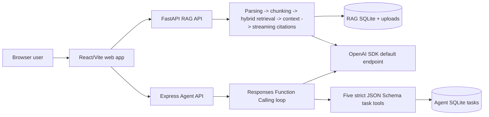
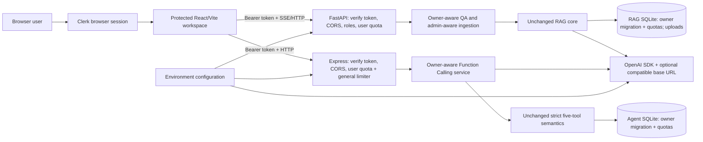

# CourseMate AI — Actual Implemented Changes Audit

> Audit date: 2026-08-13 (Asia/Shanghai)
> Repository: `https://github.com/xiao18825501901-rgb/coursemate-ai.git`
> Comparison: `8da4dcc35aad391d848e620e7e8f448e33225686..e1ef57a18bb26facf26a3568a7cd5ae1d5ea7ee5`
> Status labels: **SOURCE-VERIFIED**, **TEST-VERIFIED**, **CONFIG-VERIFIED**, **REPORT-ONLY**, **UNKNOWN**.

## Run card and evidence contract

| Field | Value |
|---|---|
| Objective | Determine what the repository actually changed between the locally complete Codex version and the current production-compatible source. |
| Mode | Deep source/change audit. |
| Source set | Current source at `e1ef57a`; Git history/diff/reflog; schema construction code; current tests; deployment configuration; local untracked runtime DB/corpus; project handoffs. |
| Missing material | `PRODUCTION_DEPLOYMENT_CHANGELOG_AND_FINAL_STATE.md` was named in the audit request but was not found in the repository, Codex work folders, or attachment files. The request's claim list is therefore only a discovery checklist, not evidence for runtime facts. |
| Output language | English audit prose with source identifiers preserved verbatim; final handoff may summarize the findings in Chinese. |
| Safety | No secret values, real user IDs, session tokens, SSH material, or provider credentials are reproduced. Test-only placeholder values are not treated as production credentials. |

Evidence priority follows the request: current source → Git → schema/migrations → tests → deployment config → production report → Atlas/README → inference. A current line reference means the line as inspected at `e1ef57a`; historical behavior is located by `<commit>:<path>` and the corresponding Git diff.

## Executive conclusion

The largest **source-level** production change was not a hosting rewrite. It was the security boundary added in `7ab0efe` and `88524c0`: Clerk-authenticated identities now flow from the browser into independently verified RAG and Agent backends, then into owner-scoped conversations and tasks. The original document parsing, chunking, FTS/vector hybrid retrieval, context/citation pipeline, strict Function Calling schemas, and bounded tool loop remain present. Later commits hardened deployment configuration, pinned esbuild, and added OpenAI-compatible endpoint support with Alibaba Model Studio/Qwen values in `render.yaml`.

The claimed Alibaba Cloud Hong Kong VM/Caddy/systemd/UFW/custom-domain runtime is **not represented in this Git repository**. Current tracked hosting configuration is still Netlify + a two-service Render Blueprint. The local ignored RAG database still contains Windows absolute `stored_path` values. Those facts do not disprove an external production deployment, but they do establish that it must be classified as runtime/data work external to this source diff.

## Major claim ledger

| ID | Claim | Claim type | Best locator | Direct evidence | Support | Gap |
|---|---|---|---|---|---|---|
| CL-01 | `8da4dcc` is the best pre-public-production baseline. | Analyst inference | Reflog at 2026-08-12 16:28; `8da4dcc:DEPLOYMENT_HANDOFF_FOR_CHATGPT.md`; next commit `cae6907` | It is the last commit completing the deployment handoff; the next commit explicitly starts the public security upgrade. | Strong / HIGH confidence | No signed external baseline declaration. |
| CL-02 | Both backends authenticate independently and derive user IDs from verified Clerk state. | Source fact | `services/rag-api/app/auth.py:16-69`; `services/agent-api/src/auth.ts:17-35`; commit `7ab0efe` | Clerk SDK verification plus backend `require_user`/`requireUser`; clients do not submit trusted user IDs. | Strong | Live Clerk issuer/key behavior was not probed in this audit. |
| CL-03 | Tasks are owner-isolated for every read and mutation. | Source fact | `services/agent-api/src/repositories/tasks.ts:88-206`; `test/task-repository.test.ts` | `owner_user_id` is inserted and included in SELECT/UPDATE/DELETE predicates. | Strong | Production DB contents unavailable. |
| CL-04 | Conversations are owner-bound and foreign access returns 404. | Source fact | `services/rag-api/app/services/qa.py:64-118`; `tests/test_qa_api.py:233` | Conversation creation stores owner; lookup filters ID + owner and maps absence to `CONVERSATION_NOT_FOUND`. | Strong | Live two-account production smoke evidence unavailable. |
| CL-05 | Corpus reads require sign-in and mutations require an admin allowlist. | Source fact | `services/rag-api/app/api/ingestion.py:30-94`; `app/auth.py:56-69` | `require_user` guards lists; `require_admin` guards course creation, upload, and job inspection. | Strong | No delete endpoint exists; live admin identity not inspected. |
| CL-06 | RAG and Agent model limits are per verified user and stored separately in their SQLite DBs. | Source fact | `rag-api/app/db.py:82-190`; `agent-api/src/rate-limit.ts:13-36` | Composite `(owner_user_id, action, window_start)` keys and HTTP 429 paths. | Strong | Multi-instance coordination is intentionally absent. |
| CL-07 | Clerk Bearer support required explicit CORS authorization headers. | Source fact | `rag-api/app/main.py:107-113`; `agent-api/src/app.ts:63-71`; CORS tests | Both allow exactly configured `WEB_ORIGIN` and `Authorization`, with credentials false. | Strong | Exact live origin unavailable. |
| CL-08 | Netlify dependency stabilization pinned esbuild from resolved 0.28.2 to 0.28.1. | Source fact | commit `78912d9`; `package.json`; `package-lock.json` | Root direct dev dependency and full platform-specific lock graph changed to 0.28.1. | Strong | The original Netlify failure log is not in Git. |
| CL-09 | Source supports OpenAI default endpoints and custom OpenAI-compatible endpoints. | Source fact | commit `e1ef57a`; RAG providers; Agent client | `OPENAI_BASE_URL`/`baseURL` is conditional; no value preserves SDK defaults. | Strong | No paid/live provider call was made. |
| CL-10 | Tracked production target values are Qwen on Alibaba Model Studio Singapore. | Configuration fact | `render.yaml:25-31,64-68` at `e1ef57a` | Workspace-specific Singapore base URL, `qwen3.7-plus`, `text-embedding-v4`. | Strong for tracked config | Does not establish what a Hong Kong VM currently runs. |
| CL-11 | Core RAG ranking/parsing algorithms were not replaced. | Source fact | `git diff 8da4dcc..e1ef57a -- app/rag`; unchanged loader/chunker/retrieval/prompt files | Only provider constructors changed in `app/rag`; ownership changed in `services/qa.py`. | Strong | Live quality after model/provider change remains unmeasured. |
| CL-12 | Alibaba VM, Caddy, systemd, UFW, DNS, backups, and Linux path rewrite are not source-verifiable here. | Unknown | `git ls-files`; repository-wide string search; missing production report | No tracked service unit, Caddyfile, firewall config, domain, `/srv/coursemate` path, or runtime report. | Strong for absence from Git | External server state was not accessible. |

# 0. BASELINE AND CURRENT STATE

```text
Baseline commit:     8da4dcc35aad391d848e620e7e8f448e33225686
Baseline date:       2026-08-12T16:28:54+08:00
Baseline description: docs: add production deployment handoff
Baseline confidence: HIGH

Current commit:      e1ef57a18bb26facf26a3568a7cd5ae1d5ea7ee5
Current date:        2026-08-13T07:16:41+08:00
Current branch:      main
Current repository:  https://github.com/xiao18825501901-rgb/coursemate-ai.git
Remote observation:  origin/main pointed to e1ef57a during this audit.
Working-tree caveat: unrelated untracked item `curl` existed before this report and was not inspected, changed, or included.
```

Why `8da4dcc`: commits through `3ab306e` completed and hardened the local product, `aa08284`/`2d14630`/`8da4dcc` completed teaching/Atlas/deployment handoffs, and the immediately following `cae6907` explicitly defines the new public-security change. Choosing `78912d9` would erase the authentication/ownership production work from the comparison, so it is not the correct original Codex baseline.

# 1. PRODUCTION CHANGE COMMIT TIMELINE

| Commit/date/message | Purpose and production reason | Main files | Categories |
|---|---|---|---|
| `cae6907` · 2026-08-12 16:54 · `docs: define public security upgrade` | Records the public-product threat model, acceptance criteria, and implementation plan before code. | `docs/specs/PUBLIC_SECURITY_UPGRADE_SPEC.md`, `docs/PUBLIC_SECURITY_UPGRADE_PLAN.md` | Security, documentation |
| `7ab0efe` · 17:24 · `feat: secure backend APIs by authenticated owner` | Adds backend Clerk verification, owner columns/migrations, owner-scoped repositories/conversations, admin corpus controls, per-user model limits, and tests. | RAG/Agent auth, DB, API, repositories, tests, package manifests | Security, backend, database, RAG, Agent, testing |
| `88524c0` · 17:31 · `feat: add Clerk-protected web experience` | Adds Clerk React integration, protected routes, Bearer injection, signed-in navigation, read-only Documents UI, and frontend tests. | `apps/web/src/**` | Frontend, security, testing |
| `bb7a750` · 17:49 · `chore: harden production security configuration` | Makes missing Clerk configuration fail closed, confines test auth to deterministic test mode, adds env/deployment/CORS/E2E configuration. | `.env.example`, `render.yaml`, configs, app composition, Playwright | Security, deployment, infrastructure-as-code, testing |
| `149814d` · 17:54 · `fix: validate agent chat before charging quota` | Prevents invalid chat bodies from consuming the user's model quota by validating before the limiter. | `services/agent-api/src/app.ts` | Backend, correctness, rate limiting |
| `360babf` · 17:55 · `docs: add public security upgrade handoff` | Captures the implemented security architecture and operational gates. | `SECURITY_UPGRADE_HANDOFF_FOR_CHATGPT.md` | Documentation |
| `78912d9` · 2026-08-13 04:03 · `fix: stabilize frontend build dependencies` | Pins esbuild 0.28.1 and regenerates the lock graph after a platform-specific Netlify build issue. | root `package.json`, `package-lock.json` | Frontend build, deployment |
| `e1ef57a` · 07:16 · `feat: support OpenAI-compatible model endpoints` | Adds optional compatible endpoints, Qwen/Alibaba Render target values, embedding batch limit 10, tests, and docs while preserving OpenAI defaults. | providers/config/wiring/tests/docs/`render.yaml` | RAG, Agent, provider config, testing, deployment |

# 2. CHANGE STATISTICS

Commands: `git diff --stat 8da4dcc..e1ef57a`, `--name-status`, `--numstat`, and per-commit `git show --stat`.

| Metric | Result |
|---|---:|
| Files added | 14 |
| Files modified | 54 |
| Files deleted | 0 |
| Files renamed | 0 |
| Total files affected | 68 |
| Frontend (`apps/web`) | 17 |
| RAG service | 16 |
| Agent service | 17 |
| Test files | 14 by manual inventory (10 matched strict `/test(s)/` path rule; four colocated/root test-config artifacts require classification) |
| Root/config/deployment artifacts | 12 |
| Insertions | 3,802 |
| Deletions | 336 |

The 1,567-line `package-lock.json` delta dominates raw line count; it should not be mistaken for equivalent business-logic volume.

# 3. CHANGED FILE INVENTORY

Priority definitions: P0 changes trust/data architecture; P1 changes important production behavior; P2 is test/config/documentation support; P3 is minor maintenance. `A` = added; `M` = modified.

## Root, deployment, and documentation

| File | Type / commits | Area / responsibility before → current | Main change or symbols | Priority |
|---|---|---|---|---|
| `.env.example` | M · `bb7a750,e1ef57a` | Config template → adds Clerk, admin, limit, app-env, and optional compatible-provider variables without values | `CLERK_*`, `ADMIN_USER_IDS`, rate limits, `OPENAI_BASE_URL` | P2 |
| `README.md` | M · `bb7a750,e1ef57a` | Local product guide → authenticated multi-user and compatible-provider guide | setup/security/provider descriptions | P2 |
| `SECURITY_UPGRADE_HANDOFF_FOR_CHATGPT.md` | A · `360babf` | none → security handoff | architecture/gates | P2 |
| `docs/PUBLIC_SECURITY_UPGRADE_PLAN.md` | A · `cae6907` | none → implementation tasks | security plan | P2 |
| `docs/specs/PUBLIC_SECURITY_UPGRADE_SPEC.md` | A · `cae6907` | none → security contract | acceptance boundaries | P2 |
| `docs/OPENAI_COMPATIBLE_ENDPOINT_PLAN.md` | A · `e1ef57a` | none → provider implementation plan | compatibility plan | P2 |
| `docs/specs/OPENAI_COMPATIBLE_ENDPOINT_SPEC.md` | A · `e1ef57a` | none → provider contract | endpoint/batch/security boundaries | P2 |
| `docs/ARCHITECTURE.md` | M · `e1ef57a` | OpenAI provider description → optional compatible endpoint description | provider mode | P2 |
| `docs/DEPLOYMENT.md` | M · `bb7a750,e1ef57a` | Netlify+Render guide → auth/secret/admin/provider deployment guide | production env matrix | P2 |
| `docs/RAG_PIPELINE.md` | M · `e1ef57a` | RAG flow → documents batch 10 and base URL | ingestion/provider settings | P2 |
| `docs/TECHNICAL_REFERENCES.md` | M · `e1ef57a` | OpenAI references → adds Alibaba official references | provider sources | P2 |
| `docs/TROUBLESHOOTING.md` | M · `e1ef57a` | OpenAI diagnosis → compatible-endpoint diagnosis | endpoint fallback | P2 |
| `package.json` | M · `78912d9` | root workspace tooling → explicit esbuild pin | `esbuild: 0.28.1` | P1 |
| `package-lock.json` | M · `7ab0efe,78912d9` | lock graph → Clerk packages plus stabilized esbuild platform packages | integrity/version graph | P1 |
| `netlify.toml` | M · `bb7a750` | Vite SPA config → documents required public build vars | Clerk/API URL comments | P1 |
| `render.yaml` | M · `bb7a750,e1ef57a` | unauthenticated OpenAI Render services → fail-closed auth, per-user limits, factory startup, Alibaba-compatible Qwen target | env vars/start commands | P1 |
| `playwright.config.ts` | M · `bb7a750` | deterministic E2E services → constrained test-auth environment and factory startup | `AUTH_TEST_USER_ID`, `APP_ENV`, output control | P2 |
| `scripts/start_local.ps1` | M · `bb7a750` | RAG app object startup → factory startup | `app.main:create_app --factory` | P2 |

## Frontend

| File | Type / commit | Before → current | Main symbols/change | Priority |
|---|---|---|---|---|
| `apps/web/package.json` | M · `7ab0efe` | React app → Clerk-enabled React app | `@clerk/react` | P2 |
| `apps/web/src/auth/AuthProvider.tsx` | A · `88524c0` | no auth context → Clerk session bridge plus test-only adapter | `ClerkAuthProvider`, `useCourseMateAuth`, `getToken`, sign-in/up/user UI | P0 |
| `apps/web/src/components/ProtectedRoute.tsx` | A · `88524c0` | no route gate → loaded/signed-in route boundary | `ProtectedRoute` | P0 |
| `apps/web/src/App.tsx` | M · `88524c0` | all routes public → QA/tasks/documents nested behind route gate | `AppRoutes` | P1 |
| `apps/web/src/main.tsx` | M · `88524c0` | renders App directly → selects Clerk, constrained dev test auth, or fail-closed screen | provider composition | P1 |
| `apps/web/src/components/Layout.tsx` | M · `88524c0` | unconditional private navigation → signed-in nav/account and signed-out actions | auth-aware layout | P1 |
| `apps/web/src/services/http.ts` | M · `88524c0` | unauthenticated fetch helpers → session-token acquisition and Bearer injection | `authenticatedFetch`, `requestJson` | P0 |
| `apps/web/src/services/agentApi.ts` | M · `88524c0` | direct Agent calls → all calls require `GetSessionToken` | CRUD/chat clients | P1 |
| `apps/web/src/services/ragApi.ts` | M · `88524c0` | direct RAG/SSE calls → authenticated reads and streaming | list/stream helpers | P1 |
| `apps/web/src/pages/DocumentsPage.tsx` | M · `88524c0` | upload/mutation controls → authenticated read-only shared inventory | `DocumentsPage` | P1 |
| `apps/web/src/pages/QaPage.tsx` | M · `88524c0` | direct APIs/upload affordance → token-aware QA and read-only corpus messaging | QA flow | P1 |
| `apps/web/src/pages/TasksPage.tsx` | M · `88524c0` | direct CRUD/chat → token-aware private task UI | task actions | P1 |
| `apps/web/src/styles.css` | M · `88524c0` | base styles → auth states/account/admin-managed labels | auth CSS | P2 |
| `apps/web/src/App.test.tsx` | M · `88524c0` | route rendering tests → private navigation/route gate regression | protected route test | P2 |
| `apps/web/src/services/http.test.ts` | A · `88524c0` | none → Bearer and no-token tests | `authenticatedFetch` tests | P2 |
| `apps/web/src/pages/QaPage.test.tsx` | M · `88524c0` | QA behavior → same behavior through test auth | authenticated QA regression | P2 |
| `apps/web/src/pages/TasksPage.test.tsx` | M · `88524c0` | task behavior → same behavior through test auth | authenticated task regression | P2 |

## Agent backend

| File | Type / commits | Before → current | Main symbols/change | Priority |
|---|---|---|---|---|
| `services/agent-api/package.json` | M · `7ab0efe` | Express API → Clerk middleware dependency | `@clerk/express` | P2 |
| `src/auth.ts` | A · `7ab0efe,bb7a750` | no identity verifier → Clerk session verification plus constrained test strategy | `AuthStrategy`, `createClerkAuthStrategy` | P0 |
| `src/app.ts` | M · `7ab0efe,149814d` | shared task API → authenticated owner routing, CORS Authorization, request/model limits | `requireUser`, `createApp` | P0 |
| `src/config.ts` | M · `7ab0efe,bb7a750,e1ef57a` | DB/model config → fail-closed Clerk, platform PORT, limits, test-auth guard, optional base URL | `AgentConfig`, `loadConfig` | P1 |
| `src/db.ts` | M · `7ab0efe` | global tasks schema → owner column, migration ledger, owner indexes, limiter table, legacy quarantine | `AgentDatabase.initialize` | P0 |
| `src/rate-limit.ts` | A · `7ab0efe` | no per-user model limiter → SQLite minute window | `SqliteModelRateLimiter` | P0 |
| `src/repositories/tasks.ts` | M · `7ab0efe` | ID/global CRUD → owner in every insert/query/mutation | `TaskRepository` | P0 |
| `src/server.ts` | M · `7ab0efe,bb7a750,e1ef57a` | simple composition → auth/limiter/fail-closed/provider-base composition | startup wiring | P0 |
| `src/services/agent.ts` | M · `7ab0efe` | tool loop without owner → same loop propagates verified owner | `AgentService.chat(ownerUserId, ...)` | P0 |
| `src/tools/executor.ts` | M · `7ab0efe` | allow-listed tools without owner → same tools pass owner to repository | `ToolExecutor.execute(ownerUserId, ...)` | P0 |
| `src/openai/client.ts` | M · `e1ef57a` | OpenAI default client → optional compatible `baseURL`, injected client preserved | `OpenAIResponsesClient` | P1 |
| `test/api.test.ts` | M · `7ab0efe` | REST/tool tests → auth, CORS, owner isolation, per-user limit tests | API suite | P2 |
| `test/config.test.ts` | A · `bb7a750,e1ef57a` | none → fail-closed/test adapter/PORT/base URL tests | config suite | P2 |
| `test/openai-client.test.ts` | A · `e1ef57a` | none → endpoint/default/injection tests | client suite | P2 |
| `test/task-repository.test.ts` | M · `7ab0efe` | global repository tests → owner isolation and legacy quarantine | repository suite | P2 |
| `test/tool-executor.test.ts` | M · `7ab0efe` | tool tests → owner-aware tool tests | executor suite | P2 |
| `test/agent-service.test.ts` | M · `7ab0efe` | Function Calling tests → same loop with owner | loop regression | P2 |

## RAG backend

| File | Type / commits | Before → current | Main symbols/change | Priority |
|---|---|---|---|---|
| `services/rag-api/requirements.txt` | M · `7ab0efe` | FastAPI/OpenAI deps → Clerk backend SDK added | `clerk-backend-api` | P2 |
| `app/auth.py` | A · `7ab0efe,bb7a750` | no identity verifier → Clerk verification, stable user, admin derivation, guarded test verifier | `ClerkAuthVerifier`, `require_user`, `require_admin` | P0 |
| `app/api/ingestion.py` | M · `7ab0efe` | public corpus endpoints → signed-in reads/admin mutations | FastAPI dependencies | P0 |
| `app/api/qa.py` | M · `7ab0efe` | public QA/history → verified owner and per-user 429 | `chat`, `get_conversation` | P0 |
| `app/config.py` | M · `7ab0efe,bb7a750,e1ef57a` | RAG/model config → Clerk/admin/limit/app/test/base URL config | `Settings`, `admin_user_id_set` | P1 |
| `app/db.py` | M · `7ab0efe` | shared conversations → owner migration/indexes, limiter table, migration ledger | `SCHEMA_SQL`, `initialize`, `consume_rate_limit` | P0 |
| `app/main.py` | M · `7ab0efe,bb7a750,e1ef57a` | module app → fail-closed factory with auth strategy, strict CORS, compatible provider wiring | `create_app` | P0 |
| `app/models.py` | M · `7ab0efe` | API models → conversation detail/message models | ownership history response types | P1 |
| `app/services/qa.py` | M · `7ab0efe` | unowned conversations → owner-bound creation/read; retrieval/streaming unchanged | `get_conversation`, `_start_conversation`, `stream` | P0 |
| `app/rag/answers.py` | M · `e1ef57a` | OpenAI endpoint → optional compatible endpoint; stream unchanged | `OpenAIAnswerProvider` | P1 |
| `app/rag/embeddings.py` | M · `e1ef57a` | OpenAI endpoint → optional compatible endpoint; embedding contract unchanged | `OpenAIEmbeddingProvider` | P1 |
| `app/services/ingestion.py` | M · `e1ef57a` | embedding batches of 64 → named limit 10 | `EMBEDDING_BATCH_SIZE` | P1 |
| `tests/test_database.py` | M · `7ab0efe,bb7a750` | schema tests → fail-closed config, migration/quarantine/path tests | DB/security tests | P2 |
| `tests/test_ingestion_api.py` | M · `7ab0efe,e1ef57a` | ingestion tests → auth/admin/CORS/batch-limit tests | API/batch tests | P2 |
| `tests/test_qa_api.py` | M · `7ab0efe` | QA tests → owner/rate/auth regressions | QA security tests | P2 |
| `tests/test_openai_compatibility.py` | A · `e1ef57a` | none → RAG endpoint/default/injection/wiring tests | compatibility suite | P2 |

Inventory total: 68 rows; no deletion or rename.

# 4. FILE-BY-FILE BEFORE / AFTER AUDIT (P0/P1)

The following groups cover every P0/P1 file above without repeating identical flows file by file.

## Frontend identity boundary — `AuthProvider.tsx`, `main.tsx`, `ProtectedRoute.tsx`, `App.tsx`, `Layout.tsx`

### BEFORE

At `8da4dcc`, the frontend rendered `<App />` directly. All navigation and `/qa`, `/tasks`, `/documents` routes were reachable without a session concept.

### PROBLEM DISCOVERED

A public site cannot rely on the absence of links or on backend secrecy. It needs a user session for private features and a token that backends can independently verify.

### CHANGE / AFTER

`88524c0` added `ClerkAuthProvider` and `ClerkSessionBridge`, exposing only session state and `getToken`; `main.tsx` fails closed if the public Clerk key is missing. `ProtectedRoute` gates private routes. `Layout` shows private navigation/account only while signed in. A fixed test token exists only through a development-only frontend branch and matching constrained backend test mode.

### KEY SYMBOLS / DATA FLOW

```text
ClerkProvider → useClerkAuth().getToken → AuthContext
                                      → ProtectedRoute
                                      → authenticated API clients
```

Test evidence: `App.test.tsx` private route/navigation test; E2E config sets test auth only with deterministic providers. Git evidence: `88524c0`, hardening `bb7a750`.

## Frontend Bearer boundary — `services/http.ts`, `agentApi.ts`, `ragApi.ts`

### BEFORE

API helpers called `fetch` without authentication.

### CHANGE / AFTER

`authenticatedFetch` obtains a token immediately before each request, rejects locally when missing, preserves caller headers, and injects `Authorization: Bearer ...`. All Agent CRUD/chat and RAG list/SSE calls now require the token getter. No user ID is sent as an authority claim.

```text
Page → getToken() → authenticatedFetch → Authorization header → backend verifier
```

Test evidence: `http.test.ts` asserts Bearer injection and zero network calls without a token. Git: `88524c0`.

## RAG authentication and corpus authorization — `auth.py`, `api/ingestion.py`, `main.py`

### BEFORE

RAG routes did not require end-user identity. Course creation, document upload, shared reads, and ingestion-job inspection had no user/admin boundary.

### CHANGE / AFTER

`ClerkAuthVerifier` validates session tokens with Clerk's backend SDK, restricts authorized parties to `WEB_ORIGIN`, and returns the verified subject. `require_user` returns 401 on absence/invalidity; `require_admin` checks the subject against `ADMIN_USER_IDS` and returns 403. Shared course/document reads require a user; course creation/upload/job inspection require an admin. `create_app` refuses normal startup without Clerk secret or JWT verification material.

```text
Bearer → ClerkAuthVerifier → AuthenticatedUser(user_id, is_admin)
                           ├─ require_user → shared read / QA
                           └─ require_admin → course/upload/job mutation
```

Test evidence: `test_ingestion_api.py` covers 401, shared authenticated read, ordinary-user 403, admin success and CORS; `test_database.py` covers fail-closed configuration. Git: `7ab0efe`, `bb7a750`.

## Agent authentication/API boundary — `auth.ts`, `app.ts`, `server.ts`

### BEFORE

The Express API accepted task and chat operations without an authenticated principal. Repository methods were called without an owner.

### CHANGE / AFTER

The Clerk middleware verifies session tokens; `getAuth(request).userId` becomes the only task/chat principal. Every protected route calls `requireUser`. The app retains a general IP-oriented `express-rate-limit` layer (120/minute) and adds a separate per-user model limiter. Commit `149814d` orders `validateChat` before model quota consumption. `server.ts` composes either real Clerk or a test strategy allowed only by guarded config.

Test evidence: `api.test.ts` covers missing/invalid tokens, two-user isolation, security/CORS headers and per-user limits. Git: `7ab0efe`, `bb7a750`, `149814d`.

## Agent task ownership — `db.ts`, `repositories/tasks.ts`

### BEFORE

`tasks` had no owner column. CRUD was global by task ID/filter; any caller knowing an ID could address that row.

### CHANGE / AFTER

`owner_user_id TEXT NOT NULL` is part of new schemas. Existing DBs receive it through an idempotent `ALTER TABLE` with `legacy_orphaned`; those rows are deliberately not assigned to a real user. Composite owner indexes replace global status/course indexes. `create` stores the verified owner, `get/list/update/delete` all include it in predicates. Cross-owner reads and mutations intentionally look like missing resources.

```text
verified user → create(owner,id) → INSERT owner_user_id
verified user → list             → WHERE owner_user_id = ?
verified user → update/delete    → WHERE owner_user_id = ? AND id = ?
```

Test evidence: `task-repository.test.ts` proves every query/mutation is isolated and legacy rows quarantined; `api.test.ts` proves HTTP isolation. Git: `7ab0efe`.

## Owner propagation through Agent Function Calling — `services/agent.ts`, `tools/executor.ts`

### BEFORE

The Responses loop and strict tools existed, but tool execution had no owner context.

### CHANGE / AFTER

The loop structure, `function_call` parsing, `call_id`, strict validation, `function_call_output`, bounded rounds, and tool schemas are unchanged. Only an authenticated `ownerUserId` is threaded through `AgentService.chat` → `ToolExecutor.execute` → repository methods. Tool business behavior is therefore **SECURITY-WRAPPED**, not rewritten.

Test evidence: all four `agent-service.test.ts` Function Calling tests and all executor tests pass. Git: `7ab0efe`.

## RAG conversation ownership — `db.py`, `api/qa.py`, `services/qa.py`, `models.py`

### BEFORE

Conversations contained course ID but no owner. QA could create history without an identity; there was no owner-filtered history endpoint.

### CHANGE / AFTER

New schemas include `owner_user_id`; existing schemas receive a default `legacy_orphaned` column and owner indexes through migration version 1. QA uses the verified subject for rate limiting and conversation creation. `get_conversation` queries `(conversation_id, owner_user_id)` and returns 404 when absent, preventing an ownership oracle. Messages inherit access through the owner-checked conversation.

```text
verified user → POST /api/qa/chat → limiter(owner)
                                   → conversations(owner,course)
                                   → messages
verified user → GET /conversations/:id → WHERE id=? AND owner=? → 200/404
```

Test evidence: `test_qa_api.py` owner isolation, two-user rate limit and 401 tests; `test_database.py` legacy quarantine/idempotence. Git: `7ab0efe`.

## SQLite model limits — RAG `db.py`/`api/qa.py`; Agent `rate-limit.ts`/`app.ts`

### BEFORE

No model-specific, user-keyed quota existed.

### CHANGE / AFTER

Each service owns its own `rate_limit_windows` table keyed by `(owner_user_id, action, window_start)`. A fixed UTC epoch-minute bucket is incremented atomically with UPSERT/RETURNING; rows older than one hour are deleted. RAG uses action `rag_qa`, Agent `agent_chat`; limits default to 10/minute and return HTTP 429. Agent also keeps its separate 120/min general middleware, whose default key is request/IP behavior rather than user ownership.

Test evidence: per-user A/A/B tests in both API suites. Git: `7ab0efe`, ordering fix `149814d`.

## CORS and production composition — both `main.py` and `app.ts`, configs, `render.yaml`

### BEFORE

The configured frontend origin existed, but authentication did not require Bearer preflight support. RAG exported a module app; deployment did not fail closed on missing auth.

### CHANGE / AFTER

Both APIs allow only `WEB_ORIGIN`, explicit methods, and `Authorization`/`Content-Type`; browser credentials are false because auth travels in Bearer headers. RAG uses a factory so injected test dependencies and fail-closed configuration can be applied at startup. Render config supplies only names/placeholders for secrets and exact non-secret provider targets.

Test evidence: both CORS preflight suites; config fail-closed tests; builds. Git: `7ab0efe`, `bb7a750`, `e1ef57a`.

## Netlify dependency stabilization — root `package.json`, `package-lock.json`

### BEFORE

esbuild was transitive and lock resolution showed `0.28.2`; platform optional packages depended on lock reconstruction.

### PROBLEM / CHANGE / AFTER

The commit message and production-change clue identify a Netlify build dependency failure. `78912d9` added explicit root `esbuild: 0.28.1` and regenerated the platform-specific lock graph at 0.28.1. This is a build reproducibility fix, not a React business bug. The failure log itself is missing, so the exact Netlify error mechanism is not source-established.

Validation: current Web build and the root workspace build pass. Git: `78912d9`.

## OpenAI-compatible providers — RAG provider/wiring files and Agent client/config/server

### BEFORE

Official SDK clients used their default OpenAI endpoints; embedding ingestion requested up to 64 inputs.

### CHANGE / AFTER

`OPENAI_BASE_URL` is optional. Non-empty values become Python `base_url` and Node `baseURL`; absent/empty values preserve the original client construction. Client injection, Responses parameters, streaming events, and Function Calling remain unchanged. Embedding ingestion uses `EMBEDDING_BATCH_SIZE = 10`. `render.yaml` currently targets Alibaba Model Studio Singapore, `qwen3.7-plus`, and `text-embedding-v4`.

Test evidence: both compatibility test files; >10-chunk exact-count test; all existing deterministic and Function Calling suites. Git: `e1ef57a`.

# 5. AUTHENTICATION CHANGE AUDIT

## BEFORE

At `8da4dcc`, neither UI nor API established an end-user identity. The backends protected model keys from the browser but did not protect user data from other public callers.

## AFTER — verified flow

```text
Browser
  → Clerk React (`ClerkAuthProvider`)
  → session `getToken()`
  → `authenticatedFetch`
  → Authorization: Bearer <redacted>
  ├→ FastAPI `ClerkAuthVerifier.authenticate`
  └→ Express `clerkMiddleware` + `getAuth`
  → verified Clerk subject/user ID
  → authorization and owner-scoped data operations
```

| Required point | Actual source locator |
|---|---|
| Frontend token acquisition | `apps/web/src/auth/AuthProvider.tsx:32-43` |
| Bearer injection | `apps/web/src/services/http.ts:34-45` |
| Protected route | `apps/web/src/components/ProtectedRoute.tsx:6-22`, nested by `App.tsx:20-25` |
| RAG verification | `services/rag-api/app/auth.py:16-37` |
| Agent verification | `services/agent-api/src/auth.ts:17-27` |
| Fail-closed startup | `rag-api/app/main.py:43-52`; `agent-api/src/config.ts:30-44` |

Authentication answers “who is the caller?” only. The next section covers “what may that caller access?”.

# 6. AUTHORIZATION CHANGE AUDIT

## Tasks

The verified backend user ID is passed through REST or Function Calling and stored as `owner_user_id`. Every list/get/update/delete predicate includes the owner. Foreign task access returns 404/false, not 403, avoiding disclosure that a task ID exists.

## Conversations

New conversations store the verified owner. Legacy conversations become `legacy_orphaned`. History lookup filters owner + ID and returns 404 for foreign/legacy rows.

## Shared corpus

| Caller | Course/document read | Course create | Upload | Job inspection | Delete |
|---|---|---|---|---|---|
| Signed out | 401 | 401 | 401 | 401 | No endpoint |
| Signed-in ordinary user | Allowed | 403 | 403 | 403 | No endpoint |
| Allowlisted admin | Allowed | Allowed | Allowed | Allowed | No endpoint |

`ADMIN_USER_IDS` is parsed by `Settings.admin_user_id_set`; admin status is derived server-side after authentication. Hiding upload UI is usability only; the FastAPI dependency is the actual enforcement.

# 7. DATABASE SCHEMA CHANGE AUDIT / DIFF

No standalone migration files exist. Both services implement versioned, idempotent migration logic in their DB initializer.

## Agent DB

```sql
-- Baseline
tasks(id, title, ..., completed_at)

-- Current new schema
tasks(id, owner_user_id TEXT NOT NULL, title, ..., completed_at)
schema_migrations(version, name, applied_at)
rate_limit_windows(owner_user_id, action, window_start, request_count,
                   PRIMARY KEY(owner_user_id, action, window_start))
```

Existing tasks receive `owner_user_id = 'legacy_orphaned'`; version 1 is `task ownership and per-user limits`. Owner/status/course indexes replace global indexes. Migration is repeatable and quarantines rather than misassigns old private data.

## RAG DB

```sql
-- Baseline
conversations(id, course_id, created_at, updated_at)

-- Current new schema
conversations(id, owner_user_id TEXT NOT NULL, course_id, created_at, updated_at)
schema_migrations(...)
rate_limit_windows(... same composite key pattern ...)
```

Existing conversations receive `legacy_orphaned`; version 1 is `conversation ownership and per-user limits`. `messages`, `courses`, `documents`, `chunks`, FTS schema/triggers retain their core structure. No provider-compatibility DB migration was added.

# 8. TASK OWNERSHIP DATA FLOW

```text
Clerk session → Agent AuthStrategy.userId
              → REST route / AgentService.chat
              → ToolExecutor(ownerUserId)
              → TaskRepository
                 ├ create: INSERT owner_user_id
                 ├ search: WHERE owner_user_id = ? + filters
                 ├ update: WHERE owner_user_id = ? AND id = ?
                 ├ complete: owner-scoped update
                 └ delete: WHERE owner_user_id = ? AND id = ?
```

This path is covered at repository, tool, Agent loop, and HTTP levels.

# 9. RAG CONVERSATION OWNERSHIP

The QA route authenticates before rate limiting or streaming. `_start_conversation` persists the verified owner and user question. Assistant messages attach to that conversation. A foreign caller cannot pass the owner filter, receives 404 `CONVERSATION_NOT_FOUND`, and therefore cannot enumerate another user's history. Legacy rows are intentionally inaccessible to real users.

# 10. RATE LIMIT CHANGE AUDIT

| Question | RAG | Agent |
|---|---|---|
| Baseline model limit | None | None |
| Current model limit | Yes | Yes |
| Store | RAG-owned SQLite | Agent-owned SQLite |
| Key | verified user + `rag_qa` + epoch minute | verified user + `agent_chat` + epoch minute |
| Default | 10/min | 10/min |
| Exceeded | HTTP 429 `RATE_LIMITED` | HTTP 429 `RATE_LIMITED` |
| Cross-user effect | None in tests | None in tests |
| General HTTP limiter | No additional layer | express-rate-limit 120/min, request/IP-oriented |

The services do not share a limiter DB; this matches service-owned SQLite. It also means the documented single-instance restriction matters.

# 11. CORS CHANGE AUDIT

Development defaults `WEB_ORIGIN=http://localhost:5173`; production must provide the exact public frontend origin. Both APIs allow the configured origin, expected methods, and `Authorization`/`Content-Type`. Clerk Bearer introduction makes `Authorization` a preflight header; without the explicit allow-list the browser could hold a valid token yet be blocked before the API route. CORS restricts browsers but is not authentication or ownership enforcement.

# 12. FRONTEND PRODUCTION CHANGE AUDIT

- **Auth Provider — ADDED:** Clerk provider/session bridge, sign-in/up, current account, test-only provider.
- **Protected Routes — ADDED:** QA/tasks/documents gate; Home/About remain public.
- **Layout/navigation — MODIFIED:** private links/account reflect sign-in state.
- **API client/Bearer — MODIFIED:** all protected HTTP and SSE calls use `getToken`.
- **Documents — MODIFIED:** upload controls removed; authenticated read-only inventory marked admin-managed.
- **Signed in/out — MODIFIED:** private workspace gate and account UI.
- **Backend URLs — UNCHANGED mechanism:** still use `VITE_RAG_API_URL` and `VITE_AGENT_API_URL`; production values remain platform configuration.
- **Clerk key — ADDED:** only `VITE_CLERK_PUBLISHABLE_KEY` may enter the browser bundle.

# 13. CORPUS SECURITY CHANGE

The frontend restriction and backend authorization are distinct:

```text
UI: no ordinary upload controls        (reduces accidental affordance)
API: require_admin on mutation routes  (actual security boundary)
```

Authenticated ordinary users can list shared corpus metadata and use course QA. Admins may create courses/upload and inspect ingestion jobs. No corpus delete endpoint was introduced.

# 14. NETLIFY CHANGE AUDIT

Commit `78912d9` is direct Git evidence for `esbuild 0.28.2 → 0.28.1`: root `package.json` gained a direct pin and lockfile entries/platform binaries resolved to 0.28.1. `netlify.toml` itself only gained guidance for the public Clerk and backend URL variables; its build/publish/SPA settings did not change in this interval. This was a dependency-resolution/platform build fix, not a functional React change. Current `npm run build` validates the repaired graph locally; the original Netlify log and a fresh Netlify build record are unavailable here.

# 15. HOSTING MIGRATION AUDIT

## Repository changes — verified

- `netlify.toml` still defines the static Vite frontend and SPA fallback.
- `render.yaml` still defines two Render `starter` web services with separate 1 GiB persistent disks.
- Runtime configuration now includes Clerk, limits, exact origin requirements, and Alibaba Model Studio **Singapore** compatible-provider values.
- No Dockerfile, Caddyfile, systemd unit, UFW rule, Nginx file, VM provisioning script, custom production domain, or `/srv/coursemate` reference is tracked.

## Server-only changes — not present in repository

The audit request lists Alibaba Cloud Hong Kong, Ubuntu, Caddy, systemd, UFW, `/etc/coursemate/*.env`, `/srv/coursemate`, DNS/custom domains, backups, and smoke tests. These are valid categories of **TYPE C/E** work but are **NOT PRESENT IN REPOSITORY**. Because the named production report itself is missing, their exact values/status remain **UNKNOWN / NOT SOURCE-VERIFIABLE**. They must not be described as code implemented by these commits.

# 16. FINAL BACKEND RUNTIME

## Source-verifiable deployment model

```text
Netlify static Vite frontend
  ├─ Bearer/SSE → Render Blueprint: coursemate-rag-api → /var/data/rag.sqlite3 + uploads
  └─ Bearer      → Render Blueprint: coursemate-agent-api → /var/data/agent.sqlite3
Both → OpenAI SDK → configured OpenAI or OpenAI-compatible endpoint
```

## Claimed external production model — report missing

```text
Alibaba Cloud HK / Ubuntu                           [REPORT-ONLY clue]
  → Caddy                                           [NOT IN GIT]
     ├─ rag.qqttai.com → 127.0.0.1:8000             [UNKNOWN]
     └─ agent.qqttai.com → 127.0.0.1:8001           [UNKNOWN]
  → systemd coursemate-rag / coursemate-agent      [NOT IN GIT]
  → UFW / TLS / DNS                                 [NOT IN GIT]
```

This diagram is not a declaration of live state; it is the requested claim shape annotated with its unavailable evidence.

# 17. RAG DATA MIGRATION AUDIT

## Source-code changes

The existing settings already support configurable `RAG_DATABASE_PATH`/`RAG_UPLOAD_DIR`; deployment aliases are tested. No Windows-to-Linux rewrite routine was added in the baseline-current diff.

## Local runtime data observed

The ignored local `data/rag.sqlite3` contains 2 courses, 66 documents, 1,936 chunks, 8 conversations, and migration version 1. All 66 `documents.stored_path` values are Windows absolute paths; 0 start with `/`. The ignored uploads tree contains 67 files: 38 under CS3481 and 29 under GE2324 (the extra GE file is consistent with a transcription sidecar, but that attribution is an inference unless file-by-file verified).

## Production data/files/embeddings

- Linux `stored_path` rewrite: **UNKNOWN**, not visible in local DB/Git.
- Upload copy to VM: **UNKNOWN**, no server inventory supplied.
- Re-embedding: **not required by path rewrite alone**; however whether production re-embedded for `text-embedding-v4` is **UNKNOWN**. The local 1,936 chunks have non-empty stored embeddings but their generating model cannot be proven from vector bytes.
- Production counts: **UNKNOWN** without the missing report/server DB. Local counts above must not be relabeled production counts.

# 18. CROSS-PLATFORM PATH MIGRATION

| Layer | What source shows | Audit verdict |
|---|---|---|
| Code | `Path`/configurable DB and upload roots; document rows persist a concrete stored path | Production-compatible configuration exists; no rewrite command added |
| Database values | Local ignored DB has 66 Windows absolute paths | Linux rewrite not present locally |
| Files | Local ignored uploads exist under repository data tree | Server file migration unknown |
| Config | Render uses `/var/data`; external VM paths are not tracked | Render config verified; `/srv/coursemate` unknown |

Therefore Windows→Linux path migration, if performed, is chiefly **TYPE D data migration + TYPE B runtime configuration**, not evidence of a new document-loader algorithm.

# 19. LLM PROVIDER REALITY AUDIT

| Question | Verified answer |
|---|---|
| Original source provider | Official OpenAI Python/Node SDKs using default endpoints; configurable OpenAI model names; deterministic offline providers. |
| Current source defaults | `RAG_PROVIDER_MODE=openai`, `AGENT_PROVIDER_MODE=openai`; SDK endpoint remains OpenAI when `OPENAI_BASE_URL` is absent/empty; source defaults still `gpt-5.6-luna` and `text-embedding-3-small`. |
| Current tracked production Blueprint | Alibaba Model Studio Singapore compatible URL, chat `qwen3.7-plus`, embedding `text-embedding-v4`, secret still named `OPENAI_API_KEY`. |
| Production report provider | Missing report; live provider cannot be independently asserted. |

`e1ef57a` is a current, non-temporary Qwen-compatible source change and has not been reverted. It does not hard-code Alibaba as the only provider. The RAG embedding limit changed 64→10; Responses streaming/tool parameters were not deleted.

# 20. CORE RAG ALGORITHM REGRESSION AUDIT

| Capability | Status | Evidence |
|---|---|---|
| Document parsing/loaders | UNCHANGED | no diff in `app/rag/loaders.py` |
| Chunking algorithm/overlap | UNCHANGED | no diff in `app/rag/chunking.py`; only request batch size changed later |
| Keyword retrieval/FTS query | UNCHANGED | no diff in `repositories/chunks.py` |
| Vector scoring | UNCHANGED | no diff in retrieval/repository cosine path |
| Hybrid retrieval/RRF | UNCHANGED | no diff in `app/rag/retrieval.py` |
| Context construction/prompt injection boundary | UNCHANGED | no diff in `app/rag/prompt.py` |
| Answer provider transport | CHANGED | optional compatible base URL; streaming logic unchanged |
| Embedding provider transport/batching | CHANGED | optional base URL; ingestion batches capped at 10 |
| Streaming orchestration | SECURITY-WRAPPED | `QaService.stream` accepts owner; SSE/retrieval/answer/citation flow unchanged |
| Citations | UNCHANGED | server-side hit-derived citation construction unchanged |

Conclusion: production changes did not replace the RAG project; they wrapped it with identity/ownership and made the model transport configurable.

# 21. CORE AGENT REGRESSION AUDIT

| Capability | Status | Evidence |
|---|---|---|
| JSON Schemas / five tool definitions | UNCHANGED | no diff in `tools/schemas.ts` |
| Ajv strict validator | UNCHANGED | no diff in `tools/validator.ts` |
| create/search/update/complete/delete semantics | SECURITY-WRAPPED | executor signatures gain owner; validation and action semantics retained |
| Tool executor dispatch | SECURITY-WRAPPED | allow-list unchanged; owner propagated |
| Responses Function Calling loop | SECURITY-WRAPPED | same `function_call`, `call_id`, JSON repair, output and round bound; owner added |
| OpenAI client | CHANGED TRANSPORT ONLY | optional `baseURL`; request payload unchanged |
| REST CRUD | SECURITY-WRAPPED | verified owner supplied to repository |

# 22. TEST SUITE CHANGE AUDIT

| Test file | New/modified | What it proves / protected risk |
|---|---|---|
| `apps/web/src/App.test.tsx` | Modified | private nav/routes are absent/gated while signed out |
| `apps/web/src/services/http.test.ts` | New | Bearer injection; missing token prevents network request |
| `QaPage.test.tsx` | Modified | QA/citation/save workflow survives authenticated client changes |
| `TasksPage.test.tsx` | Modified | direct CRUD and Agent actions survive authenticated client changes |
| `agent-api/test/api.test.ts` | Modified | 401, two-user task isolation, CORS Authorization, security headers, per-user 429, original API/tool paths |
| `agent-api/test/config.test.ts` | New | fail-closed auth, constrained test adapter, Render `PORT`, compatible endpoint present/empty |
| `task-repository.test.ts` | Modified | every CRUD operation owner-scoped; legacy quarantine |
| `tool-executor.test.ts` | Modified | same five strict tools remain owner-scoped and safe |
| `agent-service.test.ts` | Modified | original Function Calling loop/output/repair/bound still passes with owner |
| `openai-client.test.ts` | New | custom/default SDK endpoint and injected-client compatibility |
| `rag-api/tests/test_database.py` | Modified | fail-closed auth, schema/migration/quarantine repeatability, path aliases |
| `test_ingestion_api.py` | Modified | authentication/admin boundary, shared read, CORS, and embedding batch ≤10/exact count |
| `test_qa_api.py` | Modified | conversation ownership 404, per-user 429, 401, deterministic RAG regression |
| `test_openai_compatibility.py` | New | base URL settings/provider/app wiring and injected clients |

# 23. CURRENT LOCAL VALIDATION

Run on 2026-08-13 at current source, without paid/live model calls:

| Command | Result | Pass/fail/skipped |
|---|---|---|
| `.venv/Scripts/python.exe -m pytest services/rag-api/tests -q` | 56 passed; Starlette deprecation and unwritable pytest cache warnings | Pass 56 / Fail 0 / Skip 0 |
| `... -m ruff check services/rag-api/app services/rag-api/tests scripts/import_corpus.py` | All checks passed | Pass |
| `... -m mypy services/rag-api/app scripts/import_corpus.py` | No issues in 26 source files | Pass |
| Node 24.19.0 + `npm test` | Web 11; Agent 47 | Pass 58 / Fail 0 / Skip 0 |
| `npm run typecheck` | Web and Agent TypeScript checks pass | Pass |
| `npm run build` | Web Vite production build and Agent TypeScript build pass | Pass |
| `git diff --check` before audit-file creation | clean | Pass |

Earlier on the same current commit, the browser suite produced 3/3 passing scenario assertions (course-scoped citations/answer-to-plan, Agent task editing/completion, 390 px usability) but the Windows Playwright runner did not terminate after service teardown and was interrupted, yielding a nonzero process exit. This is evidence of passed assertions, not a fully green E2E command.

# 24. MASTER CHANGE MATRIX

Types: A source, B configuration, C infrastructure/runtime, D data migration, E operational procedure.

| ID | Change | Type | Baseline → current | Files/commits | Source? | Tests? | Impact / interview importance |
|---|---|---|---|---|---|---|---|
| CHG-001 | Clerk browser identity | A/B | no user session → Clerk context/sign-in/out | frontend auth files · `88524c0` | Yes | Yes | P0 / Very high |
| CHG-002 | Backend token verification | A/B | anonymous APIs → independent Clerk verification | both auth modules/config · `7ab0efe,bb7a750` | Yes | Yes | P0 / Very high |
| CHG-003 | Task ownership | A/D | shared tasks → owner-scoped + legacy quarantine | Agent DB/repository · `7ab0efe` | Yes | Yes | P0 / Very high |
| CHG-004 | Conversation ownership | A/D | shared history → owner-scoped + legacy quarantine | RAG DB/QA · `7ab0efe` | Yes | Yes | P0 / Very high |
| CHG-005 | Corpus authorization | A/B | open mutation → signed-in read/admin mutation | RAG auth/routes + Documents UI · `7ab0efe,88524c0` | Yes | Yes | P0 / High |
| CHG-006 | Per-user model limits | A/D | none → separate SQLite minute windows | RAG/Agent limiter paths · `7ab0efe,149814d` | Yes | Yes | P0 / High |
| CHG-007 | Bearer-aware CORS | A/B | origin-only usage → explicit Authorization preflight | both app composition · `7ab0efe` | Yes | Yes | P1 / High |
| CHG-008 | Fail-closed/test auth hardening | A/B | permissive/missing config → startup rejection; constrained fake | configs/composition/E2E · `bb7a750` | Yes | Yes | P0 / High |
| CHG-009 | Netlify build pin | B | transitive esbuild 0.28.2 → direct 0.28.1 | root manifests · `78912d9` | Yes | Build | P1 / Medium |
| CHG-010 | OpenAI-compatible provider | A/B | default endpoint only → optional compatible endpoint | provider/config/wiring · `e1ef57a` | Yes | Yes | P1 / High |
| CHG-011 | Embedding batch limit | A | 64 → 10 | ingestion + test · `e1ef57a` | Yes | Yes | P1 / Medium |
| CHG-012 | Render Blueprint security/provider config | B | OpenAI/unauthenticated config → Clerk/limits/Qwen compatible target | `render.yaml` · `bb7a750,e1ef57a` | Yes | Config/build | P1 / Medium |
| CHG-013 | Alibaba HK VM/Caddy/systemd/UFW | C | claimed external migration | no repository files | No | No | Potentially P0 / Unknown |
| CHG-014 | RAG SQLite/uploads/path migration | D/E | claimed Windows→Linux runtime data move | no Git artifact; local DB remains Windows | No | No | Potentially P0 / Unknown |
| CHG-015 | DNS/custom domain/TLS | C/E | claimed external runtime setup | no repository artifacts | No | No | P1 / Unknown |
| CHG-016 | Backup/restore/monitoring/rollback | E | production operational claim | docs discuss gates; no execution evidence | Partial | No | P0 / Unknown |

# 25. TOP PRODUCTION ENGINEERING CHANGES

| Rank | Change / why | Best files to study | Interview value | Difficulty |
|---:|---|---|---|---|
| 1 | Independent authentication in both backends; frontend trust is insufficient | both auth modules, both app composition files | Very high | High |
| 2 | Task ownership enforced in SQL, including legacy quarantine | Agent DB/repository/tests | Very high | High |
| 3 | Conversation ownership with 404 non-disclosure | RAG DB/QA service/tests | Very high | High |
| 4 | Verified identity propagated through Function Calling without rewriting the loop | Agent service/executor/repository | Very high | High |
| 5 | Admin-only shared corpus mutation with authenticated read | RAG auth/ingestion/UI | High | Medium |
| 6 | Per-user SQLite model quotas separated from general HTTP/IP limiting | both limiter implementations/API tests | High | High |
| 7 | Bearer-aware CORS and exact origin | both app composition files | High | Medium |
| 8 | Fail-closed production config and safe deterministic test adapter | both configs/composition/Playwright | High | High |
| 9 | Compatible provider abstraction and backward compatibility | both SDK adapters/tests | High | Medium |
| 10 | Alibaba embedding batch constraint | RAG ingestion/test | Medium | Low |
| 11 | Netlify lockfile/esbuild reproducibility fix | root manifests/commit | Medium | Medium |
| 12 | Hosting/data migration evidence boundary | `render.yaml`, ignored local DB, missing runtime artifacts | Very high epistemic value | High |

# 26. PRODUCTION CHANGE LEARNING PACKS

Each pack starts with a behavior, follows the identity/data path, and ends at the test that proves it. Paths are repository-relative and intentionally limited to the highest-value files.

## Pack A - Browser identity and authenticated transport

1. `apps/web/src/auth/AuthProvider.tsx`
2. `apps/web/src/components/ProtectedRoute.tsx`
3. `apps/web/src/services/http.ts`
4. `apps/web/src/App.tsx`
5. `apps/web/src/services/http.test.ts`

Learning objective: understand why a signed-in UI is not a security boundary, how a short-lived Clerk token reaches both APIs, and why the shared HTTP/SSE helper must fail before making a request when no token exists.

## Pack B - Backend trust boundary and authorization policy

1. `services/rag-api/app/auth.py`
2. `services/rag-api/app/main.py`
3. `services/agent-api/src/auth.ts`
4. `services/agent-api/src/app.ts`
5. `services/agent-api/test/api.test.ts`

Learning objective: trace independent token verification, exact-origin CORS, 401 versus 403, admin identity configuration, and fail-closed startup behavior.

## Pack C - Agent task ownership through Function Calling

1. `services/agent-api/src/db.ts`
2. `services/agent-api/src/repositories/tasks.ts`
3. `services/agent-api/src/services/agent.ts`
4. `services/agent-api/src/tools/executor.ts`
5. `services/agent-api/test/task-repository.test.ts`

Learning objective: follow `ownerUserId` from the verified request through the model/tool loop to every SQL statement, including legacy-row quarantine.

## Pack D - RAG conversation ownership and corpus roles

1. `services/rag-api/app/db.py`
2. `services/rag-api/app/api/qa.py`
3. `services/rag-api/app/services/qa.py`
4. `services/rag-api/app/api/ingestion.py`
5. `services/rag-api/tests/test_qa_api.py`

Learning objective: distinguish private conversation history from a shared read-only corpus, understand 404 non-disclosure for foreign conversations, and see why corpus mutation requires an administrator.

## Pack E - Cost control and abuse resistance

1. `services/rag-api/app/db.py`
2. `services/rag-api/tests/test_qa_api.py`
3. `services/agent-api/src/rate-limit.ts`
4. `services/agent-api/src/app.ts`
5. `services/agent-api/test/api.test.ts`

Learning objective: compare per-user model-call limits with the Agent API's general HTTP/IP limiter, and understand why validation must happen before quota is charged.

## Pack F - Compatible model transport and deploy-time configuration

1. `services/rag-api/app/config.py`
2. `services/rag-api/app/rag/answers.py`
3. `services/rag-api/app/rag/embeddings.py`
4. `services/agent-api/src/openai/client.ts`
5. `render.yaml`

Learning objective: see how the OpenAI SDK remains in place while endpoint/model configuration selects OpenAI or an OpenAI-compatible Alibaba endpoint, without leaking secrets into source.

## Pack G - Netlify build reproducibility

1. `package.json`
2. `package-lock.json`
3. `netlify.toml`

Learning objective: separate a platform dependency-resolution fix from application behavior, use the lockfile diff to prove the 0.28.2-to-0.28.1 resolution, and recognize that a passing local build is not a retained Netlify build log.

## Pack H - RAG storage and migration boundary

1. `services/rag-api/app/config.py`
2. `services/rag-api/app/db.py`
3. `services/rag-api/app/services/ingestion.py`
4. `services/rag-api/tests/test_database.py`
5. `render.yaml`

Learning objective: distinguish a configurable database/upload root from actual file migration, understand why absolute Windows paths are data rather than code, and identify the evidence required for a safe SQLite/uploads move.

## Pack I - Agent regression protection

1. `services/agent-api/src/tools/schemas.ts`
2. `services/agent-api/src/tools/validator.ts`
3. `services/agent-api/src/services/agent.ts`
4. `services/agent-api/test/agent-service.test.ts`
5. `services/agent-api/test/tool-executor.test.ts`

Learning objective: prove that production security wrapped rather than replaced the strict five-tool contract and bounded Function Calling loop.

# 27. LEARNING MAP

```text
Start: original project behavior
  |
  +--> Pack A: browser session and Bearer transport
  |      |
  |      +--> Pack B: independently verified backend identity
  |               |
  |               +--> Pack C: Agent owner propagation and SQL isolation
  |               |
  |               +--> Pack D: RAG owner isolation and corpus roles
  |               |
  |               +--> Pack E: identity-keyed model-call quotas
  |
  +--> Pack F: provider/deployment configuration
         |
         +--> Revisit sections 15-19 to separate source from runtime/data claims

Finish: sections 30-35, then verify every learned claim against current source
```

Three concrete concept chains:

```text
Clerk change
  -> session token
  -> Bearer transport
  -> independent backend authentication
  -> role/ownership authorization
  -> owner-scoped SQL and per-user quotas

Tracked Render configuration -> Alibaba-compatible endpoint
  -> PaaS configuration is source-verifiable
  -> alleged VM/process/systemd/Caddy/TLS/firewall state is runtime-only
  -> runtime evidence is required before claiming a hosting migration

SQLite migration
  -> database schema and migration ledger
  -> database file + uploads directory
  -> persisted absolute document paths
  -> Windows/Linux path semantics
  -> coordinated copy/rewrite/integrity check
  -> backup and restore drill
```

Recommended order: A -> B -> C -> D -> E -> F -> G -> H -> I. Packs C and D can then be compared as two implementations of the same ownership invariant in different languages and services.

# 28. INTERVIEW STORY FROM REAL CHANGES

## Evidence sequence 1 - Multi-user isolation

```text
Original design
  -> complete RAG and Agent features, but no verified end-user owner
Production constraint
  -> public users must not share tasks or conversation history
Observed failure in baseline source
  -> task/conversation schemas and queries had no owner predicate
Diagnosis
  -> a frontend route gate cannot establish database authorization
Engineering change
  -> backend Clerk verification + owner migrations + owner propagation + SQL predicates
Validation
  -> two-user repository/API tests, foreign-conversation 404, ordinary/admin corpus tests
```

## Evidence sequence 2 - Compatible model provider

```text
Original design
  -> official OpenAI SDK using its default endpoint
Production constraint
  -> use an OpenAI-compatible Alibaba endpoint without rewriting RAG/tool logic
Observed limitation
  -> clients had no configurable base URL; ingestion batch was 64
Diagnosis
  -> transport/configuration limitation, not an algorithm defect
Engineering change
  -> optional base URL + tracked Qwen/embedding model config + batch size 10
Validation
  -> default/custom/injected-client tests, exact-count batch test, full regression suite
```

## Evidence sequence 3 - Deployment claims

```text
Original design
  -> tracked Netlify frontend and Render backend blueprint
Production constraint
  -> durable public hosting, domains, process supervision and recovery
Observed evidence gap
  -> no supplied production report or VM/Caddy/systemd/UFW/runtime artifacts
Diagnosis
  -> repository configuration cannot prove external live state
Engineering change
  -> only Netlify/Render hardening and provider config are source-verifiable
Validation
  -> local builds/config tests pass; external runtime remains UNKNOWN
```

## Interview-ready factual summary

### Situation

CourseMate AI was locally complete: a Python RAG service answered course questions with citations, and a TypeScript Agent used strict Function Calling to manage study tasks. The baseline had no production user boundary, so public exposure would have made task and conversation records effectively shared and would have left model cost controls unaffiliated with a verified person.

### Task

Make both services safe for multi-user public use while preserving the demonstrated RAG pipeline and five-tool Agent behavior, keeping SQLite and the existing OpenAI SDK architecture, and allowing a compatible model endpoint.

### Action

- Added Clerk to the React application and sent its Bearer token through a single authenticated transport layer.
- Verified that token independently in FastAPI and Express; enforced exact CORS origin and fail-closed production configuration.
- Migrated both SQLite schemas to add owner columns and durable per-user rate-limit windows; quarantined pre-ownership rows as `legacy_orphaned`.
- Propagated verified ownership through the Agent Function Calling loop and RAG conversation service so authorization reaches SQL rather than stopping at the route.
- Restricted shared-corpus mutation to configured admins while keeping authenticated corpus use available to learners.
- Added optional compatible SDK base URLs and smaller embedding batches, preserving the original default endpoint behavior.
- Added regression and security tests before accepting the change.

### Result

The current source passes 56 Python tests, 58 JavaScript/TypeScript tests, lint, Python and TypeScript type checks, and both production builds. Core document parsing, chunking, hybrid retrieval, citations, strict tool schemas, and Function Calling semantics remain present. Live VM, DNS, backup, and data-migration claims are deliberately excluded from the result because their runtime evidence was not supplied.

### Strong follow-up discussion

The hardest design issue was not the login screen; it was preventing identity from being dropped between HTTP authentication and the final SQL operation. A second important lesson was evidence discipline: deployment instructions and a working website do not by themselves prove backup restoration, foreign-user isolation, or the exact live model provider.

# 29. RESUME CLAIM VALIDATION AFTER CHANGES

## Project A - Course material RAG assistant

| Resume term | Still present? | Actual current source | Changed by production work? | Safe claim |
|---|---|---|---|---|
| Python / FastAPI | Yes | `services/rag-api/app/main.py` | Security/config wrapping | Built a FastAPI RAG API with authenticated, owner-isolated production routes. |
| React | Yes | `apps/web/src/` | Clerk/protected routes and authenticated transport added | Built a React learning workspace consuming streaming RAG and task APIs. |
| SQLite | Yes | `services/rag-api/app/db.py` | Owner and rate-limit migrations added | Persisted corpus metadata, chunks, conversations, and quotas in migration-managed SQLite. |
| OpenAI API | Yes, configurable | `services/rag-api/app/rag/answers.py`, `services/rag-api/app/rag/embeddings.py` | Optional compatible endpoint added | Integrated the OpenAI SDK with configurable OpenAI-compatible chat and embedding endpoints. |
| RAG | Yes | `services/rag-api/app/rag/` | Core algorithm unchanged | Implemented course-scoped retrieval-augmented generation. |
| Document parsing | Yes | `services/rag-api/app/rag/loaders.py` | Unchanged | Parsed supported course documents into normalized text. |
| Chunking | Yes | `services/rag-api/app/rag/chunking.py` | Unchanged | Chunked documents with the original overlap/metadata behavior. |
| Keyword retrieval | Yes | `services/rag-api/app/repositories/chunks.py` | Unchanged | Combined full-text keyword retrieval with vector search. |
| Vector retrieval | Yes | `services/rag-api/app/rag/retrieval.py`, `services/rag-api/app/rag/embeddings.py` | Provider transport changed | Generated embeddings and ranked vector similarity results. |
| Hybrid retrieval | Yes | `services/rag-api/app/rag/retrieval.py` | Unchanged | Fused keyword and vector rankings for course-scoped retrieval. |
| Context construction | Yes | `services/rag-api/app/rag/prompt.py` | Unchanged | Constructed bounded source-grounded model context. |
| Streaming | Yes | `services/rag-api/app/api/qa.py`, `services/rag-api/app/services/qa.py` | Owner argument added | Streamed answers over SSE after authorization and retrieval. |
| Citation | Yes | `services/rag-api/app/services/qa.py` | Unchanged algorithm | Returned server-derived citations tied to retrieved chunks. |

Unsafe claim: do not say the audited source proves the RAG service is currently running on Alibaba Cloud Hong Kong or that its production embeddings were regenerated with a particular model.

## Project B - Study-plan Function Calling Agent

| Resume term | Still present? | Actual current source | Changed by production work? | Safe claim |
|---|---|---|---|---|
| TypeScript / Node.js | Yes | `services/agent-api/src/` | Security and config wrapping | Built a typed Node.js/Express Agent API with authenticated task isolation. |
| React | Yes | `apps/web/src/` | Clerk and protected UX added | Built a React workspace for RAG, tasks, and authenticated Agent actions. |
| SQLite | Yes | `services/agent-api/src/db.ts`, `services/agent-api/src/repositories/tasks.ts` | Owner/rate-limit migrations added | Used SQLite transactions and owner-scoped queries for durable task CRUD. |
| OpenAI API | Yes, configurable | `services/agent-api/src/openai/client.ts` | Optional compatible endpoint added | Used the OpenAI Responses API through a configurable compatible endpoint. |
| Function Calling | Yes | `services/agent-api/src/services/agent.ts` | Owner propagated, loop retained | Implemented a bounded Function Calling loop with validated tool arguments and correlated outputs. |
| JSON Schema | Yes | `services/agent-api/src/tools/schemas.ts` | Unchanged | Defined strict JSON Schemas for five task tools. |
| CRUD | Yes | `services/agent-api/src/repositories/tasks.ts`, `services/agent-api/src/tools/executor.ts` | Owner predicates added | Implemented owner-isolated create/search/update/complete/delete operations. |

Unsafe claim: do not describe Clerk, Alibaba Cloud, Caddy, or a Qwen model as part of the original baseline; they are later security/configuration or unverified runtime changes.

# CURRENT VERIFICATION GAPS

Status is based on current source and freshly executed local tests, not website availability.

| Item | Status | Evidence / next proof needed |
|---|---|---|
| User B cannot read/write User A tasks | VERIFIED | two-user API and repository tests cover owner-scoped CRUD/tool paths |
| Ordinary user corpus mutation returns 403 | VERIFIED | RAG ingestion API tests cover non-admin rejection |
| Admin corpus mutation is allowed | VERIFIED | configured-admin ingestion tests pass |
| Foreign conversation ownership is hidden | VERIFIED | QA tests require owner and return 404 for a foreign conversation |
| Per-user model limit returns 429 | VERIFIED | RAG and Agent API tests exercise independent-user windows and 429 |
| Production backup exists and is current | UNKNOWN | needs dated artifact/inventory plus successful job evidence |
| Production restore works | UNKNOWN | needs a restore drill into an isolated target and integrity checks |
| Production monitoring/alerts work | UNKNOWN | needs alert configuration and a received synthetic alert |
| Production secret audit is clean | IMPLEMENTED BUT NOT LIVE VERIFIED | source/config avoid literal credentials and a targeted 36-commit pattern scan was clean; comprehensive history/entropy and live secret-store audits remain outstanding |
| Production rollback works | UNKNOWN | needs a versioned release, rollback procedure, and observed drill |

# SECRET SAFETY

This audit names environment variables but never records their values. It does not print API keys, Clerk secrets or session tokens, administrator identifiers, SSH credentials, Alibaba credentials, Cloudflare tokens, or GitHub tokens. A targeted scan of all 36 reachable commits for common OpenAI, Clerk, JWT/Bearer, AWS-style, and literal env-assignment patterns returned 0 matches. This was not a comprehensive entropy/provider secret scanner and no live deployment secret store was inspected, so it is not a complete production secret attestation.

# 30. ORIGINAL CODE ARCHITECTURE



Baseline characteristic: functionality was complete, but browser/API access did not carry a verified user identity into database ownership predicates.

# 31. CURRENT PRODUCTION-COMPATIBLE CODE ARCHITECTURE



This is a code architecture, not proof of the live hosting platform. The tracked deployment target remains a Netlify frontend plus Render Blueprint backends; an external Alibaba HK VM topology cannot be promoted into this source-verifiable diagram.

# 32. CHANGE OVERLAY

```text
Browser/UI
  [ADDED] Clerk session, sign-in/out, protected routes
  [MODIFIED] shared HTTP/SSE client injects Bearer token

API boundary
  [ADDED] independent Clerk verification in FastAPI and Express
  [MODIFIED] exact-origin CORS permits Authorization
  [ADDED] admin corpus mutation policy and per-user model quotas

Application services
  [MODIFIED] verified owner propagated through QA and Function Calling
  [UNCHANGED] RAG retrieval/citation algorithms and strict tool semantics

Persistence
  [ADDED] owner columns, owner indexes, durable quota windows, migration ledger
  [MODIFIED] all private task/conversation reads and writes include owner
  [DATA MIGRATION] existing private rows become legacy_orphaned
  [DATA MIGRATION] claimed Windows-to-Linux path rewrite is not evidenced locally

Model integration
  [MODIFIED] optional OpenAI-compatible base URL and deployment model names
  [MODIFIED] embedding batch size 64 -> 10
  [UNCHANGED] SDK family and default-endpoint behavior when base URL is empty

Hosting/operations
  [MODIFIED] tracked Netlify/Render configuration and esbuild lock resolution
  [RUNTIME ONLY] claimed Alibaba HK, Caddy, systemd, UFW, DNS and TLS
  [RUNTIME ONLY] backup, restore, monitoring and rollback claims remain unverified
```

# 33. FINAL AUDIT VERDICT

### 1. Does the original core RAG still exist?

**Yes.** Parsing, chunking, keyword retrieval, vector retrieval, hybrid fusion, context construction, streaming, and citations remain in current source. Production work added ownership/security around the flow and compatible provider transport; it did not replace the RAG algorithm.

### 2. Does the original Agent Tool Calling still exist?

**Yes.** The five strict tool schemas, Ajv validation, bounded Responses Function Calling loop, call correlation, repair behavior, and CRUD semantics remain. The verified owner is now carried through the loop to owner-scoped SQL.

### 3. What is the largest source-level change?

The cross-service identity and ownership chain: Clerk session integration, backend token verification, owner propagation, SQL ownership predicates, role checks, and identity-keyed quotas.

### 4. What is the largest infrastructure change?

The request claims an Alibaba Cloud HK VM with Caddy/systemd/UFW and custom domains, but none of those artifacts is tracked and the named production report is missing. The largest **source-verifiable deployment change** is hardened Netlify/Render configuration plus a compatible Alibaba Model Studio endpoint in `render.yaml`.

### 5. What is the largest database change?

Both service-owned SQLite databases gained migration bookkeeping, durable per-user quota windows, and private-record ownership. Existing tasks/conversations without a trustworthy owner are quarantined under `legacy_orphaned` rather than assigned to a real user.

### 6. What is the largest security change?

Authorization moved from implicit shared access to backend-enforced least privilege: authenticated private records, admin-only corpus mutation, exact CORS, fail-closed config, and per-user cost controls.

### 7. Which changes are completely outside Git?

Any actual VM provisioning, `/srv` or `/etc` layout, Caddy/systemd/UFW configuration, DNS/TLS changes, production file/database copying, backup jobs, monitoring activation, restore drills, and rollback execution.

### 8. Which production claims are proven by source?

The claim checklist is supported for Clerk integration, independent API authentication, task/conversation ownership, admin corpus mutation, per-user rate limits, Netlify dependency pinning, Render-compatible persistent SQLite configuration, and OpenAI-compatible provider support. Live effectiveness is only proven locally where tests are cited.

### 9. Which claims lack enough source evidence?

Alibaba HK as the actual server, Caddy/systemd/UFW, custom domains and TLS, the production database/file counts, Windows-to-Linux path rewriting, production embedding regeneration, backup/restore/monitoring, secret-store state, rollback drills, and the exact live model/provider.

### 10. Are any production descriptions wrong or outdated?

No supplied production report can be directly judged because the named file is absent. Against the claim checklist in the audit request, an unconditional “OpenAI only” description is outdated, an unconditional “Qwen only” description is also inaccurate, Alibaba **Hong Kong** conflicts with the tracked Alibaba Model Studio **Singapore** endpoint configuration, and a statement that local data paths have already been converted to Linux is false for the inspected local DB.

# 34. REPORT CORRECTIONS

The report file to be corrected was not supplied. The entries below correct or qualify the specific production assertions embedded in the audit request; they are not quotations from a recovered report.

## Claim 1 - The project now uses Qwen instead of OpenAI

**Production Report claim:** OpenAI was replaced by Qwen.

**Repository/runtime evidence:** both services still use official OpenAI SDK clients. `OPENAI_BASE_URL` is optional. The tracked Render production values select an Alibaba-compatible URL and Qwen/Alibaba model names; an empty base URL preserves the default OpenAI endpoint.

**Verdict: PARTIALLY CORRECT / OUTDATED if expressed as an exclusive replacement.**

**Corrected fact:** current source supports OpenAI and compatible providers; tracked Render config selects Alibaba models, while live provider state remains unverified.

## Claim 2 - Production is hosted on Alibaba Cloud Hong Kong

**Production Report claim:** both APIs run on an Alibaba Cloud HK Ubuntu VM.

**Repository/runtime evidence:** no VM inventory, SSH evidence, provisioning artifact, service unit, or named production report is available. Git still tracks Render services. Alibaba Model Studio location in tracked config is Singapore and does not prove compute location.

**Verdict: NOT SOURCE-VERIFIABLE.**

**Corrected fact:** the repository is compatible with environment-configured hosting; the live compute platform/location requires runtime evidence.

## Claim 3 - Caddy, systemd, UFW, DNS and TLS are configured

**Production Report claim:** reverse proxy, services, firewall and domains are complete.

**Repository/runtime evidence:** none of those configuration artifacts or observed outputs is in the repository or supplied evidence.

**Verdict: NOT SOURCE-VERIFIABLE.**

**Corrected fact:** treat these as external operational claims until current configurations and live probes are audited.

## Claim 4 - RAG data was migrated from Windows to Linux

**Production Report claim:** SQLite paths and uploads were rewritten/copied for Linux.

**Repository/runtime evidence:** no migration program or server snapshot is present. The inspected ignored local DB has 66/66 Windows absolute stored paths and 0 Linux absolute paths.

**Verdict: NOT SOURCE-VERIFIABLE for production; INCORRECT for the inspected local DB.**

**Corrected fact:** source supports configurable runtime locations, but the alleged production data migration needs the production DB and file inventory.

## Claim 5 - Netlify was fixed by pinning esbuild

**Production Report claim:** an esbuild resolution caused a Netlify build issue and was pinned.

**Repository/runtime evidence:** commit `78912d9` adds a direct `esbuild 0.28.1` pin and updates the lock graph from 0.28.2; current local build passes. The failing and succeeding Netlify build records are absent.

**Verdict: PARTIALLY CORRECT.**

**Corrected fact:** the dependency fix is source-verified; the exact original platform failure and deployed resolution are not independently reproduced here.

## Claim 6 - Production security and operations are fully verified

**Production Report claim:** isolation, secrets, backup, restore, monitoring and rollback are production verified.

**Repository/runtime evidence:** isolation and role/rate-limit behavior are locally tested. No live two-account audit, restore drill, alert receipt, secret-store audit, or rollback drill was supplied.

**Verdict: PARTIALLY CORRECT for implemented application controls; NOT SOURCE-VERIFIABLE for live operations.**

**Corrected fact:** use the status table in CURRENT VERIFICATION GAPS and do not collapse “implemented” into “production verified.”

# 35. INSTRUCTIONS FOR FUTURE CHATGPT

Use the evidence hierarchy in this order:

```text
PROJECT_ATLAS_FOR_CHATGPT.md
  -> understand the original project, intended teaching story, and core algorithms

PRODUCTION_DEPLOYMENT_CHANGELOG_AND_FINAL_STATE.md
  -> understand claimed deployment events, only when that file is actually available

ACTUAL_IMPLEMENTED_CHANGES_AUDIT.md
  -> locate verified baseline-to-current changes and known evidence gaps

Current source, Git objects, schemas, tests, config, and authorized runtime evidence
  -> final source of truth; newer direct evidence overrides narrative documents
```

For teaching a production change:

1. Start in the relevant learning pack in section 26.
2. Open the current file paths rather than describing the change from memory.
3. Compare baseline `8da4dcc35aad391d848e620e7e8f448e33225686` with the current commit being taught; do not assume this audit's current commit remains HEAD forever.
4. Label every statement as source/config, runtime/infrastructure, data migration, or operational procedure.
5. Preserve the distinction between locally tested and live verified.
6. Never request or reproduce secret values. Ask for redacted outputs or narrowly scoped runtime evidence.
7. If the missing production report is later provided, audit it against source and append a dated correction; do not silently rewrite historical findings.

## Delivery ledger

| Requested measure | Audited value |
|---|---|
| Baseline commit | `8da4dcc35aad391d848e620e7e8f448e33225686` |
| Current commit | `e1ef57a18bb26facf26a3568a7cd5ae1d5ea7ee5` |
| Production-related commits audited | 8 |
| Files added / modified / deleted / renamed | 14 / 54 / 0 / 0 |
| P0 / P1 files | 17 / 19 |
| Database migrations identified | 2 service-owned migration paths; version 1 in each service |
| Tests added or modified | 14 files |
| Source-verified change categories | 12 (`CHG-001` through `CHG-012`) |
| Runtime-only claim categories | 3 (`CHG-013`, `CHG-015`, operational portion of `CHG-016`) |
| Data-migration-only claim categories | 1 (`CHG-014`) |
| Named production-report claims directly confirmed / corrected | 0 / 0 because the named report was unavailable |
| Audit-request claim groups | 4 source-confirmed, 2 corrected/qualified, 4 runtime/data groups unverified |
| Material missing evidence | named production report; live VM/domain/service/data/backup/restore/monitoring/rollback records |

The audit remains reproducible only while the cited commits and repository objects are retained. If runtime evidence is added later, update the relevant status; do not change the source-level history.
