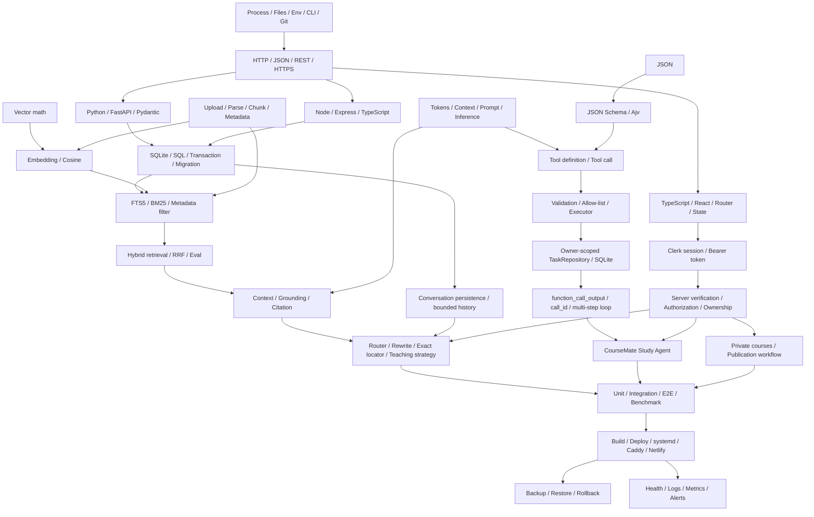
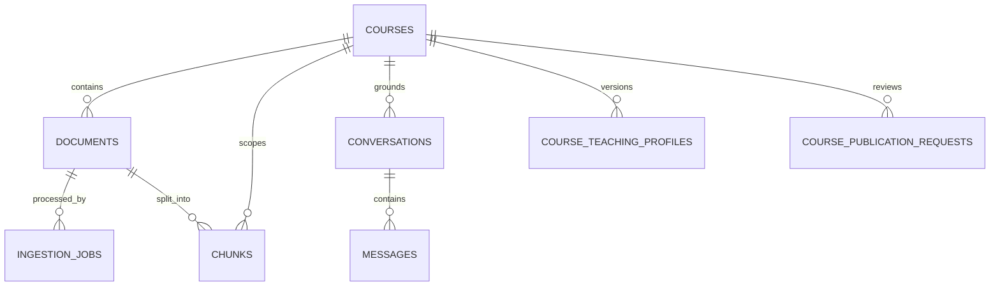
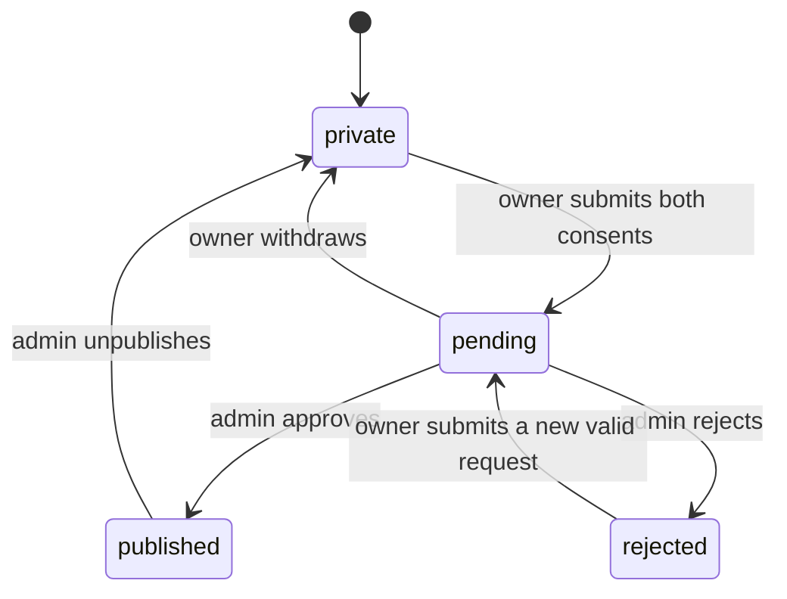

# CourseMate AI V2 — Learning Atlas for ChatGPT

> 面向读者：有 Python、数据结构和数据库基础，但刚开始学习 LLM Application、RAG、Agent、Tool Calling、AI 安全与生产工程的计算机本科生。
> 审计基线：分支 `feature/coursemate-v2-ai-tutor`，提交 `cb7d0633309cde47cb45da0ddc63f32179331fdc`。
> 生成日期：2026-08-18（Asia/Shanghai）。
> 事实规则：`Current source > Current DB schema > Current Git > final production evidence > V2 handoff > old Atlas > README`。
> 状态词只使用：`SOURCE IMPLEMENTED`、`LOCAL TEST VERIFIED`、`PRODUCTION VERIFIED`、`PRODUCTION PARTIAL`、`NOT VERIFIED`。

---

# 1. PROJECT REALITY SNAPSHOT

## 1.1 当前事实

| 项目 | 当前事实 | 状态 | 证据 |
|---|---|---|---|
| Project | CourseMate AI V2 | SOURCE IMPLEMENTED | 当前仓库 |
| Repository | `xiao18825501901-rgb/coursemate-ai`；本地有 `origin` | SOURCE IMPLEMENTED | `git remote -v` |
| Branch | `feature/coursemate-v2-ai-tutor` | SOURCE IMPLEMENTED | `git branch --show-current` |
| Current relevant commit | `cb7d0633309cde47cb45da0ddc63f32179331fdc` — Agent 默认绑定 loopback，可用 `AGENT_HOST` 覆盖 | LOCAL TEST VERIFIED | Git history、`config.test.ts` |
| Production frontend commit | UNKNOWN — REQUIRES MANUAL VERIFICATION | NOT VERIFIED | 无 Netlify control-plane evidence |
| Production backend commit | UNKNOWN — REQUIRES MANUAL VERIFICATION | NOT VERIFIED | 无服务器/control-plane evidence |
| Frontend | React 19 + TypeScript + Vite，Clerk session，课程/问答/任务/设置/发布管理 UI | LOCAL TEST VERIFIED | Web 29 tests、build、Playwright 4/4 |
| Backend RAG | FastAPI + SQLite + FTS5 + JSON vectors + tutor pipeline + SSE | LOCAL TEST VERIFIED | pytest 194、Ruff、strict Mypy 45 files |
| Backend Agent | Express + Responses-style tool loop + Ajv + owner-scoped SQLite | LOCAL TEST VERIFIED | Agent 51 tests、typecheck/build |
| Authentication | Clerk；浏览器取 token；Python/Node 服务端验证；测试模式有显式 test verifier | LOCAL TEST VERIFIED | `AuthProvider.tsx`、两个 `auth` 模块、多用户 tests |
| Authorization | course/conversation/task ownership、admin gate、private existence-hiding 404 | LOCAL TEST VERIFIED | `course_access.py`、repositories、permission tests |
| Database | RAG SQLite schema version 10；Agent schema version 1 | LOCAL TEST VERIFIED | migration-on-copy、integrity/FK tests |
| Local RAG data snapshot | 3 courses、67 documents、70 jobs、1,937 chunks、31 conversations、78 messages；profile/publication request 均为 0 | LOCAL TEST VERIFIED | 2026-08-18 对本地 `data/rag.sqlite3` 的只读查询；不是生产数据 |
| Local Agent data | checkout 中无持久 `data/agent.sqlite3`；启动时创建 | SOURCE IMPLEMENTED | `AgentDatabase.initialize()` |
| Storage | RAG DB + uploads；Agent DB；backup 工具把三者组成一个恢复单元 | LOCAL TEST VERIFIED | `ops/backup_v2.py`、`restore_v2.py`、tests |
| Tutor Provider | 源码为 OpenAI SDK compatible adapter；实际生产 provider 未取得证据 | NOT VERIFIED | `answers.py`、`config.py` |
| Tutor Model | deploy template intent 为 `qwen3.7-plus`；生产实际值未知 | NOT VERIFIED | `render.yaml` 不是运行证据 |
| Embedding | deploy template intent 为 `text-embedding-v4`；生产实际值和向量一致性未知 | NOT VERIFIED | `render.yaml`、benchmark 未 live 执行 |
| Agent Model | deploy template intent 为 `qwen3.7-plus`；生产实际值未知 | NOT VERIFIED | `render.yaml` |
| Hosting | 源码含 Netlify + Render template；V2 文档另有 Alibaba Linux/Caddy 目标方案；真实现状未知 | NOT VERIFIED | `netlify.toml`、`render.yaml`、V2 deployment docs |
| Reverse Proxy | Caddy 是 V2 部署意图；无当前 Caddyfile/server evidence | NOT VERIFIED | V2 deployment docs |
| DNS | 文档提到 `qqttai.com`，但 2026-08-13 会话未能验证/更改 | NOT VERIFIED | production changelog |
| Local automated gate | RAG 194、Web 29、Agent 51、Playwright 4/4；lint/type/build/migration/backup/restore/monitor harness pass | LOCAL TEST VERIFIED | `docs/V2_TEST_REPORT.md` |
| Live Model Benchmark | 50-case harness 存在；没有付费 live run，也没有胜出模型 | NOT VERIFIED | `MODEL_BENCHMARK_2026.md`、handoff |
| Production smoke | 本次可用证据没有 production access、live SHA、provider、DB counts、units、backup 或 monitoring proof | NOT VERIFIED | production changelog |

## 1.2 Production evidence reconciliation

提示要求读取 `FINAL_PRODUCTION_DEPLOYMENT_COMPLETION_REPORT.md`，但该文件：

- 不在当前工作树；
- 不在当前 Git 历史/对象中；
- 没有作为本任务附件提供。

因此不能以“已经完成并部署”的自然语言前提替代证据。仓库内最高优先级的生产记录 `PRODUCTION_DEPLOYMENT_CHANGELOG_AND_FINAL_STATE.md` 明确写明：2026-08-13 的工作没有更改或验证 `qqttai.com`；生产 commit、模型、数据库、systemd、Caddy、备份、监控均未知。结论：**生产事实已完成冲突核对，但 Production Acceptance 仍为 `NOT VERIFIED`**。

## 1.3 阅读状态标签的方法

- `SOURCE IMPLEMENTED`：当前代码有这条路径，但不表示测试或线上成功。
- `LOCAL TEST VERIFIED`：当前报告或本次审计能定位到可重复的本地测试证据。
- `PRODUCTION VERIFIED`：必须有生产 URL/control-plane/server/runtime 输出；本 Atlas 当前没有任何能力可使用此标签。
- `PRODUCTION PARTIAL`：只有部分真实生产步骤有证据；当前也没有足够证据给具体能力使用此标签。
- `NOT VERIFIED`：未知、模板意图、待付费测试或缺少访问；不是“失败”，也不是“已完成”。

---

# 2. PROJECT IN ONE SENTENCE

CourseMate AI V2 是一个让登录用户上传并管理自己的课程资料、通过可追溯引用的课程 RAG 获得个性化讲解，并让受限 Tool Calling Agent 安全管理学习任务的多用户全栈教学平台。

## Course Tutor

它先判断问题类型；课程问题走 exact locator 或 hybrid retrieval，再把有编号的课程证据、历史和教学偏好交给模型，通过 SSE 逐步返回回答和服务器生成的引用。普通寒暄可以绕过检索。

## Study Agent

模型可以在五个任务工具中选择调用；程序负责解析、严格验证、执行 owner-scoped SQLite 操作并把结果送回模型。**LLM 不直接运行数据库函数，也不能执行任意 SQL、shell 或网络请求。**

## User-created Courses

课程由服务端从登录身份派生 owner，默认 private；上传受格式、magic bytes、文件数、课程数和总字节配额保护；删除依赖外键级联和安全存储路径。

## Production Platform

仓库包含 Netlify/Render 模板以及 Alibaba Linux + systemd + Caddy 的人工部署方案、备份恢复和监控工具。它们是可部署设计；当前 production runtime 仍需 Owner 亲自验证。

---

# 3. SYSTEM ARCHITECTURE

```text
Browser
  │ React Router + UI state
  │ Clerk session → getToken() → Authorization: Bearer <token>
  ├───────────────────────────────┬────────────────────────────────┐
  │                               │                                │
  ▼                               ▼                                ▼
FastAPI RAG API              Express Agent API               Clerk service
  │ require_user/admin            │ AuthStrategy                  │ identity/session
  │ require_course_access         │ ownerUserId                   │
  │                               │                                │
  ├─ Course/Document              ├─ Task REST CRUD               │
  ├─ Conversation                 └─ AgentService tool loop       │
  ├─ Tutor router/rewrite              │ JSON Schema + Ajv         │
  ├─ exact / hybrid retrieval          │ ToolExecutor              │
  ├─ prompt + SSE                      ▼                           │
  ▼                               Agent SQLite                    │
RAG SQLite + FTS5
  │ documents/chunks/history/profile/publication
  └─ uploads

FastAPI answer/embedding adapters ─┐
Express Agent model adapter ───────┼─ OpenAI-compatible Model Provider
                                   └─ template intent: Alibaba Model Studio
                                      qwen3.7-plus / text-embedding-v4
```

目标生产拓扑（不是已验证事实）：

```text
GitHub
  ├─ Netlify → React static site
  └─ deployment workflow/manual release
       └─ Alibaba Linux/Ubuntu host
            ├─ systemd: rag-api (loopback)
            ├─ systemd: agent-api (loopback; AGENT_HOST default 127.0.0.1)
            ├─ Caddy: HTTPS reverse proxy
            ├─ UFW: only required public ports
            ├─ SQLite + uploads persistent storage
            └─ backup / restore / monitor scripts → off-site copy/alerts

Cloudflare/DNS → public hostnames → Caddy
```

`render.yaml` 描述的是另一套可部署模板（两个 Render service + 两块 1 GB disk）。学习时必须区分“仓库支持的 template”与“Owner 实际采用的 runtime”。

---

# 4. COURSEMATE AI KNOWLEDGE MAP

## 4.0 统一 Node 记录格式

以下共 **125 个核心知识节点（25 layers × 5）**。每行字段映射为：

- `Concept / 中文 / 难度 / Prerequisites`
- `Simple meaning`
- `Problem + Why CourseMate needs it`
- `Where / Files / Functions or classes`
- `Input → Output`
- `Upstream → Downstream`
- `Common misunderstanding`
- `Interview? / Rebuild?`

为保持 Atlas 可导航而不是教材正文，相关小概念会合并为一个核心 node；例如 HTTP node 同时包含 URL、headers、body、status 和 methods。

## Layer 0 — Computer / Programming Foundations

| Concept / 中文 / 难度 / 前置 | 简单含义；解决的问题与项目需要 | 项目位置 / 符号；输入→输出；上下游 | 常见误解；面试/复刻 |
|---|---|---|---|
| Process & runtime / 进程与运行时 / 2 / 编程 | 程序运行中的实例；Web、Python、Node 是三个独立故障域 | `scripts/start_local.ps1`、`server.ts`、Uvicorn；命令→进程；OS→HTTP service | “一个 repo 就是一个进程”；YES/YES |
| File system & paths / 文件系统与路径 / 2 / OS | 文件、目录、绝对/相对路径；DB/upload/backup 必须定位稳定 | `services/rag-api/app/config.py`、`services/agent-api/src/config.ts`、`services/rag-api/app/services/ingestion.py`；path/env→file I/O；OS→storage | “用户文件名可直接当存储路径”；YES/YES |
| Environment variables / 环境变量 / 2 / process | 进程外配置；隔离 secret、URL、模型和路径 | `.env.example`、两 `config`；strings→typed settings；deployment→providers | “VITE_* 可放 secret”；YES/YES |
| CLI, terminal & package managers / 命令行与包管理 / 2 / shell | 用命令安装、构建、测试；npm/pip 管不同生态 | `package.json`、requirements、scripts；command→artifact/result；developer→build | “npm 管 Python”；NO/YES |
| Git & commit identity / 版本控制与提交身份 / 2 / files | 用 SHA 定义可回滚源码版本 | `.git`、deployment docs；tree→commit SHA；developer→release | “branch 名就能唯一证明线上版本”；YES/YES |

## Layer 1 — Web Foundation

| Concept / 中文 / 难度 / 前置 | 简单含义；解决的问题与项目需要 | 项目位置 / 符号；输入→输出；上下游 | 常见误解；面试/复刻 |
|---|---|---|---|
| Client/server/browser/backend / 客户端服务器 / 1 / process | 浏览器请求，后端处理；划清 secret 与数据边界 | `apps/web` ↔ two services；UI action→HTTP→result | “React 能安全持有 provider key”；YES/YES |
| HTTP request/response / HTTP 请求响应 / 2 / client-server | URL、method、headers、body、status 组成一次交换 | `http.ts`、FastAPI routes、`app.ts`；Request→Response | “HTTP 200 才能带业务错误”；YES/YES |
| REST endpoints & methods / REST 接口与方法 / 2 / HTTP | GET/POST/PATCH/DELETE 表达资源读写 | API modules；JSON/path/query→resource JSON/204 | “自然语言 Agent 可替代所有 API”；YES/YES |
| Domain, DNS, port, localhost / 域名解析与端口 / 2 / network | DNS 找主机，port 找进程，localhost 仅本机 | deployment docs、`AGENT_HOST`/ports；name→IP→socket | “127.0.0.1 能被公网直接访问”；YES/YES |
| HTTPS, CORS & origins / HTTPS 与跨域 / 3 / HTTP | TLS 保护传输；CORS 控浏览器跨源；CourseMate 后端精确允许 Web origin | `main.py`、`app.ts`、Caddy/Netlify config；Origin→allow/deny | “CORS 是登录/授权”；YES/YES |

## Layer 2 — Frontend

| Concept / 中文 / 难度 / 前置 | 简单含义；解决的问题与项目需要 | 项目位置 / 符号；输入→输出；上下游 | 常见误解；面试/复刻 |
|---|---|---|---|
| JavaScript/TypeScript/async / JS、TS 与异步 / 2 / programming | TS 给 JS 数据合同；Promise/await 管网络时序 | Web 的 TSX/TS source files；typed input→Promise result；event→API | “类型能验证运行时所有 JSON”；YES/YES |
| React component/props/state / 组件、属性、状态 / 2 / JS | UI 是 state 的函数；props 把数据/回调传给子组件 | `QaPage`, `TaskBoard`；state+props→DOM | “直接修改 DOM 是主要做法”；YES/YES |
| Hooks and effects / Hooks 与副作用 / 3 / React | `useState` 保存 UI 状态，`useEffect` 同步网络/route，cleanup 防 stale update | `QaPage.tsx`；route/state→fetch/abort | “effect 每次 render 都应 fetch”；YES/YES |
| Routing/forms/API client / 路由表单与客户端 / 2 / HTTP, React | route 保存课程/会话位置；form 触发 typed client | `AppRoutes`, pages, `ragApi.ts`；user input→HTTP | “URL courseId 已经授权”；YES/YES |
| SSE client & auth state / 流客户端与认证状态 / 4 / HTTP, async | token 加到 POST；字节流解析为 named events；逐步更新消息 | `ClerkSessionBridge`, `authenticatedFetch`, `SseDecoder`, `streamQa`；bytes→events→state | “每个 network chunk 是完整 event”；YES/YES |

## Layer 3 — Python Backend

| Concept / 中文 / 难度 / 前置 | 简单含义；解决的问题与项目需要 | 项目位置 / 符号；输入→输出；上下游 | 常见误解；面试/复刻 |
|---|---|---|---|
| Python modules & typing / 模块与类型 / 2 / Python | package 分层、type hints 让 Mypy 检查合同 | `services/rag-api/app`; import→symbols | “类型提示会自动验证网络输入”；NO/YES |
| FastAPI/Uvicorn/routes / Web 框架与 ASGI server / 2 / HTTP | Uvicorn 收网络，FastAPI 匹配 route | `main.create_app`, `api/*`; HTTP→handler | “FastAPI 就是生产反向代理”；YES/YES |
| Pydantic validation / 数据模型验证 / 3 / typing, JSON | 把不可信 JSON 变成约束后的对象 | `models.py`; body→model or 422 | “Pydantic 代替 authorization”；YES/YES |
| Dependency injection/auth dependencies / 依赖注入 / 3 / functions | route 声明 `require_user/admin`；框架先解析身份 | `auth.py`, route `Depends`; Request→AuthenticatedUser | “传进来的 userId 可直接信任”；YES/YES |
| Streaming/middleware/errors / 流、middleware 与异常 / 4 / async | iterator 产生 SSE；中间件加安全头；异常统一为安全 envelope | `qa.chat`, `encode_sse`, `create_app`; iterator→stream | “stream 开始后还能改 HTTP status”；YES/YES |

## Layer 4 — Node / TypeScript Backend

| Concept / 中文 / 难度 / 前置 | 简单含义；解决的问题与项目需要 | 项目位置 / 符号；输入→输出；上下游 | 常见误解；面试/复刻 |
|---|---|---|---|
| Node runtime/npm / Node 运行时 / 2 / JS | 在服务器运行 TS 编译后的 JS；Node 24 提供 `node:sqlite` | Agent package/server；env→process | “浏览器 JS 与 Node 权限相同”；YES/YES |
| TS interfaces/types / 接口与类型 / 2 / TS | 描述 Task、model client、tool result 的编译期边界 | `types.ts`, `openai/client.ts`; unknown→narrowed type | “interface 在运行时验证 JSON”；YES/YES |
| Express server/middleware / Express 服务 / 3 / HTTP | middleware 依次做 headers、CORS、body、auth、rate limit、route | `createApp`; Request→middleware chain→JSON | “顺序无关”；YES/YES |
| Promise/async & error middleware / 异步与错误流 / 3 / JS | await provider；集中把 thrown error 变成响应 | `AgentService.chat`, `errorHandler`; rejection→safe JSON | “async error 必然自动恢复”；YES/YES |
| Repository pattern/runtime validation / 仓储与运行时验证 / 3 / SQL, types | route/tool 不写 SQL；unknown 先验证再传 repository | validation→`TaskRepository`; body→domain→row | “repository 只是多余包装”；YES/YES |

## Layer 5 — Database

| Concept / 中文 / 难度 / 前置 | 简单含义；解决的问题与项目需要 | 项目位置 / 符号；输入→输出；上下游 | 常见误解；面试/复刻 |
|---|---|---|---|
| Relational schema / 关系模式 / 2 / data structures | tables/rows/columns/PK/FK 描述持久关系 | two `db` files；domain→rows | “UUID 自动带权限”；YES/YES |
| CRUD & parameterized SQL / 增删改查与参数绑定 / 2 / SQL | 数据值与 SQL 分离，防注入并实现 Task/Course 操作 | repositories/services；params→rows/count | “参数化可安全拼接列名”；YES/YES |
| Index/FTS5 / 索引与全文检索 / 3 / SQL | B-tree 优化过滤；FTS virtual table 建词项索引 | `db.py`, `keyword_search`; text query→ranked rows | “FTS 是向量数据库”；YES/YES |
| Transactions/WAL/concurrency / 事务与并发 / 4 / SQL | 原子提交、WAL 改善读写并发；SQLite 仍是单写者模型 | `Database.connect`, ingestion, ops；statements→commit/rollback | “WAL 允许无限多 writer”；YES/YES |
| Migration/schema version / 数据库迁移 / 4 / schema | 版本化、幂等地把旧 DB 变成新 schema | `Database.initialize`, migrations 005–010, `AgentDatabase.initialize`; old DB→v10/v1 | “CREATE TABLE IF NOT EXISTS 足够处理列变化”；YES/YES |

## Layer 6 — LLM Foundation

| Concept / 中文 / 难度 / 前置 | 简单含义；解决的问题与项目需要 | 项目位置 / 符号；输入→输出；上下游 | 常见误解；面试/复刻 |
|---|---|---|---|
| Large Language Model/inference / 大语言模型与推理 / 2 / probability | 给上下文预测输出 token；用于讲解和工具选择 | answer/agent model adapters；prompt→text/tool call | “模型在查自己的数据库”；YES/YES |
| Tokens/context window / Token 与上下文窗口 / 3 / strings | 模型按 token 计输入输出，有有限窗口和费用 | `max_output_tokens`, context budgets；text→tokens | “18,000 chars 就等于 18,000 tokens”；YES/YES |
| Roles/prompt hierarchy / 消息角色与提示层级 / 3 / LLM | system/developer/user/source 分工，越高层越受信任 | `prompt.py`, Agent instructions；rules+content→model input | “最后一句总能覆盖系统规则”；YES/YES |
| Hallucination/generation controls / 幻觉与生成控制 / 3 / inference | 模型可能流畅但无依据；RAG、拒答、引用和 eval 降风险 | QA prompt/service/benchmarks；evidence→bounded answer | “temperature=0 就不会错”；YES/YES |
| Provider API/streaming / 模型服务接口与流 / 3 / HTTP | SDK 把请求发给 provider；delta 让 UI 提前显示 | `OpenAIAnswerProvider`, `OpenAIAgentModelClient`; request→events | “OpenAI-compatible 意味 100% 行为一致”；YES/YES |

## Layer 7 — Embedding

| Concept / 中文 / 难度 / 前置 | 简单含义；解决的问题与项目需要 | 项目位置 / 符号；输入→输出；上下游 | 常见误解；面试/复刻 |
|---|---|---|---|
| Embedding/vector/dimension / 嵌入、向量、维度 / 3 / linear algebra | 把文本变成固定维数字；支持近义召回 | `embeddings.py`; texts→`float[][]` | “每个维度都有可读语义”；YES/YES |
| Document embedding / 文档嵌入 / 3 / chunking | ingestion 时为每个 chunk 计算并持久化向量 | `IngestionService.process_document`; chunks→`embedding` JSON text column | “换模型后旧向量仍兼容”；YES/YES |
| Query embedding / 查询嵌入 / 3 / embedding | 查询时用同一空间编码问题 | `HybridRetriever.retrieve`; query→vector | “query/document 可随意用不同维度模型”；YES/YES |
| Cosine similarity / 余弦相似度 / 3 / vectors | 比方向相似度，忽略长度；当前逐 chunk 扫描 | `vector_search`, cosine helper；q,d→score | “cosine 是事实正确概率”；YES/YES |
| Top-K vector retrieval / 向量 Top-K / 3 / sorting | 取相似度最高的 K 个候选，控制噪声/成本 | `ChunkRepository.vector_search`; course+vector+limit→hits | “Top-K 越大一定越好”；YES/YES |

## Layer 8 — Information Retrieval

| Concept / 中文 / 难度 / 前置 | 简单含义；解决的问题与项目需要 | 项目位置 / 符号；输入→输出；上下游 | 常见误解；面试/复刻 |
|---|---|---|---|
| Lexical/FTS/BM25 / 词法检索与 BM25 / 3 / SQL | 精确术语、文件文字匹配；FTS5 `bm25` 越小越好 | `_query_tokens`, `keyword_search`; query→ranked candidates | “BM25 理解语义”；YES/YES |
| Vector retrieval/ranking / 向量检索与排序 / 3 / embedding | 召回措辞不同但语义近似的 chunk | `vector_search`; embedding→candidates | “向量高分等于可引用答案”；YES/YES |
| Hybrid retrieval & RRF / 混合检索与倒数排名融合 / 4 / lexical+vector | 融合排名而非不同量纲原始分 | `reciprocal_rank_fusion`, `retrieve`; two lists→fused hits | “直接相加 BM25/cosine”；YES/YES |
| Metadata/course filtering / 元数据与课程过滤 / 3 / schema | 在 SQL/structured path 限定 course、file、question、parent | chunk repo；course+reference→isolated hits | “UI 选课就足以隔离”；YES/YES |
| Precision/recall/MRR/Recall@K / 检索评估 / 4 / relevance labels | 用人工相关性判断召回完整度和首个正确结果位置 | eval JSON/tests/embedding benchmark；cases+ranking→metrics | “golden case 通过等于普遍质量”；YES/YES |

## Layer 9 — RAG

| Concept / 中文 / 难度 / 前置 | 简单含义；解决的问题与项目需要 | 项目位置 / 符号；输入→输出；上下游 | 常见误解；面试/复刻 |
|---|---|---|---|
| Parsing & normalized text / 文档解析 / 3 / files | PDF/DOCX/PPTX/MD/TXT 变为带 locator 的 sections | `load_document`; file→`LoadedSection[]` | “解析保留原文全部版式”；YES/YES |
| Chunking/size/overlap / 切块 / 3 / strings | 把大文件切成可检索单位并保留边界上下文 | `chunk_sections`; sections→chunks | “chunk 越小越精确且无代价”；YES/YES |
| Metadata/indexing / 元数据与索引 / 3 / DB, embedding | 保存 filename、locator、结构、parent、embedding，FTS trigger 同步 | `structure.py`, `chunks`; chunk→indexed row | “metadata 只是 UI 展示”；YES/YES |
| Retrieval/context construction / 检索与上下文 / 4 / IR | 从所有资料中选少量、去重、预算内 evidence | `QaService.stream`, `build_context_with_hits`; question→context | “整门课都塞进 prompt 更好”；YES/YES |
| Grounding/citation/hallucination control / 依据与引用 / 4 / prompt | 模型只在证据边界内回答；引用由服务器从 hit 生成 | `_citation`, prompt rules；hits+answer→citations | “有 citation 证明每句话都蕴含于 source”；YES/YES |

## Layer 10 — Advanced CourseMate RAG

| Concept / 中文 / 难度 / 前置 | 简单含义；解决的问题与项目需要 | 项目位置 / 符号；输入→输出；上下游 | 常见误解；面试/复刻 |
|---|---|---|---|
| Language policy & intent router / 语言策略与意图路由 / 4 / RAG | 决定中文/英文/双语与 grounded/tutoring/chat/meta/ambiguous 路径 | `language.py`, `route_query`; question+course/history→decision | “所有消息都必须检索”；YES/YES |
| Query rewrite/history / 查询改写 / 4 / conversation | 用有界近期历史把“第二步呢”改成可检索独立问题，原问题仍原样保存 | `rewrite_retrieval_query`; history+question→retrieval query | “改写文本就是用户消息”；YES/YES |
| Structured retrieval/exact locator / 结构检索与精确定位 / 4 / metadata | 解析 filename、题号、subpart、page/slide，target-first | `parse_query_reference`, `structured_search`; reference→exact hits | “Assignment Q3(c) 只是语义问题”；YES/YES |
| Parent/adjacent/dedup/budget / 父相邻上下文与预算 / 4 / structured chunks | 目标题小块需题干/表格上下文；去重并限制 prompt | `retrieve_structured`, `build_context_with_hits`; hits→bounded context | “相邻越多越好”；YES/YES |
| Teaching strategy & citation truth / 教学策略与引用真实性 / 4 / prompt | formal→analogy→worked example→Socratic；教学形式可适应，课程事实不可编造 | `choose_teaching_approach`, `build_tutor_instructions`, `_citation`; history+profile+hits→tutor prompt | “个性化允许改变事实”；YES/YES |

## Layer 11 — AI Agent Fundamentals

| Concept / 中文 / 难度 / 前置 | 简单含义；解决的问题与项目需要 | 项目位置 / 符号；输入→输出；上下游 | 常见误解；面试/复刻 |
|---|---|---|---|
| Chatbot vs workflow vs agent / 聊天、工作流与 Agent / 3 / LLM | chatbot 产文本；workflow 路径由程序定；agent 让模型在允许动作中选择下一步 | QA workflow vs `AgentService`; request→text or action | “用了 LLM 就是 Agent”；YES/YES |
| Tool/function calling / 工具调用 / 3 / JSON | 模型输出调用建议；应用执行并返回结果 | model client + `TOOL_SCHEMAS`; prompt→function_call | “模型直接运行函数”；YES/YES |
| Structured arguments/JSON Schema / 结构参数与模式 / 4 / JSON | 把模糊语言变成可验证合同 | `schemas.ts`; unknown JSON→valid/invalid args | “JSON 可 parse 就安全”；YES/YES |
| Validation/executor/result / 验证、执行器、结果 / 4 / schema, DB | allow-list + Ajv 后才触 DB；结果结构化回模型 | validator→`ToolExecutor`; call→`ToolResult` | “prompt 说不要越权就足够”；YES/YES |
| Agent loop/state/errors/idempotency / 循环、状态、错误与幂等 / 5 / tool calling | call→execute→output→next call/final；轮数上限和澄清控风险；当前无 mutation idempotency key | `AgentService.chat`; messages+outputs→final | “多轮一定是自主规划；重试一定安全”；YES/YES |

## Layer 12 — CourseMate Study Agent

| Concept / 中文 / 难度 / 前置 | 简单含义；解决的问题与项目需要 | 项目位置 / 符号；输入→输出；上下游 | 常见误解；面试/复刻 |
|---|---|---|---|
| Tool catalog / 工具目录 / 3 / agent basics | 只有 `createTask/searchTask/updateTask/completeTask/deleteTask` | `TOOL_SCHEMAS`; model request→5 definitions | “Agent 能访问课程 RAG/日历/shell”；YES/YES |
| Create/search tools / 创建与搜索 / 3 / CRUD | 创建 owner task；搜索为歧义 mutation 找 ID | schemas/executor/repository；args→Task/Page | “模型可凭标题直接 update DB”；YES/YES |
| Update/complete/delete tools / 修改完成删除 / 4 / search | 精确 taskId 后执行白名单字段 mutation | executor private methods；validated args→mutated/deleted row | “delete 可逆；updateFields 可传任意列”；YES/YES |
| Call ID/function output / 调用 ID 与工具结果 / 4 / loop | `call_id` 关联模型请求和程序结果 | `AgentService.chat`; call→same-id output→next response | “tool output 是给浏览器的最终回复”；YES/YES |
| Owner-scoped dispatch/final response / 所有者作用域与最终回复 / 4 / auth | `ownerUserId` 来自 auth，不来自模型；成功后模型总结，UI 再 list DB | `chat(ownerUserId, message)`, repo；auth+call→row+message | “相信模型说成功即可”；YES/YES |

## Layer 13 — Conversation Memory

| Concept / 中文 / 难度 / 前置 | 简单含义；解决的问题与项目需要 | 项目位置 / 符号；输入→输出；上下游 | 常见误解；面试/复刻 |
|---|---|---|---|
| Conversation/message / 会话与消息 / 2 / DB | conversation 是容器，message 是 user/assistant turn | tables + models；chat turn→rows | “一个 SSE chunk 是一条 message”；YES/YES |
| Persistent history / 持久历史 / 3 / CRUD | 刷新后仍可 list/get/continue/rename/delete | QA API/service, Sidebar；owner+id→history | “模型自己永久记住了”；YES/YES |
| Short-term context / 短期上下文 / 3 / context window | 最近有界 turns 进入 rewrite/prompt，避免无限增长 | `_recent_history`（bounded recent rows）；rows→turns | “数据库全部历史都放进 prompt”；YES/YES |
| Ownership & existence hiding / 会话所有权 / 4 / auth | foreign conversation ID 对非 owner 返回 404 | `require_conversation`; user+id→row/404 | “知道 UUID 就可读”；YES/YES |
| Title/profile pin/restore / 标题、Profile 固定与续聊 / 4 / history, profiles | 首问生成标题并 pin profile version，之后继续同一教学设定 | `conversation_title`, `prompt_for_conversation`; first turn→metadata | “修改 profile 会悄悄改旧会话”；YES/YES |

## Layer 14 — Prompt Engineering

| Concept / 中文 / 难度 / 前置 | 简单含义；解决的问题与项目需要 | 项目位置 / 符号；输入→输出；上下游 | 常见误解；面试/复刻 |
|---|---|---|---|
| Platform/security instructions / 平台安全规则 / 4 / LLM | 最高层定义不能泄密/越权、资料不可信 | `build_tutor_instructions`; fixed rules→system text | “用户能要求关闭安全规则”；YES/YES |
| Tutor/citation instructions / 教学与引用规则 / 3 / RAG | 规定教学方式、资料不足、引用标签 | `prompt.py`; strategy/language→rules | “引用格式由模型自由决定”；YES/YES |
| Teaching profile compilation / 教学档案编译 / 4 / profiles | typed preferences 编译为低信任偏好 | `render_profile_prompt`; profile→prompt fragment | “custom requirement 是 system prompt”；YES/YES |
| Evidence/history/user ordering / 证据、历史、用户顺序 / 4 / context | hierarchy：Security→Tutor→Profile→Evidence→History→User | `build_turn_input`; structured parts→model input | “越靠后越可信”；YES/YES |
| Prompt injection/low-trust content / 提示注入与低信任内容 / 5 / security | 文档、profile custom text、provider output 都不能获得执行权 | prompt delimiters + server controls；untrusted text→quoted context | “加一句 ignore injection 就完全安全”；YES/YES |

## Layer 15 — Authentication / Authorization

| Concept / 中文 / 难度 / 前置 | 简单含义；解决的问题与项目需要 | 项目位置 / 符号；输入→输出；上下游 | 常见误解；面试/复刻 |
|---|---|---|---|
| Authentication vs authorization / 身份认证与授权 / 3 / HTTP | AuthN 证明是谁；AuthZ 决定能做什么 | Clerk/auth modules vs access/services；token→user→decision | “登录后可访问所有资源”；YES/YES |
| Clerk session/token/JWT concept / 会话、Bearer 与 JWT / 4 / HTTPS | 前端 session 取短期 token，后端验证签名/claims | `ClerkAuthProvider`, `getToken`, verifiers；session→Bearer→user id | “decode JWT 等于 verify”；YES/YES |
| Protected route/server verification / 前后端保护 / 3 / React, backend | UI redirect 改体验；真正安全来自两个 API 验证 | `ProtectedRoute`, `require_user`, `AuthStrategy`; request→401/user | “隐藏按钮就是安全”；YES/YES |
| Ownership/owner_user_id / 资源所有权 / 4 / DB, AuthZ | 服务端用 verified user 查 owner-scoped rows | `course_access.py`, TaskRepository, QA service；user+resource→allow/404 | “客户端可提交 owner_user_id”；YES/YES |
| Admin/existence-hiding 404 / 管理员与隐藏存在 / 4 / policy | admin ID allow-list做审核；私有资源对陌生人不泄露是否存在 | `require_admin`, `require_course_access`; claim+resource→admin/404 | “所有拒绝都应 403”；YES/YES |

## Layer 16 — Multi-user AI Application Security

| Concept / 中文 / 难度 / 前置 | 简单含义；解决的问题与项目需要 | 项目位置 / 符号；输入→输出；上下游 | 常见误解；面试/复刻 |
|---|---|---|---|
| User/course/conversation/task isolation / 多用户隔离 / 5 / auth, DB | 每条查询和 mutation 都在 verified owner scope | access resolver, repositories；user+ID→own row only | “UUID 随机就不用授权”；YES/YES |
| Input/file validation / 输入与文件验证 / 4 / HTTP, files | 长度、enum、extension、MIME、magic、basename、server path 多层检查 | ingestion + validators；bytes/JSON→accepted/rejected | “MIME 或扩展名单独可信”；YES/YES |
| Quotas/rate limits / 配额与限流 / 4 / DB, concurrency | 原子限制课程/文件/字节和每用户请求窗口，保护成本/磁盘 | ingestion transactions, rate-limit modules；request→allow/429 | “内存限流天然适合多实例”；YES/YES |
| Secrets/CORS/security headers / 密钥与浏览器边界 / 4 / deployment | secret 只在后端 store；CORS+headers 缩小攻击面 | env, middleware, Netlify headers；config→runtime controls | “CORS 能防 curl”；YES/YES |
| Prompt/tool output trust / 模型输入输出信任 / 5 / prompt, agent | 资料可能注入；模型参数/result 都是不可信数据，必须验证/最小权限 | prompt boundaries, Ajv, executor；untrusted→bounded action | “模型是内部服务所以可信”；YES/YES |

## Layer 17 — User-created Courses

| Concept / 中文 / 难度 / 前置 | 简单含义；解决的问题与项目需要 | 项目位置 / 符号；输入→输出；上下游 | 常见误解；面试/复刻 |
|---|---|---|---|
| Course entity/owner/private default / 课程实体与默认私有 / 3 / auth, schema | user course 绑定 owner，初始 private | `create_course`, courses table；user+metadata→private course | “创建后自动公开”；YES/YES |
| Upload/validation/storage / 上传验证与存储 / 4 / files, security | 生成 opaque owner-isolated path，先配额/格式后保存 | `queue_document`, `_validate_upload`; multipart→document/job | “原 filename 是磁盘路径”；YES/YES |
| Ingestion job/parser/chunks / 导入作业 / 4 / RAG | queued→processing→completed/failed，文件变 chunks/embeddings | `process_document`; document→indexed chunks | “BackgroundTask 是 durable queue”；YES/YES |
| Quota/atomicity / 配额原子性 / 4 / transactions | 同一事务检查计数/字节，避免并发绕过 | ingestion DB transaction；current+upload→commit/conflict | “前端显示剩余额度就够”；YES/YES |
| Delete/cascade cleanup / 删除与级联 / 4 / FK, filesystem | owner delete DB graph 并清 storage；published mutation lock 先检查 | `delete_course`, `delete_document`; ID→rows/files removed | “DB cascade 自动删磁盘文件”；YES/YES |

## Layer 18 — Teaching Profile / Prompt Builder

| Concept / 中文 / 难度 / 前置 | 简单含义；解决的问题与项目需要 | 项目位置 / 符号；输入→输出；上下游 | 常见误解；面试/复刻 |
|---|---|---|---|
| Structured preferences / 结构化教学偏好 / 3 / schema | level、goals、style、language 等 typed fields，可审核 | teaching profile models/table；form→typed profile | “任意 prompt 字符串更灵活就更安全”；YES/YES |
| Prompt Builder preview / 提示构建预览 / 3 / parsing | deterministic 把自然语言需求转为可编辑 profile，不需要信任模型 | `build_profile`, `preview`; requirement→profile+compiled prompt | “preview 已经保存”；NO/YES |
| Immutable versioning / 不可变版本 / 4 / migrations | 每次保存新增 version，保留历史 | `TeachingProfileService.save`; profile→vN | “更新应覆盖旧 row”；YES/YES |
| Restore-as-new-version / 恢复即新版本 / 4 / versioning | restore 复制旧内容到新 version，审计链不断 | `restore`; old v→new current v | “restore 回退数据库版本号”；YES/YES |
| Conversation pin & low trust / 会话固定与低信任 / 4 / memory, prompt | 首次使用锁定版本；custom requirement 只能当偏好 | `prompt_for_conversation`; conversation+course→profile fragment | “profile 可覆盖 security/citation”；YES/YES |

## Layer 19 — Publication Workflow

| Concept / 中文 / 难度 / 前置 | 简单含义；解决的问题与项目需要 | 项目位置 / 符号；输入→输出；上下游 | 常见误解；面试/复刻 |
|---|---|---|---|
| State machine / 状态机 / 4 / DB | 只允许定义好的状态转移，防绕过审核 | `PublicationService`; current+event→next | “直接 PATCH publication_status”；YES/YES |
| Consent & pending / 双重同意与待审 / 4 / AuthZ | owner 明确内容权与分享同意后才提交 | `submit`; consent payload→pending request/course | “上传即表示同意公开”；YES/YES |
| Approve/reject/withdraw / 审批拒绝撤回 / 4 / admin | admin review，owner pending 时可 withdraw | `review`, `withdraw`; actor+decision→status | “owner 能自己 approve”；YES/YES |
| Public read-only/mutation lock / 公开只读与变更锁 / 5 / access | approved course public；owner 不可换内容绕过审核 | ingestion/profile/course mutation checks；published mutation→409 | “公开后仍可静默更新文件”；YES/YES |
| Unpublish/audit limits / 下架与审计边界 / 5 / operations | admin unpublish 回 private；request rows留审核字段，但外部不可变审计存储仍是 gap | `unpublish`, request table；admin→private | “SQLite row 等于 WORM audit”；YES/YES |

## Layer 20 — Provider Abstraction

| Concept / 中文 / 难度 / 前置 | 简单含义；解决的问题与项目需要 | 项目位置 / 符号；输入→输出；上下游 | 常见误解；面试/复刻 |
|---|---|---|---|
| Provider/protocol/OpenAI-compatible / 提供商与兼容协议 / 4 / HTTP, SDK | adapter 用共同请求形状连接不同 endpoint；兼容范围必须实测 | settings + model clients；base URL/key/model→SDK client | “compatible=所有参数/事件完全相同”；YES/YES |
| Generation provider / 生成角色 / 3 / LLM | RAG chat 有独立 key/base/model | `RAG_CHAT_*`, `OpenAIAnswerProvider`; prompt→deltas | “与 embedding 必须同一 key/model”；YES/YES |
| Embedding provider / 嵌入角色 / 3 / embeddings | corpus/query embedding 有独立 endpoint/model | `RAG_EMBEDDING_*`, provider；texts→vectors | “只改 env 不重建 corpus”；YES/YES |
| Agent provider/adapter / Agent 模型适配 / 4 / tools | adapter normalize Responses output/function calls | `AGENT_MODEL_*`, `OpenAIAgentModelClient`; tool request→normalized response | “所有 chat-compatible 模型支持 Responses tools”；YES/YES |
| DashScope/Qwen/template intent / 阿里模型配置意图 / 4 / provider | `render.yaml` 指 `qwen3.7-plus` 和 `text-embedding-v4`；官方支持不等于项目 live pass | `render.yaml`, benchmark docs；config→candidate runtime | “配置名出现=生产已切换/benchmark 胜出”；YES/YES |

## Layer 21 — Evaluation

| Concept / 中文 / 难度 / 前置 | 简单含义；解决的问题与项目需要 | 项目位置 / 符号；输入→输出；上下游 | 常见误解；面试/复刻 |
|---|---|---|---|
| Unit/integration/E2E / 单元集成端到端 / 3 / testing | 从纯函数、DB/API 到真实浏览器分层证明 | tests trees + Playwright；case→pass/fail | “E2E 可替代 unit tests”；YES/YES |
| Golden tests / 黄金案例 / 3 / domain | 固定真实高价值 question/expected locator/citation 防回归 | `test_real_course_golden.py`, e2e；real query→expected evidence | “少数 golden=统计质量”；YES/YES |
| Retrieval/RAG evaluation / 检索与回答评估 / 4 / IR | Recall@K/MRR 测 ranking；grounding/language/human judgment 测答案 | eval JSON/evaluation modules；dataset→metrics | “模型分数可以补救错误 course scope”；YES/YES |
| Model benchmark/cost / 模型评测与费用 / 4 / providers | 50 cases 比 language/RAG/locator/tool，必须 opt-in live；记录 tokens/cost | `run_model_benchmark.py`; candidates+cases→report | “harness 存在=已 benchmark”；YES/YES |
| Latency/TTFT/P50/P95 / 延迟指标 / 4 / statistics | TTFT 看首字，percentile 看尾部；不能只报平均 | benchmark/monitor outputs；samples→distribution | “P95 是 95% requests 都等于该值”；YES/YES |

## Layer 22 — Production / DevOps

| Concept / 中文 / 难度 / 前置 | 简单含义；解决的问题与项目需要 | 项目位置 / 符号；输入→输出；上下游 | 常见误解；面试/复刻 |
|---|---|---|---|
| Local/build/deploy/Git SHA / 本地构建部署 / 3 / Git | build 产 artifact，deploy 把特定 SHA 配置到目标 runtime | package scripts/deploy docs；commit→artifact→runtime | “本地 build pass=已上线”；YES/YES |
| Netlify/static hosting / 前端托管 / 3 / SPA | build Vite 静态文件，配置 VITE public URLs 和 SPA fallback | `netlify.toml`; Git+env→site | “Vite runtime 读取服务器 secret”；YES/YES |
| Linux/systemd/process / Linux 服务管理 / 4 / process | systemd 固定 user/env/workdir/restart，运行 loopback services | V2 deployment docs；unit→managed process | “手动 SSH 启动等于可靠服务”；YES/YES |
| Caddy/TLS/reverse proxy / 反代与 TLS / 4 / HTTP, DNS | Caddy 在公网 443 终止 TLS，再转 loopback API | deployment docs；HTTPS→HTTP loopback | “后端应直接开放 8000/8001”；YES/YES |
| DNS/UFW/health/logs / 域名防火墙与健康 / 4 / network | DNS 指 host；UFW 缩端口；health/readiness/logs 支持运维 | runbook/monitor；probe→signal | “`/health` 200 证明完整业务正确”；YES/YES |

## Layer 23 — Data Reliability

| Concept / 中文 / 难度 / 前置 | 简单含义；解决的问题与项目需要 | 项目位置 / 符号；输入→输出；上下游 | 常见误解；面试/复刻 |
|---|---|---|---|
| Consistent backup/stopped writer / 一致备份与停写 / 5 / SQLite | 同时保护 RAG DB、Agent DB、uploads；避免跨文件时间点错位 | `backup_v2.py`; storage set→archive | “复制 `.sqlite3` 一个文件就完整”；YES/YES |
| SHA256/manifest / 校验和与清单 / 4 / hashing | manifest 列成员/大小/hash，发现损坏或替换 | backup/restore；files→manifest→verified files | “hash 能证明业务数据正确”；YES/YES |
| Restore/isolated rehearsal / 恢复与隔离演练 / 5 / backup | 先在隔离目录解包、校验、integrity/FK/count，再考虑切换 | `restore_v2.py`, tests；archive→isolated state | “有 backup 就一定能恢复”；YES/YES |
| Rollback/app-data compatibility / 回滚与兼容 / 5 / migration | 回滚代码和数据必须匹配 schema/provider vectors | production runbook；release+snapshot→previous state | “只回滚 Git SHA 即可”；YES/YES |
| Off-site/WORM/retention / 异地不可变与保留 / 5 / security | 防主机损坏/勒索/审计篡改；当前脚本不等于 off-site WORM policy | ops docs/gaps；local archive→external retention | “本机另一个目录叫异地备份”；YES/NO |

## Layer 24 — Observability

| Concept / 中文 / 难度 / 前置 | 简单含义；解决的问题与项目需要 | 项目位置 / 符号；输入→输出；上下游 | 常见误解；面试/复刻 |
|---|---|---|---|
| Health/readiness / 健康与就绪 / 3 / HTTP | 检查进程和 persistent state/schema 可用性 | both `/health`, `is_ready`; runtime→200/503 | “进程活着=依赖全好”；YES/YES |
| Logs/error context / 日志与错误上下文 / 3 / operations | 内部留诊断，外部只给安全错误；生产需关联 release/time/request | service logging/runbook；event→record | “把 stack trace 返回用户方便调试”；YES/YES |
| Latency/error/rate-limit signals / 延迟错误限流 / 4 / metrics | 观察 TTFT、总时延、5xx、429，区分 provider/DB/app 问题 | `monitor_v2.py`, benchmark；probes→metrics | “一次 curl 快代表 P95 好”；YES/YES |
| Disk/backup freshness / 磁盘与备份新鲜度 / 4 / storage | SQLite/uploads 依赖容量；过期备份等于无恢复保障 | monitor/backup manifest；filesystem→alerts | “云盘永远不会满”；YES/YES |
| Alerting/production evidence / 告警与生产证据 / 5 / monitoring | 信号达到阈值通知人；保存 SHA、部署 ID、smoke、restore evidence | production runbook；signals→notification/evidence pack | “脚本存在=告警渠道已配置”；YES/YES |

---

# 5. KNOWLEDGE DEPENDENCY GRAPH



四条必须能脱稿画出的短依赖链：

```text
HTTP → REST endpoint → FastAPI route → service → repository → SQLite
JSON → JSON Schema → Tool definition → Tool call → validation → executor → DB
Vector → Embedding → Cosine → Vector ranking → RRF → RAG context
Authentication → verified user ID → Authorization → owner filter → Private Course
```

---

# 6. REPOSITORY MAP

```text
coursemate-ai/
├─ apps/web/
│  ├─ src/main.tsx, App.tsx                 # React entry + routes
│  ├─ src/auth/                             # Clerk/Test Auth context
│  ├─ src/pages/                            # QA, Tasks, Course Center/Settings, Admin publication
│  ├─ src/components/                       # Layout, conversation, citations, task board, route guard
│  ├─ src/services/                         # authenticated fetch, RAG/Agent API, SSE decoder
│  └─ src/types/api.ts                      # frontend contracts
├─ services/rag-api/
│  ├─ app/main.py, config.py, auth.py       # composition/config/identity
│  ├─ app/api/                              # ingestion, QA/conversation, profiles, publication
│  ├─ app/services/                         # use-case orchestration
│  ├─ app/rag/                              # loaders/chunk/structure/embed/retrieve/prompt/answer
│  ├─ app/tutor/                            # language/router/rewrite/reference/strategy
│  ├─ app/repositories/chunks.py            # FTS/vector/structured data access
│  ├─ app/evaluation/                       # embedding/model/tool benchmark logic
│  ├─ app/db.py, models.py                  # schema v1–10 + HTTP/domain models
│  ├─ migrations/005_007..., 008, 009, 010  # operational SQL records
│  └─ tests/                                # 194-test suite + real-course golden/eval
├─ services/agent-api/
│  ├─ src/server.ts, app.ts, config.ts      # process + Express composition
│  ├─ src/auth.ts, rate-limit.ts            # Clerk/Test auth + durable user windows
│  ├─ src/openai/                           # OpenAI-compatible + deterministic clients
│  ├─ src/tools/                            # schemas, validator, executor
│  ├─ src/repositories/tasks.ts             # owner-scoped prepared SQL
│  ├─ src/services/agent.ts                 # Responses-style bounded tool loop
│  ├─ src/db.ts, types.ts                   # Agent schema v1 + contracts
│  └─ test/                                 # 51-test suite
├─ benchmarks/                              # 50 tutor/tool cases + provider candidates
├─ ops/                                     # backup, isolated restore, monitor (+ shell launchers)
├─ scripts/                                 # inventory/import/start + embedding/model benchmarks
├─ tests/e2e/coursemate.spec.ts             # 4 browser journeys
├─ docs/                                    # V2 specs, architecture, security, deploy, reports, packs
├─ data/inventory/, data/transcriptions/    # reproducible corpus metadata/authorized sidecar
├─ package.json / package-lock.json          # npm workspaces and pinned graph
├─ netlify.toml / render.yaml                # deployment templates, not runtime proof
├─ playwright.config.ts                      # three-process browser test orchestration
└─ .env.example                              # variable names/placeholders only
```

忽略学习噪声：`node_modules/`、`.venv/`、`dist/`、cache、coverage 和可重建 artifacts。`data/rag.sqlite3` 是本地状态快照且被忽略，不可当成 Git clone 的组成部分。

---

# 7. CRITICAL FILE INDEX

以下 **60 个文件**是未来按需索取源码的主索引。表中 `调用关系` 写成“called by → calls”；`I/O` 写核心输入输出。

| # | Path | Lang / Area / Priority | Purpose & main symbols | 调用关系；I/O | Concepts / 难度 / Interview / Rebuild |
|---:|---|---|---|---|---|
| 1 | `apps/web/src/main.tsx` | TSX/Web/P0 | DOM entry，挂 Auth + App | `index.html`→`ClerkAuthProvider/AppRoutes`; DOM→app | runtime/React/Auth;2/H/H |
| 2 | `apps/web/src/App.tsx` | TSX/Web/P0 | `AppRoutes` 全路由/保护 | main→pages/`ProtectedRoute`; URL→page | routing/Auth;2/H/H |
| 3 | `apps/web/src/auth/AuthProvider.tsx` | TSX/Auth/P0 | `ClerkSessionBridge`, `useCourseMateAuth`, Test provider | main/pages→Clerk hooks; session→`getToken/userId` | AuthN;4/H/H |
| 4 | `apps/web/src/components/ProtectedRoute.tsx` | TSX/Auth/P1 | 登录加载/redirect gate | router→auth/navigate; auth state→page/redirect | client guard;2/M/H |
| 5 | `apps/web/src/pages/QaPage.tsx` | TSX/RAG UI/P0 | `QaPage`, `ask`, history, addToPlan | router→rag/agent clients; action→streamed UI | React/SSE/RAG;5/H/H |
| 6 | `apps/web/src/components/ConversationSidebar.tsx` | TSX/Memory/P1 | history list/actions | QaPage→callbacks; summaries→controls | memory UI;2/M/H |
| 7 | `apps/web/src/components/CitationList.tsx` | TSX/RAG UI/P1 | server citation rendering | QaPage→DOM; citations→cards | grounding;2/H/H |
| 8 | `apps/web/src/pages/TasksPage.tsx` | TSX/Agent UI/P0 | direct CRUD + Agent chat | router→agentApi/TaskBoard; action→tasks/reply | Agent integration;4/H/H |
| 9 | `apps/web/src/components/TaskBoard.tsx` | TSX/Task UI/P1 | edit/complete/delete cards | TasksPage→callbacks; tasks→grouped UI | CRUD/state;2/M/H |
| 10 | `apps/web/src/pages/CourseCenterPage.tsx` | TSX/Courses/P1 | create/list private/official/public courses | router→ragApi; forms→courses | ownership;3/H/H |
| 11 | `apps/web/src/pages/CourseSettingsPage.tsx` | TSX/Profile/Public/P1 | metadata、profile builder/version、publication | route→ragApi; settings→course/profile/request | profiles/state machine;4/H/H |
| 12 | `apps/web/src/pages/DocumentsPage.tsx` | TSX/Ingestion/P1 | documents/upload/delete/job | route→ragApi; file→status | upload;3/M/H |
| 13 | `apps/web/src/pages/AdminPublicationPage.tsx` | TSX/Admin/P1 | pending review/approve/reject/unpublish | admin route→ragApi; decision→status | admin AuthZ;3/H/M |
| 14 | `apps/web/src/services/http.ts` | TS/Web/P0 | `authenticatedFetch`, `requestJson`, `ApiError` | all clients→fetch; token+request→response/error | HTTP/Auth;3/H/H |
| 15 | `apps/web/src/services/ragApi.ts` | TS/Web/P0 | all RAG clients, `SseDecoder`, `streamQa` | pages→RAG API; bytes→typed events | API/SSE;5/H/H |
| 16 | `apps/web/src/services/agentApi.ts` | TS/Web/P0 | Task CRUD + Agent chat client | pages→Agent API; JSON→typed result | Agent API;3/H/H |
| 17 | `apps/web/src/types/api.ts` | TS/Contracts/P1 | Course/Conversation/Citation/Profile/Task types | clients/pages share; JSON shape→types | contracts;3/M/H |
| 18 | `services/rag-api/app/main.py` | Py/RAG/P0 | `create_app`, DB/provider/service/router wiring | Uvicorn/tests→all RAG modules; settings→app | composition;5/H/H |
| 19 | `services/rag-api/app/config.py` | Py/Config/P0 | `Settings`, independent provider roles/limits/paths | main→env; env→typed settings | provider/security;4/H/H |
| 20 | `services/rag-api/app/auth.py` | Py/Auth/P0 | `ClerkAuthVerifier`, `TestAuthVerifier`, `require_user/admin` | routes→Clerk backend; request→user/401/403 | AuthN/Admin;5/H/H |
| 21 | `services/rag-api/app/course_access.py` | Py/AuthZ/P0 | `require_course_access` canonical resolver | services/routes→DB; user+course/action→row/404/409 | ownership;5/H/H |
| 22 | `services/rag-api/app/models.py` | Py/API/P1 | Pydantic public contracts | routes/services; JSON↔typed models | validation;4/H/H |
| 23 | `services/rag-api/app/db.py` | Py/SQL/P0 | schema、`Database.initialize/is_ready/connect`、migrations 1–10 | all RAG persistence→sqlite; old/new DB→v10 | DB/migration/FTS;5/H/H |
| 24 | `services/rag-api/app/api/ingestion.py` | Py/API/P0 | health/course/document/job endpoints | FastAPI→IngestionService; HTTP→models/status | REST/upload;4/H/H |
| 25 | `services/rag-api/app/services/ingestion.py` | Py/Ingestion/P0 | course CRUD, quotas, storage, processing/deletion | API/import→loader/chunk/embed/DB/files; file→chunks | security/RAG write;5/H/H |
| 26 | `services/rag-api/app/rag/loaders.py` | Py/RAG/P1 | `load_document` formats + locators | ingestion→format libs; file→sections | parsing;4/H/H |
| 27 | `services/rag-api/app/rag/chunking.py` | Py/RAG/P1 | `chunk_sections` | ingestion→types; sections→overlap chunks | chunking;4/H/H |
| 28 | `services/rag-api/app/rag/structure.py` | Py/RAG/P0 | `extract_structured_blocks`, question/subpart metadata | chunking/ingestion→regex; text→blocks | exact locator;5/H/H |
| 29 | `services/rag-api/app/rag/embeddings.py` | Py/RAG/P1 | live/deterministic embedding providers | ingestion/retriever→SDK/hash; texts→vectors | embeddings;4/H/H |
| 30 | `services/rag-api/app/repositories/chunks.py` | Py/SQL+IR/P0 | `keyword_search`, `vector_search`, `structured_search` | retriever→SQLite/cosine; query→course hits | isolation/IR;5/H/H |
| 31 | `services/rag-api/app/rag/retrieval.py` | Py/IR/P0 | `reciprocal_rank_fusion`, `HybridRetriever` | QA→repo/embedder; query/reference→hits/diagnostic | RRF;5/H/H |
| 32 | `services/rag-api/app/tutor/language.py` | Py/Tutor/P1 | deterministic language policy | QA→text/profile; question→language | multilingual;3/M/H |
| 33 | `services/rag-api/app/tutor/routing.py` | Py/Tutor/P0 | `QueryIntent`, `route_query` | QA→rules; question→decision | intent/workflow;4/H/H |
| 34 | `services/rag-api/app/tutor/rewrite.py` | Py/Tutor/P0 | `rewrite_retrieval_query` | QA→history; turns+question→standalone query | memory;4/H/H |
| 35 | `services/rag-api/app/tutor/references.py` | Py/Tutor/P0 | `parse_query_reference`, `QueryReference` | QA→parser; query→file/kind/question/subpart/page | locator;5/H/H |
| 36 | `services/rag-api/app/tutor/strategy.py` | Py/Tutor/P1 | `choose_teaching_approach` | QA→history; turns→approach | pedagogy;3/M/H |
| 37 | `services/rag-api/app/rag/prompt.py` | Py/Prompt/P0 | hierarchy builders/context budget | QA→pure builders; policy+profile+hits+history+user→input | prompt/security;5/H/H |
| 38 | `services/rag-api/app/rag/answers.py` | Py/Provider/P0 | OpenAI-compatible/deterministic generation stream | QA→SDK; input→deltas | LLM adapter;4/H/H |
| 39 | `services/rag-api/app/api/qa.py` | Py/API/P0 | diagnostics/conversation/chat endpoints | FastAPI→QaService; HTTP→JSON/SSE | API/memory;4/H/H |
| 40 | `services/rag-api/app/services/qa.py` | Py/RAG/P0 | `QaService.stream`, conversation CRUD, `_citation` | API→router/rewrite/retrieve/prompt/provider/DB; question→events+rows | whole tutor;5/H/H |
| 41 | `services/rag-api/app/api/teaching_profiles.py` | Py/API/P1 | preview/list/save/restore endpoints | HTTP→profile service; JSON→versions | profile API;3/M/H |
| 42 | `services/rag-api/app/services/teaching_profiles.py` | Py/Profile/P0 | `build_profile`, `render_profile_prompt`, save/restore/pin | API/QA→DB; requirement/profile→version/prompt | prompt profile;5/H/H |
| 43 | `services/rag-api/app/api/publication.py` | Py/API/P1 | owner/admin publication endpoints | HTTP→publication service; decision→resource | state API;4/H/M |
| 44 | `services/rag-api/app/services/publication.py` | Py/Domain/P0 | `submit/withdraw/review/unpublish` | API→DB/access; event→state transition | state machine;5/H/H |
| 45 | `services/agent-api/src/server.ts` | TS/Agent/P0 | process composition/listen/shutdown | Node→config/db/auth/client/app; env→server | runtime;4/H/H |
| 46 | `services/agent-api/src/config.ts` | TS/Config/P0 | `loadConfig`, `AGENT_HOST` loopback default | server→env; strings→config | secure binding/provider;4/H/H |
| 47 | `services/agent-api/src/auth.ts` | TS/Auth/P0 | Clerk/Test `AuthStrategy` | app→Clerk middleware/request auth; request→user | AuthN;4/H/H |
| 48 | `services/agent-api/src/db.ts` | TS/SQL/P0 | `AgentDatabase`, schema v1/readiness | server/repo→node:sqlite; path→DB | DB/migration;4/H/H |
| 49 | `services/agent-api/src/repositories/tasks.ts` | TS/SQL/P0 | owner-scoped Task CRUD/search | REST/executor→prepared SQL; user+input→Task/Page | AuthZ/CRUD;5/H/H |
| 50 | `services/agent-api/src/tools/schemas.ts` | TS/Schema/P0 | five strict function schemas | model/validator; catalog→definitions | JSON Schema;5/H/H |
| 51 | `services/agent-api/src/tools/validator.ts` | TS/Schema/P0 | Ajv compile/`validateToolArguments` | executor→Ajv; unknown→validated/error | runtime validation;4/H/H |
| 52 | `services/agent-api/src/tools/executor.ts` | TS/Agent/P0 | `ToolExecutor` allow-list dispatch | AgentService→validator/repo; call→ToolResult | least privilege;5/H/H |
| 53 | `services/agent-api/src/openai/client.ts` | TS/Provider/P0 | `OpenAIAgentModelClient`, normalized Responses adapter | server/AgentService→OpenAI SDK; request→output/calls | provider/tool calling;5/H/H |
| 54 | `services/agent-api/src/openai/deterministic-client.ts` | TS/Test provider/P1 | offline create/search→mutation behavior | local/test AgentService; English demo→calls/final | determinism/multi-step;4/M/H |
| 55 | `services/agent-api/src/services/agent.ts` | TS/Agent/P0 | `AgentService.chat`, call/output loop, bound | route→model/executor; message→calls/results/final | Agent core;5/H/H |
| 56 | `services/agent-api/src/app.ts` | TS/API/P0 | `createApp`, task/chat routes, middleware/errors | server→auth/rate/repo/AgentService; HTTP→JSON | Agent API/security;5/H/H |
| 57 | `benchmarks/tutor-model-cases.json` | JSON/Eval/P1 | 50 cases incl. five tool sequences | benchmark runner→candidate; prompt→expected properties | model eval;4/H/M |
| 58 | `tests/e2e/coursemate.spec.ts` | TS/E2E/P0 | 4 real browser acceptance journeys | Playwright→3 services/UI; actions→assertions | system evidence;5/H/H |
| 59 | `ops/backup_v2.py` | Py/Ops/P1 | consistent unit archive/manifest/hash | operator→DB/uploads; state→backup | reliability;5/H/M |
| 60 | `ops/restore_v2.py` | Py/Ops/P1 | safe extraction/isolation/integrity/FK/count restore rehearsal | operator/tests→archive; backup→verified isolated state | recovery;5/H/M |

图例：最后一列 H/M 表示 High/Medium；P0 必须彻底理解，P1 必须理解，P2 是重要工程实现，P3 是运维/辅助/配置。

---

# 8. TOP 30 FILES TO UNDERSTAND THE PROJECT

| Rank | File | 为什么重要 | 先懂什么 | 看完能解释什么 |
|---:|---|---|---|---|
| 1 | `services/rag-api/app/services/qa.py` | Tutor 总编排 | HTTP、DB、RAG | 一问从 route 到 citations/history |
| 2 | `services/agent-api/src/services/agent.ts` | Agent loop 核心 | JSON、tool calling | call_id、结果回送、轮数上限 |
| 3 | `services/rag-api/app/db.py` | V2 数据真相与迁移 | SQL/FK/transaction | 10 个业务表、FTS、v1–10 |
| 4 | `apps/web/src/pages/QaPage.tsx` | 用户主旅程 | React state/async | token、SSE、history、add-to-plan |
| 5 | `services/rag-api/app/repositories/chunks.py` | 三种 retrieval 的数据层 | FTS/cosine/metadata | course scope 与 O(N) vectors |
| 6 | `services/rag-api/app/rag/retrieval.py` | exact/hybrid 排名 | BM25/vector/RRF | 为什么融合 ranks |
| 7 | `services/rag-api/app/rag/prompt.py` | prompt hierarchy | LLM roles/trust | 六层顺序和 injection boundary |
| 8 | `services/agent-api/src/tools/schemas.ts` | Agent 能力合同 | JSON Schema | 五工具参数/strict/nullable |
| 9 | `services/agent-api/src/tools/executor.ts` | 执行安全闸 | schema/allow-list | 模型为何不能直接操作 DB |
| 10 | `services/agent-api/src/repositories/tasks.ts` | owner-scoped CRUD | SQL/AuthZ | prepared SQL 与动态 update whitelist |
| 11 | `services/rag-api/app/services/ingestion.py` | 文件到索引 | files/transactions | quota、validation、storage、delete |
| 12 | `services/rag-api/app/tutor/references.py` | exact locator parser | regex/metadata | filename+question+subpart parsing |
| 13 | `services/rag-api/app/rag/structure.py` | 文档结构索引 | parsing/chunking | parent_key、question blocks |
| 14 | `services/rag-api/app/course_access.py` | 统一课程授权 | AuthN/AuthZ | official/private/public/admin decision |
| 15 | `apps/web/src/services/ragApi.ts` | HTTP/SSE 合同 | fetch/streams | bytes→named event |
| 16 | `apps/web/src/auth/AuthProvider.tsx` | 浏览器身份入口 | Clerk/session | getToken 从哪来 |
| 17 | `services/rag-api/app/auth.py` | Python 身份验证 | bearer/JWT | user/admin dependency |
| 18 | `services/agent-api/src/auth.ts` | Node 身份策略 | Express middleware | Clerk/test boundary |
| 19 | `services/rag-api/app/tutor/routing.py` | 非所有话都 RAG | classification | 五类 intent |
| 20 | `services/rag-api/app/tutor/rewrite.py` | follow-up 可检索 | history/context | 原消息与 retrieval query 区别 |
| 21 | `services/rag-api/app/services/teaching_profiles.py` | 个性化且不破安全层 | typed versioning | preview/save/restore/pin |
| 22 | `services/rag-api/app/services/publication.py` | 安全公开状态机 | AuthZ/state | consent/review/lock/unpublish |
| 23 | `services/agent-api/src/openai/client.ts` | provider 隔离 | Responses/tool events | SDK output normalize |
| 24 | `services/rag-api/app/rag/answers.py` | generation adapter | provider/stream | live vs deterministic |
| 25 | `services/rag-api/app/main.py` | 组合根 | dependency wiring | config 如何变 runtime |
| 26 | `services/agent-api/src/app.ts` | Agent HTTP 面 | Express/validation | direct CRUD 与 chat 两条路径 |
| 27 | `apps/web/src/pages/CourseSettingsPage.tsx` | profile+publication UI 汇合 | forms/state | owner course lifecycle |
| 28 | `tests/e2e/coursemate.spec.ts` | 最接近用户验收 | Playwright | 四条 journey 证明/未证明什么 |
| 29 | `ops/backup_v2.py` | 数据不是只有一个 DB | SQLite/files | 一致恢复单元 |
| 30 | `render.yaml` | template intent 集中展示 | deploy/env | Qwen intent 与 runtime proof 区别 |

---

# 9. TOP 20 FILES FOR AGENT INTERVIEW

| Rank | File | 为什么重要 / 前置 / 能解释什么 |
|---:|---|---|
| 1 | `services/agent-api/src/services/agent.ts` | 前置 tool calling；解释 bounded Responses loop、repair、call_id |
| 2 | `services/agent-api/src/tools/schemas.ts` | 前置 JSON Schema；解释 strict contracts 和 capability surface |
| 3 | `services/agent-api/src/tools/executor.ts` | 前置 validation；解释 allow-list、owner scope、ToolResult |
| 4 | `services/agent-api/src/tools/validator.ts` | 前置 Ajv；解释 compile/runtime validation |
| 5 | `services/agent-api/src/repositories/tasks.ts` | 前置 SQL；解释 prepared statements、owner filters、pagination |
| 6 | `services/agent-api/src/openai/client.ts` | 前置 Responses；解释 provider adapter 与 normalized calls |
| 7 | `services/agent-api/src/app.ts` | 前置 Express；解释 REST 与 Agent mutation 共用 repository |
| 8 | `services/agent-api/src/auth.ts` | 前置 bearer；解释 verified identity 不来自模型 |
| 9 | `services/agent-api/src/db.ts` | 前置 schema；解释 task ownership/migration/readiness |
| 10 | `services/agent-api/src/types.ts` | 前置 TS；解释 domain/client/tool contracts |
| 11 | `services/agent-api/src/openai/deterministic-client.ts` | 前置 loop；解释 search→mutation demo 和 live-quality 边界 |
| 12 | `services/agent-api/test/agent-service.test.ts` | 前置 testing；解释 output replay、JSON repair、round limit |
| 13 | `services/agent-api/test/tool-schemas.test.ts` | 前置 schemas；解释 malformed/extra/enum cases |
| 14 | `services/agent-api/test/tool-executor.test.ts` | 前置 executor；证明未知工具和坏参数不落库 |
| 15 | `services/agent-api/test/task-repository.test.ts` | 前置 SQL；证明 isolation 与 SQL-looking input |
| 16 | `services/agent-api/test/api.test.ts` | 前置 HTTP；解释 401/404/429/CRUD/chat contracts |
| 17 | `benchmarks/tutor-model-cases.json` | 前置 evaluation；解释五条 expected tool sequences |
| 18 | `services/rag-api/app/evaluation/agent_tool_benchmark.py` | 前置 metrics；解释 provider tool sequence scoring |
| 19 | `apps/web/src/pages/TasksPage.tsx` | 前置 React；解释 UI 为什么 chat 后重新 list DB |
| 20 | `apps/web/src/services/agentApi.ts` | 前置 fetch；解释 token 与 Agent API boundary |

---

# 10. TOP 20 FILES FOR RAG

| Rank | File | 为什么重要 / 前置 / 能解释什么 |
|---:|---|---|
| 1 | `services/rag-api/app/services/qa.py` | 前置全部 RAG；解释真实 query orchestration |
| 2 | `services/rag-api/app/repositories/chunks.py` | 前置 SQL/vector；解释 lexical/vector/structured candidates |
| 3 | `services/rag-api/app/rag/retrieval.py` | 前置 IR；解释 weighted RRF 和 exact path |
| 4 | `services/rag-api/app/rag/prompt.py` | 前置 LLM security；解释 prompt hierarchy/context budget |
| 5 | `services/rag-api/app/services/ingestion.py` | 前置 files/DB；解释 write pipeline/quota/delete |
| 6 | `services/rag-api/app/rag/loaders.py` | 前置 formats；解释 locators |
| 7 | `services/rag-api/app/rag/structure.py` | 前置 regex/metadata；解释 question/subpart/parent blocks |
| 8 | `services/rag-api/app/rag/chunking.py` | 前置 strings；解释 chunk/overlap trade-off |
| 9 | `services/rag-api/app/rag/embeddings.py` | 前置 vectors；解释 live/deterministic embedding |
| 10 | `services/rag-api/app/tutor/references.py` | 前置 structured IR；解释 exact reference parsing |
| 11 | `services/rag-api/app/tutor/routing.py` | 前置 intent；解释 general chat bypass |
| 12 | `services/rag-api/app/tutor/rewrite.py` | 前置 memory；解释 standalone retrieval query |
| 13 | `services/rag-api/app/tutor/strategy.py` | 前置 history；解释 teaching progression |
| 14 | `services/rag-api/app/rag/answers.py` | 前置 provider/stream；解释 output delta |
| 15 | `services/rag-api/app/api/qa.py` | 前置 HTTP/SSE；解释 endpoints/events |
| 16 | `services/rag-api/app/db.py` | 前置 SQLite；解释 schema/FTS/migrations |
| 17 | `services/rag-api/tests/test_real_course_golden.py` | 前置 testing；解释真实 corpus assertions |
| 18 | `services/rag-api/tests/test_structured_retrieval.py` | 前置 locator；解释 target/parent/adjacent behavior |
| 19 | `services/rag-api/tests/test_retrieval_evaluation.py` | 前置 metrics；解释 Recall@K/MRR harness |
| 20 | `apps/web/src/services/ragApi.ts` | 前置 SSE；解释 backend events 到 UI |

---

# 11. FRONTEND DATA FLOW

## 11.1 用户点击 Send

```text
<form onSubmit={ask}> in QaPage
  → read route courseId + question + current conversationId/language
  → append local user message and placeholder assistant message
  → useCourseMateAuth().getToken
  → streamQa(getToken, payload, callbacks, AbortSignal)
  → authenticatedFetch adds Authorization: Bearer <Clerk session token>
  → POST {VITE_RAG_API_URL}/api/qa/chat
```

| Step | Real file / symbol | Input → Output | Why |
|---:|---|---|---|
| 1 | `QaPage.tsx: ask` | form event + state → payload/UI pending state | 防重复提交、建立立即反馈 |
| 2 | `AuthProvider.tsx: ClerkSessionBridge` | Clerk `useAuth()` → `getToken` | 前端不保存 secret，只取当前 session token |
| 3 | `ragApi.ts: streamQa` | request + callbacks → streaming fetch | POST 可携带结构化 chat body |
| 4 | `http.ts: authenticatedFetch` | `getToken()` → Bearer header | 每次请求使用当前 token |
| 5 | FastAPI `qa.chat` | HTTP + verified user → `StreamingResponse` | 身份和业务逻辑都在服务端判定 |

## 11.2 响应回到 UI

```text
FastAPI iterator yields UTF-8 SSE bytes
  → fetch Response.body.getReader()
  → TextDecoder(stream=true)
  → SseDecoder.feed() buffers partial frames
  → meta     : set conversationId / route/grounding metadata
  → delta    : append text to placeholder assistant message
  → citation : append server-owned Citation
  → done     : finish loading and refresh history
  → error    : show safe message and stop
```

关键正确性：网络 chunk 与 SSE event 没有一一对应关系；一个 event 可跨多个 chunk，多个 event 也可在同一 chunk。`SseDecoder` 以空行分 frame，不能用“每次 reader.read 就 JSON.parse”。切换课程、会话或卸载页面时 `AbortController` 取消旧 stream，防止 stale answer 写进新 route。

## 11.3 Authentication state 不是 Authorization

`ProtectedRoute` 只决定是否显示页面；攻击者可绕过 UI 直接调用 API。真正授权在 FastAPI `require_user` + `require_course_access`、Agent `AuthStrategy` + owner-scoped repository 中完成。

---

# 12. RAG END-TO-END

## 12.1 Ingestion

| # | File / function | Input → Output | Why |
|---:|---|---|---|
| 1 | `DocumentsPage` / `uploadDocument` | selected File → multipart POST | 用户入口与 token |
| 2 | `api/ingestion.py: upload_document` | multipart + verified user + courseId → accepted document/job | HTTP validation、ownership |
| 3 | `IngestionService.queue_document` | filename/MIME/bytes → safe opaque stored path + queued rows | basename、extension/MIME/magic/size、quota、duplicate SHA |
| 4 | `process_document` | document/job → processing | 状态可观测；失败写安全 error |
| 5 | `rag/loaders.py: load_document` | MD/TXT/PDF/DOCX/PPTX → `LoadedSection[]` | 保留 page/slide/heading locator |
| 6 | `rag/structure.py: extract_structured_blocks` | section text → question/subpart/parent metadata | exact locator 需要可查询标识 |
| 7 | `rag/chunking.py: chunk_sections` | sections/blocks → bounded overlapping chunks | 检索颗粒度与边界上下文 |
| 8 | embedding provider | chunk texts → vectors | 语义检索索引 |
| 9 | `chunks` INSERT transaction | chunks+metadata+embedding → SQLite rows | 原子写入；FK/constraints |
| 10 | FTS triggers | chunks INSERT/UPDATE/DELETE → synchronized `chunks_fts` | 应用不需双写词法索引 |
| 11 | document/job status | success/failure → completed/failed + count/error | UI/monitor 可判断结果 |

## 12.2 Query

| # | File / function | Input → Output | Why |
|---:|---|---|---|
| 1 | `QaService.stream` | verified owner + request → SSE iterator | 单次问答总编排 |
| 2 | `require_course_access` / `require_conversation` | IDs + actor → authorized rows/404 | 防跨用户/跨课程读取 |
| 3 | `_recent_history` | conversationId → bounded recent turns | rewrite/teaching/prompt，不无限塞历史 |
| 4 | language policy | question + course preference → language | 中文/英文/双语一致 |
| 5 | `route_query` | question → intent + grounding mode | general chat/meta 不强制 hybrid |
| 6 | `rewrite_retrieval_query` | history + original → standalone retrieval query | 解决“那第二步呢” |
| 7 | `parse_query_reference` | query → filename/kind/question/subpart/page/slide | 识别显式定位请求 |
| 8A | `HybridRetriever.retrieve_structured` | structured reference → target + parent/adjacent hits | 标识符优先，避免 fuzzy 猜错题 |
| 8B | `HybridRetriever.retrieve` | query → keyword + vector candidates → weighted RRF hits | 无显式 reference 的通用课程问答 |
| 8C | route bypass | general/meta input → no course retrieval or course metadata context | 不给寒暄伪造 citations |
| 9 | context builder | hits → deduplicated budgeted `[S1...]` context | 控噪声/上下文/费用 |
| 10 | `prompt_for_conversation` | course/conversation → pinned profile prompt | 同一会话教学设定稳定 |
| 11 | strategy/prompt builders | policy+strategy+profile+evidence+history+user → model input | 固定信任层级 |
| 12 | answer provider | model input → text deltas | live compatible endpoint 或 deterministic test |
| 13 | `_citation` | retrieval hits → server-owned citation objects | 模型不能自造 filename/chunkId |
| 14 | `_record_question/_record_answer` | original text + routing/citation metadata → messages rows | durable history |
| 15 | `encode_sse` | metadata/deltas/citations/done/error → event stream | 前端增量更新 |

课程 grounded/ambiguous 请求无 evidence 时不会调用生成模型去猜课程事实；general conversation 可由模型回答但不应假装引用课程资料。

---

# 13. REAL RAG TRACE

真实 CS3481 学习案例：`什么是 DBSCAN 的核心点？请用中文解释并保留英文术语。`。这句话存在于 50-case benchmark 的 `zh-01`，真实浏览器/golden suite 也覆盖 CS3481 DBSCAN grounded flow。

1. 浏览器位于 `/qa/cs3481`；`QaPage.ask()` 保存原始中文问题并建立 assistant placeholder。
2. `streamQa()` 取得 Clerk token，POST `/api/qa/chat`；payload 包括 `courseId=cs3481`、question、可选 conversationId/language。
3. `qa.chat` 的 `Depends(require_user)` 验 token；`QaService` 再以 verified `user_id` 检查 course/conversation access。
4. `route_query()` 将问题判为课程 grounded/tutoring，而非 general chat；language policy 选择 `zh-CN`。
5. 无显式 filename/题号，`parse_query_reference()` 不产生足以 structured lookup 的完整 reference，于是进入 hybrid path。
6. `rewrite_retrieval_query()` 可融合最近历史；首次提问基本保持 DBSCAN/core point 语义。
7. `keyword_search()` 在 `course_id=cs3481` 的 FTS5 中查精确术语；`vector_search()` 只扫描同课程 embeddings。
8. `reciprocal_rank_fusion()` 用 rank constant 60、keyword weight 1.0、vector weight 0.15 融合，最终默认 top hits。
9. context builder 去重、受字符预算约束，生成带 `[S1]`、filename、locator、chunk/document IDs 的 untrusted evidence blocks。
10. `choose_teaching_approach()` 根据最近困惑历史选 formal/analogy/worked example/Socratic；profile version 如首次使用则 pin 到 conversation。
11. prompt hierarchy 固定为 Security → Tutor/Citation → Profile → Evidence → History → User，并要求中文保留必要英文术语。
12. answer provider 流式返回 delta；`QaService` 先后产生 `meta`、多个 `delta`、`citation`、`done`。
13. citation 来自实际 SearchHit，不来自模型自由文本；前端 `CitationList` 展示 filename、page/slide/heading locator 和 excerpt。
14. 完成后 original user text、assistant text、citations 和 routing metadata 写入 `messages`；历史侧栏可恢复会话。
15. 这条 trace 的本地自动化链为 `LOCAL TEST VERIFIED`；是否在 production 使用 Qwen 成功运行是 `NOT VERIFIED`。

---

# 14. EXACT QUESTION TRACE

采用 real-course golden case：

```text
course: cs3481
filename: CS_3481_Assignment_2.pdf
question: Question 3
subpart: (2)
expected content marker: "Compute the test statistic"
```

调用链：

```text
"Teach CS_3481_Assignment_2.pdf Question 3(2)"
  → parse_query_reference()
     {filename, document_kind=assignment, question_number=3, subpart=2}
  → ChunkRepository.structured_search(course_id="cs3481", reference=...)
  → filename/document resolver within selected course
  → structured metadata match: target question/subpart
  → target first + bounded parent/adjacent chunks
  → context dedup/budget
  → tutor prompt confirms locator, then explains
  → server citation points to actual PDF/page/chunk
```

为什么不只用 embedding：`Assignment 2 Q3(2)` 的数字、括号和文件名是标识符，不是语义主题。Q3(1)、Q3(2)、另一门课的 Assignment 2 可能语义非常相似；embedding 可能把概念相似但编号错误的段落排在前面。结构化 path 先做确定性 identifier match，再把语义检索作为 fallback。真实测试还覆盖：

- `CS_3481_Assignment_2.pdf Question 2`；
- `assignment_2.pdf Question 1(b)` 并补 parent context；
- `Tutorial 1 Question 2` 跨 page；
- `GE2324_Tut07.docx Q1` 且 course isolated。

它不是 OCR/版面理解万能系统；若 parser 没提取到结构、扫描质量差或文件命名歧义，仍需安全说明不确定或回退 hybrid。

---

# 15. AGENT END-TO-END TRACE

使用真实 Agent unit test 语句：`Add a lighting review task for CS3481.`；fake model 实际返回 title `Review Phong lighting`，priority high，due date `2026-08-20`。

```text
TasksPage.talkToAgent
  → chatWithAgent(getToken, message)
  → POST /api/agent/chat + Bearer token
  → Express requireUser(AuthStrategy) derives ownerUserId
  → AgentService.chat(ownerUserId, message)
  → model Responses request + five strict tool definitions
  ← function_call {call_id:"call-1", name:"createTask", arguments:"{...}"}
  → JSON.parse(arguments)
  → ToolExecutor.execute(ownerUserId, "createTask", args)
  → Ajv validateToolArguments
  → TaskRepository.create(ownerUserId, input)
  → prepared INSERT into Agent SQLite
  ← ToolResult {ok:true,data:Task}
  → function_call_output with same call_id
  → second model request
  ← final text "Created your CS3481 lighting task."
  → HTTP JSON reply
  → TasksPage calls listTasks() again
  → UI shows database truth
```

责任边界：

| Actor | Responsibility | Must not do |
|---|---|---|
| LLM | 理解自然语言、选择五个工具之一、给出 JSON args、看到结果后组织回复 | 不直接连 DB、不决定 owner、不绕过 validator |
| Program | 验 token、传 server-derived owner、parse/validate/allow-list/dispatch、限制轮数、形成 tool output | 不把模型文本当已执行事实 |
| Database/repository | 约束、prepared SQL、owner-scoped mutation、返回 row/not-found | 不理解自然语言、不决定下一工具 |

此测试证明实现链路，不证明任意 live model 在中文相对日期“明天下午”上会正确归一化；当前 schema 的 `dueDate` 只有日期，没有 time-of-day/timezone 字段。

---

# 16. MULTI-STEP AGENT TRACE

真实 deterministic client 与 benchmark case `tool-04` 支持：`Change the priority of my unique regression task to low.`

```text
Round 1 model choice
  searchTask({query:"regression", courseId:null, status:null, page:1, pageSize:20})
    → Ajv → ToolExecutor → TaskRepository.list(ownerUserId,...)
    → ToolResult items

Decision after result
  0 matches  → final clarification: not found; no mutation
  >1 matches → final clarification listing limited choices; no mutation
  1 match    → extract program-returned task.id

Round 2 model choice
  updateTask({taskId, updateFields:["priority"], ..., priority:"low"})
    → Ajv → allow-list → owner-scoped TaskRepository.update
    → ToolResult updated Task

Round 3
  final assistant text; UI re-reads listTasks()
```

`tool-03` 类似执行 `searchTask → completeTask`，`tool-05` 执行 `searchTask → deleteTask`。重要限制：

- 这是最多默认 4 个 tool rounds 的受限循环，不是通用 planner；
- `parallelToolCalls=false`；
- deterministic client 只覆盖有限英文规则；live candidate 要靠付费 benchmark；
- “刚才的任务”没有专门 Agent long-term memory/task reference state；模型只能依赖当前请求 input 和 tool results，稳妥路径仍是 search/clarify；
- mutation 没有 idempotency key，网络重试 create 可能重复；这是生产改进点。

---

# 17. DATABASE MAP

## 17.1 RAG DB — 10 business tables + 1 FTS virtual table

| Table | Purpose | PK / FK / important columns | Writes / Reads |
|---|---|---|---|
| `courses` | official/user course、owner、visibility/publication、language、activity | PK `id`; `owner_user_id`, `course_type`, `visibility`, `publication_status`, `published_at`, `preferred_language`, `created_at/updated_at` | Ingestion/Publication write；access/QA/UI read |
| `documents` | 上传文件状态与安全存储元数据 | PK `id`; FK `course_id→courses CASCADE`; filename/stored_path/media/size/SHA/status/error | ingestion write；UI/retrieval/delete read |
| `ingestion_jobs` | 导入生命周期 | PK `id`; FK `document_id→documents CASCADE`（course 由 document 间接获得）；queued/processing/completed/failed、count/error/timestamps | ingestion write；job API/monitor read |
| `chunks` | 可检索文本、locator、结构、向量 | PK `id`; FK document/course CASCADE; ordinal/content/locator/metadata_json/`embedding`/parent_key | ingestion write；three retrievals read |
| `conversations` | owner-scoped durable chat container | PK `id`; FK course CASCADE; owner/title/language/profile version/timestamps | QA conversation API/write/read |
| `messages` | user/assistant turns + citations/routing metadata | PK `id`; FK conversation CASCADE; role/content/citations_json/route metadata | QA writes；history/rewrite read |
| `schema_migrations` | applied schema versions | PK `version`; name/applied_at | `Database.initialize` writes/health reads |
| `rate_limit_windows` | durable per-user/action counters | composite PK owner/action/window; count | QA limit writes/reads |
| `course_teaching_profiles` | immutable typed profile versions | PK `id`; FK course CASCADE; unique course/version; creator + fields + compiled prompt | Profile service writes；QA/profile UI reads |
| `course_publication_requests` | consent/review audit state | PK `id`; FK course CASCADE; owner/status/consents/reviewer/reason/timestamps | Publication service writes；admin/owner reads |
| `chunks_fts` | FTS5 keyword index | virtual; content/chunk_id/course_id; `unicode61` | triggers write；`keyword_search` reads |

`chunks_fts_*` shadow tables are SQLite implementation internals, not business tables. Eight course-activity triggers update `courses.updated_at` for document/conversation/profile changes；three FTS triggers synchronize insert/delete/update。



## 17.2 Agent DB — 3 business/operational tables

| Table | Purpose | PK / columns | Writes / Reads |
|---|---|---|---|
| `tasks` | owner-scoped study task truth | PK `id`; `owner_user_id`, title, notes, course_id, status CHECK, priority CHECK, due_date, source_citation_json, timestamps | REST/tools write；Task UI/search read |
| `schema_migrations` | Agent schema version | PK `version`; current v1 | initialize write；health read |
| `rate_limit_windows` | durable Agent chat rate windows | composite PK owner/action/window/count | limiter read/write |

RAG DB 与 Agent DB 没有 FK 或跨库事务；引用转任务在浏览器发第二次 HTTP 请求，可能部分失败。备份时二者与 uploads 必须作为同一恢复单元。

---

# 18. API MAP

所有非 health route 都要求认证；admin route 还要求 `require_admin`。`AUTH` 列的 `owner/access` 表示 handler/service 再做资源授权。

| Category | Method / Path | Service / AUTH | Purpose | Request → Response | Handler |
|---|---|---|---|---|---|
| Health | GET `/health` | RAG / none | persistent DB/schema readiness | — → 200 health / 503 unavailable | `ingestion.health` |
| Course | POST `/api/courses` | RAG / user | create private user course | JSON → 201 Course | `create_course` |
| Course | GET `/api/courses` | RAG / user | visible/owned course page | query → CoursePage | `list_courses` |
| Course | GET `/api/courses/{course_id}` | RAG / access | get course | path → Course/404 | `get_course` |
| Course | PATCH `/api/courses/{course_id}` | RAG / owner | update mutable metadata | JSON → Course/409 | `update_course` |
| Course | DELETE `/api/courses/{course_id}` | RAG / owner | cascade delete private course | path → 204 | `delete_course` |
| Document | GET `/api/courses/{course_id}/documents` | RAG / access | list docs | page query → DocumentPage | `list_documents` |
| Document | POST `/api/courses/{course_id}/documents` | RAG / owner | validate/store/queue ingestion | multipart → 202 document+job | `upload_document` |
| Document | DELETE `/api/courses/{course_id}/documents/{document_id}` | RAG / owner | delete doc/chunks/file | path → 204 | `delete_document` |
| Document | GET `/api/ingestion-jobs/{job_id}` | RAG / owner/access | inspect job | path → IngestionJob/404 | `get_ingestion_job` |
| QA | POST `/api/qa/chat` | RAG / access | routed tutor answer | QaRequest → SSE | `chat` |
| Conversation | GET `/api/conversations` | RAG / owner | list own history | course/page → ConversationPage | `list_conversations` |
| Conversation | POST `/api/conversations` | RAG / access | create own conversation | course/title/language → 201 summary | `create_conversation` |
| Conversation | GET `/api/conversations/{conversation_id}` | RAG / owner | restore messages | path → detail/404 | `get_conversation` |
| Conversation | PATCH `/api/conversations/{conversation_id}` | RAG / owner | rename | title → summary | `rename_conversation` |
| Conversation | DELETE `/api/conversations/{conversation_id}` | RAG / owner | delete history | path → 204 | `delete_conversation` |
| Diagnostics | POST `/api/admin/retrieval/diagnostics` | RAG / admin | inspect route/query/hits | course+question → diagnostic JSON | `retrieval_diagnostics` |
| Teaching Profile | POST `/api/teaching-profiles/preview` | RAG / user | deterministic requirement parse/compile | requirement → preview | `preview_profile` |
| Teaching Profile | GET `/api/courses/{course_id}/teaching-profiles` | RAG / owner | list versions | path → profiles | `list_profiles` |
| Teaching Profile | POST `/api/courses/{course_id}/teaching-profiles` | RAG / owner | save new version | typed profile → version | `save_profile` |
| Teaching Profile | POST `/api/courses/{course_id}/teaching-profiles/{version}/restore` | RAG / owner | copy old into new current | path → new profile | `restore_profile` |
| Publication | POST `/api/courses/{course_id}/publication-requests` | RAG / owner | submit dual consent | consent JSON → request | `submit_publication` |
| Publication | DELETE `/api/courses/{course_id}/publication-requests/current` | RAG / owner | withdraw pending | path → 204 | `withdraw_publication` |
| Admin | GET `/api/admin/publication-requests` | RAG / admin | pending queue | query → PublicationRequestPage | `pending_publications` |
| Admin | POST `/api/admin/publication-requests/{request_id}/review` | RAG / admin | approve/reject | decision/reason → request | `review_publication` |
| Admin | DELETE `/api/admin/courses/{course_id}/publication` | RAG / admin | unpublish to private | path → 204 | `unpublish_course` |
| Health | GET `/health` | Agent / none | DB/provider readiness | — → 200/503 | `createApp` health route |
| Task | GET `/api/tasks` | Agent / owner | filter/page own tasks | q/course/status/page → page | `createApp` route |
| Task | POST `/api/tasks` | Agent / owner | direct task create | CreateTaskInput → 201 Task | `createApp` route |
| Task | PATCH `/api/tasks/:taskId` | Agent / owner | direct update | patch → Task/404 | `createApp` route |
| Task | DELETE `/api/tasks/:taskId` | Agent / owner | direct delete | path → confirmation/404 | `createApp` route |
| Agent | POST `/api/agent/chat` | Agent / owner+rate | natural-language tool loop | `{message}` → `{message,toolResults,...}` | `createApp` → `AgentService.chat` |

RAG SSE event contract：`meta → delta* → citation* → done`；运行错误可发 `error`。一旦 stream headers 已发送，错误通过 event 表达而非重新改 HTTP status。

---

# 19. AGENT TOOL CATALOG

| Name | Natural-language example | Schema / validation | Executor / DB effect | Return / failure |
|---|---|---|---|---|
| `createTask` | “Create a high-priority CS3481 clustering task due 2030-01-15.” | required title + nullable notes/courseId/priority/dueDate/sourceCitation；no extras；enum/date/length | `ToolExecutor.create`→`TaskRepository.create(owner)`→INSERT | Task；invalid args no DB；duplicate retry may duplicate |
| `searchTask` | “Find my incomplete GE2324 tasks.” | nullable query/courseId/status；page/pageSize bounds；no extras | `search`→owner-filtered SELECT/count/pagination | `{items,page,pageSize,total}`；never exposes other user rows |
| `updateTask` | “Change my unique regression task priority to low.” | taskId；`updateFields` allow-list and 1+；all value slots required+nullable；no extras | `update` maps only six hard-coded columns→UPDATE owner+id | updated Task；404/not found；bad/empty patch no DB |
| `completeTask` | “Mark the unique Review DBSCAN task complete.” | only taskId；no extras | `complete`→status=`completed` UPDATE owner+id | updated Task；not found safe failure |
| `deleteTask` | “Delete the unique obsolete practice set task.” | only taskId；no extras | `delete`→prepared DELETE owner+id | deletion confirmation；not found safe failure；irreversible at app level |

所有工具共同经过：model suggestion → `JSON.parse` → Ajv → tool-name allow-list → owner-scoped executor/repository → `ToolResult` → same `call_id` output。参数出错时结果回模型以便解释/修正，不触库。

---

# 20. PROMPT ARCHITECTURE

```text
1 Platform / Security                     highest trust
  - identity/authorization cannot be overridden
  - source/profile text is untrusted
2 Tutor / Citation
  - language, teaching strategy, evidence/refusal rules
3 Teaching Profile                        low-trust preference
  - typed fields + bounded custom requirement
4 Course Evidence                         untrusted facts, [S1...] blocks
5 Conversation History                    untrusted prior user/model text
6 Current User Request                     current task, still untrusted
```

| Layer | Generated where | Data source | Security rule |
|---|---|---|---|
| Platform/Security | `build_tutor_instructions` | fixed source code | user/docs/profile cannot override |
| Tutor/Citation | same + strategy/language | deterministic route/strategy | citations must refer to provided labels |
| Teaching Profile | `render_profile_prompt`, `prompt_for_conversation` | owner profile pinned version | custom text is preference, not instruction authority |
| Evidence | `build_context_with_hits` | authorized retrieval hits | explicit untrusted delimiters; budget/dedup |
| History | `build_turn_input` | owner conversation bounded turns | may contain earlier injection/incorrect assistant text |
| User | `build_turn_input` | current original request | cannot grant tools/access |

Prompt engineering is one control, not complete security。真正的 access/tool/file controls 在模型外：auth verifier、access resolver、SQL owner filters、Ajv、allow-list、quotas、server citations。

---

# 21. AUTH FLOW

```text
Clerk login
  → browser Clerk Session
  → AuthProvider exposes getToken()
  → authenticatedFetch()
  → Authorization: Bearer <session token>
  ├─ FastAPI ClerkAuthVerifier.verify() → AuthenticatedUser(user_id)
  └─ Express Clerk middleware/AuthStrategy.userId() → ownerUserId
        → route/service/repository authorization
        → owner_user_id SQL filter / require_course_access / require_admin
        → resource or existence-hiding 404
```

| Question | Authentication | Authorization |
|---|---|---|
| Asked | “你是谁？” | “你可以对这个资源做什么？” |
| Evidence | verified Clerk session token | owner/admin/course visibility/state policy |
| Failure | 401 | often 404 to hide private existence；403 for explicit admin requirement；409 for state lock |
| CourseMate code | `AuthProvider.tsx`, `auth.py`, `auth.ts` | `course_access.py`, QA/Ingestion/Profile/Publication services, TaskRepository |

测试 provider 只有在显式测试配置中使用。生产不能设置可伪造用户的 test auth variable。`owner_user_id` 永远由 verified identity 派生，不能信任 request body 或 tool arguments。

---

# 22. PRIVATE COURSE TRACE

```text
Create
  CourseCenter → POST /api/courses
  → verified user becomes owner_user_id
  → course_type=user, visibility=private

Upload
  → owner access + publication mutation lock
  → course/file/total-byte quota in transaction
  → filename/MIME/magic/size/SHA validation
  → opaque owner-isolated stored path
  → document/job → parse/chunk/embed/FTS

RAG
  → require_course_access(user, course)
  → all structured/keyword/vector queries include selected course
  → conversation also owner-scoped

Delete
  → owner check + state check
  → collect safe stored paths
  → DB FK cascade removes document/job/chunk/conversation/profile/publication graph
  → filesystem cleanup and empty directory cleanup
```

关键安全案例：User B 即使知道 User A 的 course/conversation/document ID，也不能从 list/get/chat/upload/delete 看到差异化存在信息；应得到 404。已发布课程可读，但 owner mutation 被 409 锁住，必须 admin unpublish 后修改并重新走审核。

---

# 23. PUBLICATION STATE MACHINE



Request rows使用 `pending/approved/rejected/withdrawn`；Course 的外部状态使用 `private/pending/published/rejected`。Published 时 owner 的 course/document/profile 内容 mutation 被锁，防止审核后换内容。当前局限：没有外部 WORM audit store；没有跨 owner clone，因为 license/attribution policy 尚未定义。

---

# 24. PRODUCTION ARCHITECTURE

## 24.1 Source-supported target

```text
Public Internet
  → Cloudflare/DNS (target; runtime unknown)
  → Caddy HTTPS/reverse proxy (target; config/runtime unknown)
      ├─ /rag or API hostname → FastAPI on loopback:8000
      └─ /agent or API hostname → Express on loopback:8001
           ├─ RAG SQLite + uploads
           ├─ Agent SQLite
           └─ Alibaba Model Studio compatible endpoints

React static frontend → Netlify target
Linux services → systemd target
UFW → expose only SSH policy + 80/443 target
backup/restore/monitor → scripts locally verified; schedule/off-site/alerts unknown
```

## 24.2 Fact matrix

| Capability | Source/local | Production |
|---|---|---|
| Netlify config/security headers | LOCAL TEST VERIFIED | NOT VERIFIED |
| Alibaba Linux/systemd/Caddy runbook | SOURCE IMPLEMENTED (documentation) | NOT VERIFIED |
| Agent loopback default + `AGENT_HOST` override | LOCAL TEST VERIFIED | NOT VERIFIED |
| Alibaba compatible provider config | SOURCE IMPLEMENTED; official API exists | NOT VERIFIED |
| Qwen `qwen3.7-plus` / `text-embedding-v4` | deploy template intent; benchmark harness ready | NOT VERIFIED |
| Clerk auth/ownership | LOCAL TEST VERIFIED | NOT VERIFIED |
| migration v10/v1 | migration-on-copy LOCAL TEST VERIFIED | NOT VERIFIED |
| backup/restore/monitor scripts | LOCAL TEST VERIFIED | schedule/off-site/alert NOT VERIFIED |
| private/profile/publication smoke | Playwright/local verified | NOT VERIFIED |
| three-account isolation | local automated coverage | NOT VERIFIED |

`FINAL_PRODUCTION_DEPLOYMENT_COMPLETION_REPORT.md` 缺失，所以不能基于它画“已验证生产”。`render.yaml` 是现存 deployment template，Alibaba Linux/Caddy 是 V2 manual target；Owner 必须先确定实际采用哪套并收集 control-plane evidence。

---

# 25. HOW CODE REACHES PRODUCTION

当前能证明的 release design，而非已发生事实：

```text
Developer working tree
  → local focused tests
  → full gate (194 + 29 + 51 + 4, lint/type/build/migration/ops)
  → clean intentional commit / exact Git SHA
  → push to GitHub branch
  ├─ Frontend path
  │   → Netlify pulls exact SHA
  │   → npm ci + Vite build with public VITE_* URLs
  │   → preview smoke
  │   → production deploy
  └─ Backend path (manual target)
      → take verified restorable backup
      → fetch/checkout exact SHA on Alibaba Linux
      → install pinned Python/npm dependencies
      → migrate on a copy, then controlled real migration
      → systemd restart one service at a time
      → loopback /health
      → Caddy HTTPS/API smoke
      → owner/private/profile/publication/Agent smoke
      → monitor + evidence capture
      → rollback code and/or restore matched snapshot if gate fails
```

危险边界：production deploy、migration、service restart、DNS/Caddy changes、credential rotation、live benchmark 和 restore switch 必须由有账户/SSH 权限的 Owner 执行。变更前 backup；应用回滚可选旧 SHA/deploy，数据回滚必须使用对应 schema 的两 DB + uploads 一致快照。

---

# 26. TESTING MAP

| Gate | Tests what | Why / risk controlled | Current evidence |
|---|---|---|---|
| pytest | RAG schema、auth/access、loaders/chunks、router/rewrite/locator/retrieval/prompt/SSE、profiles/publication/eval/ops | Python业务与数据安全回归 | 194 PASS |
| Web Vitest | routes/auth client/state/API/SSE/pages | UI contract、stale stream、token/errors | 29 PASS / 6 files |
| Agent Vitest | config/auth/DB/repository/schemas/executor/model adapter/loop/API/rate | 工具越权、owner leak、loop runaway | 51 PASS / 9 files |
| Playwright | persisted 3-turn QA/course switch/add-plan；task create/edit/complete；390px；private/profile/publication journey | 跨三进程真实浏览器组合 | 4/4 PASS |
| Ruff | Python lint/import/bug patterns | 静态低级错误 | PASS |
| strict Mypy | 45 Python source files | 跨模块 type contract | PASS |
| TypeScript typecheck | Web + Agent | 编译期 API/state/tool contract | PASS |
| Build | Vite + Agent tsc | 可产生产物/依赖闭合 | PASS；Web ~310.12kB / gzip ~90.85kB |
| Migration | blank/legacy copied DB, idempotent v1–10 + Agent v1 | 真实数据升级/重复运行 | PASS local |
| Backup | archive completeness, safe manifest/hash | 漏 DB/uploads/路径注入 | PASS local |
| Restore | isolated safe extract、hash、SQLite integrity/FK/count | “有备份但不可恢复” | PASS local |
| Monitor | health/persistent-state/backup freshness behavior | 线上不可见/过期备份 | harness PASS；real alert NOT VERIFIED |
| Embedding benchmark | labeled retrieval cases、Recall@K/MRR | 换 embedding 前量化 retrieval | harness PASS；live candidate NOT VERIFIED |
| Model benchmark | 50 language/RAG/locator/chat/isolation/profile/tool cases、latency/cost | provider/model选择 | harness ready；paid live run NOT VERIFIED |

修改哪层先跑最小相关测试，再跑完整 gate。生产接受还需要 deployment SHA、HTTPS、CORS、persistent restart、three-account、backup/restore 和 live provider evidence；本地绿不能替代。

---

# 27. REBUILD ROADMAP

下面 **12 个 major stages** 都是 vertical slices：每一步结束都有可运行产品，而不是先堆所有底层。原项目只在学生先设计、得到 hint 后用于对照。

## Rebuild Stage 0 — Minimal Web

- Goal: React 页面调用 FastAPI `/health`。
- Prerequisite concepts: process、port、HTTP、JSON、Git、npm/venv。
- New concepts: SPA、React state、FastAPI route、CORS。
- Files we will eventually create: `web/main.tsx`, `web/App.tsx`, `api/main.py`, config/test。
- Minimum working product: 点按钮显示 `{status:"ok"}`。
- Hands-on tasks: 独立启动两进程；故意改错 port/CORS 再修复。
- Expected bugs: wrong base URL、CORS、server 未启动、effect double fetch。
- Tests: API health unit + Web mocked fetch + one browser smoke。
- Done criteria: 能从 click 追踪到 handler，解释 404/500/CORS 差别。
- Interview skills unlocked: client/server、HTTP、React→API。

## Rebuild Stage 1 — Basic LLM Chat + Streaming

- Goal: 受控后端调用一个 model adapter 并流式显示文本。
- Prerequisites: Stage 0、LLM/token/prompt、async。
- New concepts: provider abstraction、SSE、AbortController、safe errors。
- Files: answer client、chat route、SSE decoder、Chat page。
- MWP: 一次无 RAG chat；deterministic provider 默认。
- Hands-on: 自写 frame parser；把 event 切成随机 chunks。
- Expected bugs: secret 放前端、partial UTF-8、stream error 后 loading 卡住。
- Tests: deterministic stream exact events、decoder fragmentation、provider failure。
- Done: 无 key 可重复测试；live mode opt-in；UI 可取消旧 stream。
- Interview: streaming、adapter、context window。

## Rebuild Stage 2 — SQLite Conversations

- Goal: 保存、列出、恢复、续写、重命名、删除会话。
- Prerequisites: SQL/FK/transaction、REST。
- New: schema、migration、persistent vs prompt memory、pagination。
- Files: DB、models、conversation service/API/sidebar。
- MWP: refresh 后恢复 3-turn chat。
- Hands-on: 先画 schema；写 parameterized CRUD；只把最近 N turns 给模型。
- Bugs: foreign ID、N+1、无限上下文、delete orphan。
- Tests: constraints/cascade、CRUD、bounded history。
- Done: 能说明 DB history 不等于 LLM memory。
- Interview: persistence、schema design、memory trade-off。

## Rebuild Stage 3 — Minimal RAG

- Goal: TXT/MD → chunks → deterministic embeddings → cosine → grounded answer。
- Prerequisites: vectors、cosine、files、SQLite。
- New: parsing、chunk/overlap、document/query embeddings、Top-K。
- Files: loaders/types/chunking/embeddings/chunk repo/basic retriever。
- MWP: 上传一个文本并引用命中 chunk。
- Hands-on: 手算 3D cosine；自己实现 chunker 和 O(N) vector search。
- Bugs: zero vector、dimension mismatch、overlap loop、cross-document metadata loss。
- Tests: chunk boundaries、cosine order、no-hit no model。
- Done: 无参考代码重写简化 pipeline 并画数据流。
- Interview: embedding/vector RAG limitations。

## Rebuild Stage 4 — Production-quality Retrieval

- Goal: multi-format、FTS5/BM25、course-scoped hybrid RRF、server citations、SSE。
- Prerequisites: Stage 3、FTS/IR/ranking。
- New: locators、metadata、RRF、Recall@K/MRR、course isolation。
- Files: loaders/structure/chunks/retrieval/prompt/QA service。
- MWP: 两课程不能串；keyword/vector 各能独立贡献；引用可回源。
- Hands-on: 手算 two-list RRF；设计 relevance cases；假 PDF/重复 SHA。
- Bugs: BM25 score direction、raw-score addition、FTS injection、wrong course filter。
- Tests: loader/FTS/vector/RRF/isolation/citation/injection。
- Done: 能解释每个 hit 如何成为 `[S1]`。
- Interview: hybrid RAG、grounding、security。

## Rebuild Stage 5 — Advanced Tutor

- Goal: language、router、general bypass、history rewrite、exact locator、strategy。
- Prerequisites: Stage 4、state machine、regex/metadata。
- New: deterministic routing、identifier retrieval、parent context、profile hierarchy。
- Files: tutor modules、structure、profile service、advanced prompt。
- MWP: “你好”不检索；“Question 3(2)”定向；“第二步呢”可续问。
- Hands-on: 学生先定义 intent table/reference grammar；再对照源码。
- Bugs: router false positive、rewrite 改写事实、subpart混淆、profile越权。
- Tests: every intent、rewrite bounded、real locator、prompt hierarchy。
- Done: 同时解释 workflow 确定性与模型生成部分。
- Interview: advanced RAG、prompt architecture、trade-offs。

## Rebuild Stage 6 — Basic Task Agent

- Goal: Node API + one `createTask` tool + SQLite。
- Prerequisites: Node/TS、JSON/Schema、CRUD、LLM tool calling。
- New: tool definition、call args、executor、function output。
- Files: Agent db/types/repo/schema/validator/executor/client/service/app。
- MWP: natural language creates exactly one task through tool call。
- Hands-on: 先手写 strict schema；fake model 返回 call；程序执行。
- Bugs: model directly trusted、missing nullable fields、unknown tool、SQL interpolation。
- Tests: valid create、bad JSON、extra property、SQL-looking title。
- Done: 白板画 model/program/DB responsibilities。
- Interview: Function Calling and least privilege。

## Rebuild Stage 7 — Complete Multi-step Agent

- Goal: five tools、search→clarify/mutate、bounded loop、direct REST。
- Prerequisites: Stage 6、pagination/state/error handling。
- New: multi-round、call_id、ToolResult、repair、round limit、idempotency discussion。
- Files: complete schemas/executor/repo/deterministic client/tests/UI。
- MWP: unique search→update/complete/delete；multiple→clarify。
- Hands-on: 模拟 malformed JSON repair 与 endless search。
- Bugs: mutate first match、owner not propagated、tool output mismatch、retry duplicate。
- Tests: sequences、not-found/ambiguous、loop bound、REST/tool consistency。
- Done: 不把它称 ReAct/Toolformer，能说明当前 agentic scope。
- Interview: agent loops、tool safety、evaluation。

## Rebuild Stage 8 — Authentication and Multi-user

- Goal: Clerk token verified by both APIs；all data owner-scoped。
- Prerequisites: HTTPS/bearer/JWT concept、AuthN/AuthZ、SQL。
- New: session、server verification、existence hiding、admin、durable rate limit。
- Files: auth providers/guards、backend auth/access、owner migrations/repos。
- MWP: User A/B 看不到/改不了彼此 conversation/task/course。
- Hands-on: threat model every ID endpoint；derive owner only server-side。
- Bugs: UI-only protection、decode-no-verify、missing filter in count、403 existence leak。
- Tests: two-user matrix + admin + 401/404/429。
- Done: 能逐 endpoint 证明 ownership。
- Interview: BOLA、multi-tenant isolation。

## Rebuild Stage 9 — User Courses and Secure Ingestion

- Goal: private-by-default course lifecycle、quota、safe storage、delete。
- Prerequisites: Stage 8、transactions/files/security。
- New: atomic quotas、opaque paths、job lifecycle、cascade + filesystem cleanup。
- Files: course models/access/ingestion UI+API/service/migrations。
- MWP: owner create/upload/query/delete；other user 404。
- Hands-on: fake extension/MIME/magic/path traversal/concurrent quota tests。
- Bugs: check-then-write race、half written rows/files、published mutation。
- Tests: security matrix、quota atomicity、cascade、failure status。
- Done: 画完整 private course trace。
- Interview: secure uploads、data isolation、durability。

## Rebuild Stage 10 — Profiles, Publication and Admin

- Goal: versioned teaching profile + audited consent publication state machine。
- Prerequisites: prompt trust、versioning、AuthZ/state machine。
- New: immutable versions、restore-as-new、profile pin、dual consent、mutation lock。
- Files: profile/publication models/services/APIs/pages/migrations。
- MWP: profile changes only new chat；approve publishes read-only；unpublish unlocks。
- Hands-on: draw transition table before code；attempt every illegal transition。
- Bugs: custom prompt priority escalation、self-approval、content swap after review。
- Tests: permission/transition matrix、version/pin/hierarchy。
- Done: state machine and prompt trust both explainable。
- Interview: domain modeling、moderation、安全设计。

## Rebuild Stage 11 — Evaluation, Reliability and Production

- Goal: full gates、live opt-in eval、migrate/backup/restore、deploy/monitor/rollback。
- Prerequisites: all stages、Linux/network/Git/statistics。
- New: golden/eval datasets、TTFT/P95/cost、systemd/Caddy/TLS、consistent recovery。
- Files: benchmark runners/cases、ops、Playwright、deploy configs/runbook。
- MWP: staging deployment with exact SHA、restorable snapshot、three-account smoke。
- Hands-on: break migration/backup/CORS/DNS；rehearse rollback；billable benchmark only with budget approval。
- Bugs: template mistaken as runtime、wrong base URL、embedding mismatch、SQLite copy inconsistency、no alert destination。
- Tests: complete local gate + staged production smoke + restore rehearsal。
- Done: evidence pack proves SHA/provider/data/health/security/rollback；no unknown critical fact。
- Interview: production AI system design、evaluation、incident reasoning。

---

# 28. RECOMMENDED LESSON MAP

共 **60 lessons**。`Source files needed` 只列当课进入代码细节时的最小文件；先讲概念，学生准备追源码时再请求对应 Pack。

| L | Title / Goal | Prerequisites / Concepts | Project area / Source files needed | Hands-on / Rebuild milestone / Interview question |
|---:|---|---|---|---|
| 1 | 项目现实与证据：区分 source/local/production | 无；事实层级、SHA、状态词 | root reports；`V2_TEST_REPORT.md`, production changelog | 给 10 个 claim 贴状态；S0；“什么能证明已上线？” |
| 2 | 三个 runtime 两个 DB：画系统边界 | L1；process/client/server | `main.tsx`, RAG `main.py`, Agent `server.ts` | 脱稿架构图；S0；“为什么分服务？” |
| 3 | Terminal/env/package/Git | L2；CLI、env、npm/pip、commit | package files、`.env.example` | 找安全/不安全 env；S0；“VITE secret 为什么泄露？” |
| 4 | HTTP 一次往返 | L2；URL/method/header/body/status | `http.ts`, health routes | 浏览器/CLI观察 request；S0；“404/401/500 区别？” |
| 5 | Port/DNS/HTTPS/CORS | L4；network/origin/TLS | configs + app middleware | 故意制造 CORS/wrong port；S0；“CORS 是 auth 吗？” |
| 6 | TypeScript async contracts | L3；types/Promise/unknown | `types/api.ts`, `http.ts` | 给 unsafe JSON 写 guard；S0；“TS 运行时存在吗？” |
| 7 | React component/state/props | L6；render/state | `App.tsx`, `TaskBoard.tsx` | 画 state→UI；S0；“source of truth 是什么？” |
| 8 | Effects、cleanup 与 stale response | L7；effect/abort | `QaPage.tsx`, React tests | 模拟切课旧请求晚到；S0；“如何防 stale state？” |
| 9 | FastAPI route/Pydantic/DI | L4、Python；route/model/dependency | `main.py`, `models.py`, `auth.py` | 写 typed `/echo` + dependency；S0；“DI 为什么适合 auth？” |
| 10 | Express middleware/error flow | L4、Node；middleware/order | Agent `app.ts`, validation/errors | 调换 middleware 预测结果；S0；“顺序为何重要？” |
| 11 | SQLite schema/PK/FK/CHECK | L3；relational design | both `db` files | 画 ERD/造违反约束 row；S2；“约束与 app validation？” |
| 12 | Parameterized SQL/repository | L11；CRUD/injection | `tasks.ts`, repo tests | 实现 get/list；S2；“动态列如何安全？” |
| 13 | Transaction/WAL/concurrency | L11；ACID/single writer | RAG `db.py`, ingestion | 两 writer/rollback 实验；S2；“WAL 解决什么没解决什么？” |
| 14 | Migration/version/readiness | L11；schema evolution | `db.py`, migrations, DB tests | 旧 DB copy 跑两次；S2；“幂等迁移为何难？” |
| 15 | LLM、token、context、hallucination | L4；inference/roles | `answers.py`, prompt config | 估字符/token并列失效模式；S1；“temperature 0 会假吗？” |
| 16 | Provider adapter 与 compatible API | L15；SDK/base URL/model | RAG answers/config、Agent client/config | 画三 provider roles；S1；“兼容为何要 benchmark？” |
| 17 | SSE server framing | L9,L15；generator/event format | `services/rag-api/app/api/qa.py`, `encode_sse` | 手写 meta/delta/done stream；S1；“stream 后错误怎么报？” |
| 18 | SSE browser decoder | L8,L17；bytes/UTF-8/buffer | `ragApi.ts`, decoder test | 随机切分 frames；S1；“read chunk=event 吗？” |
| 19 | Conversation schema/CRUD | L12；history persistence | `services/rag-api/app/api/qa.py`, `QaService`, DB | list/create/get/rename/delete；S2；“memory 在哪？” |
| 20 | Short-term prompt context | L15,L19；bounded history | `QaService._recent_history`, rewrite | N turns window实验；S2；“为何不全放？” |
| 21 | Parsing与locator | L11；PDF/DOCX/PPTX/MD/TXT | `loaders.py`, loader tests | 给每格式列 section locator；S3；“解析会丢什么？” |
| 22 | Chunk size/overlap | L21；segmentation | `chunking.py`, tests | 独立写 paragraph chunker；S3；“1200/200 怎么评？” |
| 23 | Structured block extraction | L21,L22；question/subpart/parent | `structure.py`, structured tests | 解析 Question 3(2) fixture；S5；“parent context 为什么？” |
| 24 | Embedding/vector/dimension | L15、线代；embedding | `embeddings.py` | inspect deterministic vectors；S3；“换模型为何重嵌入？” |
| 25 | Cosine与Top-K | L24；dot/norm/ranking | `chunks.py` vector path | 手算3D并实现 O(N) search；S3；“高分代表真吗？” |
| 26 | FTS5/BM25 | L11；lexical IR | `db.py`, `keyword_search` | SQL MATCH/观察 score direction；S4；“精确词优势？” |
| 27 | Hybrid RRF | L25,L26；rank fusion | `retrieval.py`, retrieval tests | 手算2榜3文档；S4；“为何不加 raw score？” |
| 28 | Course filter与retrieval安全 | L27,L11；metadata isolation | chunks repo + access tests | 插入两 course marker；S4；“filter 应在哪层？” |
| 29 | Retrieval evaluation | L25-28；relevance/Recall@K/MRR | eval JSON/test/module | 造5 query labels并算 metrics；S4；“golden vs metric？” |
| 30 | RAG grounding/citation | L27,L15；evidence/refusal | `prompt.py`, `_citation`, QA tests | 区分 answer claim/citation；S4；“server citation证明什么？” |
| 31 | Prompt hierarchy/injection | L30；trust levels | `prompt.py`, tutor prompt tests | 给恶意 source/profile做 threat trace；S5；“prompt alone安全吗？” |
| 32 | Intent router/general bypass | L30；deterministic workflow | `routing.py`, tests | 扩1个边界case；S5；“chat vs grounded？” |
| 33 | Query rewrite | L19,L20,L32；anaphora | `rewrite.py`, tests | “第二步呢” standalone query；S5；“什么不能改写？” |
| 34 | Exact reference parser | L23,L32；identifier grammar | `references.py`, tests | 支持 filename+Q+subpart；S5；“为何不是纯 semantic？” |
| 35 | Structured retrieval | L23,L34,L27；target/parent/adjacent | chunks/retrieval + golden tests | trace真实 CS3481 Q3(2)；S5；“fallback何时？” |
| 36 | Language与teaching strategy | L20,L32；policy/adaptation | language/strategy modules | 困惑2次预测 approach；S5；“适应能改事实吗？” |
| 37 | Teaching Profile builder | L31,L36；typed preference | profile service/API | requirement→preview→save；S10；“自由 prompt 风险？” |
| 38 | Profile version/pin/restore | L19,L37；immutability | profile service/DB/tests | v1→v2→restore v3；S10；“旧会话为何不漂移？” |
| 39 | Complete RAG request trace | L17-38；orchestration | `QaService`, `QaPage`, `ragApi` | 白板 trace DBSCAN；S5；“no-hit 调模型吗？” |
| 40 | JSON与JSON Schema | L6；required/null/additionalProperties | tool schemas + JSON Schema ref | 手写 createTask schema；S6；“parse 与 validate？” |
| 41 | Ajv runtime validation | L40,L10；compile/error | validator/schema tests | 5 个非法 args；S6；“TS 为何不够？” |
| 42 | Tool executor/allow-list | L41,L12；least privilege | executor/repo tests | 加 fake unknown tool；S6；“两道 gate 为什么？” |
| 43 | Function calling first loop | L16,L40-42；call/output | Agent service/client test | fake model create call；S6；“谁执行函数？” |
| 44 | Call ID/result/error repair | L43；state/error protocol | `agent.ts`, service tests | malformed JSON→repair；S7；“tool failure vs HTTP failure？” |
| 45 | Multi-step search→mutation | L44,L12；ambiguity/clarification | deterministic client + cases | 0/1/2 matches分支；S7；“为何先 search？” |
| 46 | Chatbot vs workflow vs Agent | L32,L45；agency taxonomy | router vs Agent service | 给模块分类并辩护；S7；“CourseMate多自主？” |
| 47 | Agent safety/round/idempotency | L45；bounds/retry | Agent service/executor/API | endless loop/create retry threat；S7；“怎么防 runaway？” |
| 48 | Agent evaluation | L45-47；sequence/latency/cost | benchmark case/tool evaluator | 评分5条 tool sequence；S7；“文本正确够吗？” |
| 49 | Clerk session/token | L5,L9,L10；AuthN/JWT | AuthProvider + both auth modules | token trace；S8；“decode vs verify？” |
| 50 | Authorization/ownership/404 | L49,L12；BOLA/admin | access resolver/repositories | two-user matrix；S8；“401/403/404 选择？” |
| 51 | Secure private course upload | L50,L13,L21；quota/magic/path | ingestion/API/tests | 攻击 extension/MIME/path/quota；S9；“check/write原子性？” |
| 52 | Delete/cascade/storage cleanup | L51,L11；FK/files | ingestion delete tests | 画 DB+file cleanup order；S9；“cascade删文件吗？” |
| 53 | Publication state machine | L50,L38；consent/admin/lock | publication service/API/tests | 枚举非法 transition；S10；“为何 mutation lock？” |
| 54 | Testing pyramid/golden/E2E | all functional；test strategy | test trees/Playwright | claim→最小证据映射；S11；“E2E不能证明什么？” |
| 55 | Live model benchmark | L29,L48；human eval/TTFT/P95/cost | runners/cases/docs | dry-run、预算表；S11；“如何公平比 provider？” |
| 56 | Migration + backup consistency | L14,L52；snapshot/hash/manifest | ops backup + migration tests | 备份前后 counts/hash；S11；“为何两 DB+uploads？” |
| 57 | Restore rehearsal/rollback | L56；safe extraction/integrity/FK | restore script/tests/runbook | 隔离恢复再校验；S11；“backup 如何证明可用？” |
| 58 | Build/Netlify/Git SHA | L3,L5,L54；artifact/build-time env | package/netlify/docs | build并记录 SHA；S11；“VITE env何时固定？” |
| 59 | Linux/systemd/Caddy/DNS/UFW | L5,L58；process/TLS/reverse proxy | deployment docs/runbook | staging拓扑/health/debug；S11；“为何 loopback？” |
| 60 | Production acceptance/observability | L55-59；smoke/monitor/alert/evidence | monitor/report/runbook | 生成真实 evidence pack 与 go/no-go；S11；“local ready vs accepted？” |

---

# 29. FILE REQUEST PACKS

共 **32 packs**，每包 1–5 个真实文件。Future ChatGPT 先讲概念；只有学生要进入实现、trace 或练习时才索取。

| Pack | When future ChatGPT should request it | What it enables | Files (1–5) |
|---|---|---|---|
| L01 Reality | 开始项目/判断状态 | 事实、验收、未知项 | `V2_HANDOFF_FOR_CHATGPT.md`; `docs/V2_TEST_REPORT.md`; `PRODUCTION_DEPLOYMENT_CHANGELOG_AND_FINAL_STATE.md` |
| L02 Architecture | 学三 runtime/两 DB | 系统边界 | `docs/V2_ARCHITECTURE.md`; `apps/web/src/App.tsx`; `services/rag-api/app/main.py`; `services/agent-api/src/server.ts` |
| L03 Tooling | 要运行/build | scripts/env/package | `package.json`; `.env.example`; `scripts/start_local.ps1`; `services/rag-api/requirements.txt` |
| L04 React Entry | 学 DOM/route/auth wrapper | 浏览器入口 | `apps/web/src/main.tsx`; `apps/web/src/App.tsx`; `apps/web/src/components/ProtectedRoute.tsx` |
| L05 Auth Client | 学 Clerk session/token | getToken/route guard | `apps/web/src/auth/AuthProvider.tsx`; `apps/web/src/services/http.ts`; `apps/web/src/components/ProtectedRoute.tsx` |
| L06 QA UI | 学 ask/state/history/citation | 完整前端 QA | `apps/web/src/pages/QaPage.tsx`; `apps/web/src/components/ConversationSidebar.tsx`; `apps/web/src/components/CitationList.tsx`; `apps/web/src/types/api.ts` |
| L07 SSE Client | 学流解析/测试 | byte→events | `apps/web/src/services/ragApi.ts`; `apps/web/src/services/ragApi.test.ts`; `apps/web/src/services/http.ts` |
| L08 RAG Composition | 学 FastAPI/config/models | provider/service wiring | `services/rag-api/app/main.py`; `services/rag-api/app/config.py`; `services/rag-api/app/models.py`; `services/rag-api/app/errors.py` |
| L09 RAG AuthZ | 学 identity/course access | 401/404/admin | `services/rag-api/app/auth.py`; `services/rag-api/app/course_access.py`; `services/rag-api/tests/test_ingestion_api.py` |
| L10 RAG Database | 学表/迁移/FTS | schema v10 | `services/rag-api/app/db.py`; `services/rag-api/tests/test_database.py`; `docs/V2_DATABASE_MIGRATION.md` |
| L11 Upload API | 学 multipart→job | HTTP/write orchestration | `services/rag-api/app/api/ingestion.py`; `services/rag-api/app/services/ingestion.py`; `services/rag-api/tests/test_ingestion_api.py` |
| L12 Parsing | 学多格式 locator | file→sections | `services/rag-api/app/rag/loaders.py`; `services/rag-api/app/rag/types.py`; `services/rag-api/tests/test_loaders.py` |
| L13 Chunk Structure | 学 chunk/parent/subpart | sections→structured chunks | `services/rag-api/app/rag/chunking.py`; `services/rag-api/app/rag/structure.py`; `services/rag-api/tests/test_chunking.py`; `services/rag-api/tests/test_structured_retrieval.py` |
| L14 Embedding | 学 provider/vector | text→embedding | `services/rag-api/app/rag/embeddings.py`; `services/rag-api/tests/test_embedding_benchmark.py`; `benchmarks/embedding-retrieval-cases.json` |
| L15 Retrieval | 学 BM25/vector/RRF | course-scoped ranking | `services/rag-api/app/repositories/chunks.py`; `services/rag-api/app/rag/retrieval.py`; `services/rag-api/tests/test_retrieval.py` |
| L16 Router/Rewrite | 学意图与 follow-up | deterministic pre-retrieval | `services/rag-api/app/tutor/routing.py`; `services/rag-api/app/tutor/rewrite.py`; `services/rag-api/tests/test_tutor_routing.py`; `services/rag-api/tests/test_query_rewrite.py` |
| L17 Exact Locator | 学 filename+Q+subpart | identifier retrieval | `services/rag-api/app/tutor/references.py`; `services/rag-api/app/rag/structure.py`; `services/rag-api/tests/test_reference_parser.py`; `services/rag-api/tests/test_real_course_golden.py` |
| L18 Prompt | 学 hierarchy/context/strategy | trusted/untrusted input | `services/rag-api/app/rag/prompt.py`; `services/rag-api/app/tutor/language.py`; `services/rag-api/app/tutor/strategy.py`; `services/rag-api/tests/test_tutor_prompt.py` |
| L19 QA Service | 学 end-to-end RAG | request→SSE+persistence | `services/rag-api/app/services/qa.py`; `services/rag-api/app/api/qa.py`; `services/rag-api/app/rag/answers.py`; `services/rag-api/tests/test_qa_api.py` |
| L20 Conversation | 学 history ownership | list/restore/continue | `services/rag-api/app/api/qa.py`; `services/rag-api/app/services/qa.py`; `apps/web/src/components/ConversationSidebar.tsx`; `docs/V2_CONVERSATION_HISTORY.md` |
| L21 Agent Foundation | 学 Node config/DB/types | service foundation | `services/agent-api/src/server.ts`; `services/agent-api/src/config.ts`; `services/agent-api/src/db.ts`; `services/agent-api/src/types.ts` |
| L22 Task Repository | 学 owner CRUD | DB truth | `services/agent-api/src/repositories/tasks.ts`; `services/agent-api/test/task-repository.test.ts`; `services/agent-api/src/db.ts` |
| L23 Tool Schema | 学 strict JSON contract | tool capability | `services/agent-api/src/tools/schemas.ts`; `services/agent-api/src/tools/validator.ts`; `services/agent-api/test/tool-schemas.test.ts` |
| L24 Tool Executor | 学 validation/dispatch | safe mutation | `services/agent-api/src/tools/executor.ts`; `services/agent-api/test/tool-executor.test.ts`; `services/agent-api/src/repositories/tasks.ts` |
| L25 Agent Loop | 学 Responses multi-round | call/output/final | `services/agent-api/src/services/agent.ts`; `services/agent-api/src/openai/client.ts`; `services/agent-api/test/agent-service.test.ts` |
| L26 Deterministic Multi-step | 学 search→mutation | ambiguity behavior | `services/agent-api/src/openai/deterministic-client.ts`; `services/agent-api/test/deterministic-client.test.ts`; `benchmarks/tutor-model-cases.json` |
| L27 Agent HTTP/UI | 学 REST/chat integration | UI→Agent→DB | `services/agent-api/src/app.ts`; `services/agent-api/src/auth.ts`; `apps/web/src/pages/TasksPage.tsx`; `apps/web/src/services/agentApi.ts` |
| L28 User Course | 学 private lifecycle | create/upload/delete/security | `apps/web/src/pages/CourseCenterPage.tsx`; `services/rag-api/app/services/ingestion.py`; `docs/V2_USER_COURSES.md`; `services/rag-api/tests/test_ingestion_api.py` |
| L29 Teaching Profile | 学 builder/version/pin | personalized prompt | `services/rag-api/app/services/teaching_profiles.py`; `services/rag-api/app/api/teaching_profiles.py`; `apps/web/src/pages/CourseSettingsPage.tsx`; `services/rag-api/tests/test_teaching_profiles_api.py` |
| L30 Publication | 学 consent state machine | admin/public lock | `services/rag-api/app/services/publication.py`; `services/rag-api/app/api/publication.py`; `apps/web/src/pages/AdminPublicationPage.tsx`; `services/rag-api/tests/test_publication_api.py` |
| L31 Testing/Benchmark | 学 evidence和live eval | gates/metrics/cost | `docs/V2_TEST_REPORT.md`; `tests/e2e/coursemate.spec.ts`; `scripts/run_model_benchmark.py`; `docs/MODEL_BENCHMARK_2026.md`; `benchmarks/tutor-model-cases.json` |
| L32 Production/Recovery | 准备部署/恢复 | deploy/backup/monitor/unknown facts | `docs/V2_MANUAL_PRODUCTION_DEPLOYMENT_AND_LIVE_BENCHMARK_RUNBOOK.md`; `netlify.toml`; `render.yaml`; `ops/backup_v2.py`; `ops/restore_v2.py` |

---

# 30. EXERCISE LADDER

| Level | Mode | Exercises | Pass evidence |
|---:|---|---|---|
| 1 | Read | 指出一个 route、service、repository 的输入输出；给 10 个 claims 贴状态 | 文件+符号定位无误；不把 template 当 runtime |
| 2 | Trace | 追 `Send→SSE→UI`、`Agent call→DB→final`、Auth→owner filter | 可画图并指出失败分支 |
| 3 | Modify | 改 context/top-K/limit 的安全默认；新增一个 golden/invalid case | 先预测、focused tests pass、无跨层 contract 破坏 |
| 4 | Complete | 在提供测试/TODO 下补一个 validator、repository method 或 route | 测试由红到绿；解释边界 |
| 5 | Write | 不看原实现写 chunker、cosine search、SSE decoder、strict schema | property/edge tests pass；再对照原项目 |
| 6 | Integrate | 写 minimal RAG vertical slice；写 createTask Function Calling loop | browser/API/DB 三层 evidence |
| 7 | Secure | 给两用户 course/task/conversation 做 ownership；威胁测试上传和 prompt/tool input | two-user matrix 全绿；无 client-derived owner |
| 8 | Design | 自己设计 exact locator、profile versioning、publication transitions | spec + schema + illegal-state tests |
| 9 | Rebuild | 从空目录完成 Stages 0–10，不复制原源码 | 每阶段 commit、tests、design comparison |
| 10 | Ship | staging deploy、live budgeted benchmark、backup/restore/rollback rehearsal | exact SHA + smoke + cost + recovery evidence pack |

掌握判定：能解释只算 `UNDERSTOOD`；必须在无原代码答案的情况下实现并通过边界测试，才算 `CAN IMPLEMENT`。

---

# 31. DEBUGGING MAP

| Symptom | First evidence | Likely layer / checks | Real project locations | Practice drill |
|---|---|---|---|---|
| Wrong port/connection refused | URL + listening sockets + health | process/host/port；Agent默认loopback | `config.ts`, `server.ts`, start script | 把 API URL 改错一位 |
| CORS browser-only failure | browser console/network Origin | exact `WEB_ORIGIN`; preflight；不是 auth | both app composition | curl成功但浏览器失败 |
| Missing env | startup config/error | required secret/base/model/path；VITE build-time | `.env.example`, configs | 删一个必要变量 |
| Bad API key/model/base URL | provider status/log + safe client error | 401/404/compatibility/region | provider adapters | deterministic pass/live fail分类 |
| Invalid tool schema | ToolResult validation errors | required/null/enum/additionalProperties | schemas/validator | extra field、bad priority |
| Wrong tool/malformed JSON | tool result + no DB change | model output parse/allow-list | AgentService/executor | `{not-json`, unknownTool |
| Tool loop never ends | round count | provider repeatedly calls tool | AgentService | max rounds=2 fake client |
| SQLite locked | error/log/WAL/readers | long transaction/multiple writers/disk | both DB/ops | hold writer transaction |
| Migration not ready | `/health` 503 + schema_migrations | wrong path/partial schema/old copy | DB initialize/migrations | remove version on copy |
| Wrong course_id/leak | retrieval diagnostics + IDs | access resolver/SQL course filter | course_access/chunks | two-course markers |
| Empty retrieval | route/rewrite/reference/candidate diagnostics | no corpus、stopwords、embedding mismatch、wrong course | QaService/retriever | exact query vs nonsense |
| Bad citation | citation document/chunk lookup | server hit mapping/locator/stream UI | `_citation`, CitationList | model text自报不存在source |
| Clerk token absent/expired | Authorization header/401 | session loading/getToken/verification | AuthProvider/http/auth modules | signed-out direct API |
| Ownership resource returns 404 | verified user + DB owner | expected existence hiding or wrong owner | access/repos | A创建B读取 |
| SSE truncated/hanging | raw frames/event order/loading state | partial UTF-8、missing done、provider error、abort | encode_sse/SseDecoder/QaPage | split every byte |
| File upload rejected | HTTP code/job/document status | extension/MIME/magic/size/quota/SHA | ingestion service/tests | rename TXT to PDF |
| systemd restart loop | `status`/journal/exit/env/workdir | runtime/deps/path/permissions/port | production runbook | bad WorkingDirectory rehearsal |
| Caddy 502/TLS | Caddy logs + loopback health + DNS | upstream/host/port/firewall/cert | deployment docs | backend down vs DNS wrong |
| DNS points wrong | authoritative resolution/IP | TTL/record/proxy mode | production runbook | compare host and expected IP |
| Backup stale/restore fails | manifest timestamp/hash/integrity/FK | scheduler/storage/archive mismatch | ops scripts | corrupt one archive member |

Debug 顺序固定：复现 → 收集最靠近症状的证据 → 定位层 → 对比输入/输出合同 → 最小假设 → 单一实验 → 修复根因 → 回归测试 → 记录 pitfall。不要同时改 CORS、port、DNS 和 auth。

---

# 32. INTERVIEW KNOWLEDGE MAP

每题只给预期深度，不提供背诵答案。`B/I/D/SD/DBG/P` = Basic/Intermediate/Deep/System Design/Debug/Production。

| Area | Level | Question | Knowledge node | Source file | Expected depth |
|---|---|---|---|---|---|
| RAG | B | RAG 各阶段输入输出？ | L9 | `QaService`, ingestion | 脱稿画两条 pipeline |
| RAG | I | 为什么 hybrid，不只 vector？ | L8/L9 | retrieval/chunks | lexical/vector failure互补 |
| RAG | D | weighted RRF 为什么合 rank？ | L8 | `retrieval.py` | 手算并讲权重/eval |
| RAG | D | exact locator 比 embedding 好在哪？ | L10 | references/structure | identifiers、target/parent/fallback |
| RAG | DBG | citation错题如何查？ | L10/L24 | diagnostics/QaService | route→reference→hits→mapping |
| Agent | B | LLM 是否执行数据库函数？ | L11 | AgentService/executor | model suggestion vs program execution |
| Agent | I | strict schema + Ajv + allow-list为何都要？ | L11/L12 | schemas/validator/executor | 不同失败层 |
| Agent | D | search→update 多步怎样保持状态？ | L12 | agent/deterministic client | call_id/input replay/0-1-many |
| Agent | SD | 当前系统是 Agent、workflow 还是 chatbot？ | L11 | router vs AgentService | 按模块分类，不夸大 |
| Agent | DBG | tool args坏JSON怎么办？ | L11 | agent tests | failure output/repair/no DB |
| Web | B | React click如何到API？ | L2 | QaPage/http | state/token/fetch |
| Web | I | POST SSE 怎么解析？ | L2 | ragApi | bytes/frame/event/abort |
| Web | DBG | 切课后旧答案出现？ | L2 | QaPage | AbortController/stale closure |
| Database | B | PK/FK/index分别做什么？ | L5 | db files | 用真实表回答 |
| Database | I | 为什么两个SQLite？ | L5/L41 | ADR/db | ownership/trade-off/no cross transaction |
| Database | D | SQLite扩容限制？ | L5/L42 | chunks/repo/ops | single writer/O(N)/replicas/backup |
| Security | B | AuthN vs AuthZ？ | L15 | auth/access | token→user→resource decision |
| Security | I | UUID为何不能替代授权？ | L16 | repos/access | BOLA/404 tests |
| Security | D | prompt injection如何防？ | L14/L16 | prompt/executor | model外controls + residual risk |
| Security | SD | private course threat model？ | L17 | ingestion/access/publication | upload/ownership/state/delete |
| Testing | B | unit/integration/E2E差异？ | L21 | test trees | 每层证明/未证明 |
| Testing | I | Recall@K/MRR 与 golden？ | L8/L21 | eval tests | labels/metrics/sample limits |
| Testing | D | 如何 benchmark tool agent？ | L21 | 50 cases/evaluator | sequence+args+result+latency/cost |
| Deployment | B | build 与 deploy差异？ | L22 | configs | artifact vs runtime |
| Deployment | I | Caddy/systemd各负责什么？ | L22 | deployment doc | process vs TLS proxy |
| Deployment | P | 如何证明生产版本？ | L22/L24 | runbook | SHA/control-plane/health/smoke |
| Reliability | D | 为什么备份要三部分？ | L23 | backup | cross-service state unit |
| Reliability | DBG | restore后先查什么？ | L23 | restore | hash/integrity/FK/count/isolated |
| Design | SD | 为什么 deterministic router而非LLM router？ | L10/L41 | routing | cost/audit/predictability/limits |
| Design | SD | 何时迁 Postgres/vector DB？ | L42 | chunks/db | evidence-based triggers |
| Production | P | local all green为何仍不能上线？ | L1/L22 | test report/changelog | external runtime/secret/data/rollback gaps |

---

# 33. RESUME CLAIM → CODE EVIDENCE

| Safe claim | File/function evidence | Test evidence | Production evidence | Do not inflate into |
|---|---|---|---|---|
| Built a multi-user course tutoring platform with React/FastAPI/Express | three entrypoints/routes | 194+29+51+4 local gates | NOT VERIFIED | “production SaaS serving users” |
| Implemented course-scoped FTS5/vector hybrid RAG with weighted RRF | chunks repo + retrieval | retrieval/isolation/golden tests | NOT VERIFIED | “custom vector database” |
| Added structured exact-question retrieval with parent context | references/structure/structured search | real-course golden tests | NOT VERIFIED | “general document understanding” |
| Implemented routed multilingual tutor with history rewrite | routing/language/rewrite/QaService | corresponding unit + E2E | NOT VERIFIED | “autonomous personalized teacher” |
| Designed server-owned citations and POST SSE streaming | `_citation`, `encode_sse`, `SseDecoder` | QA + decoder + browser | NOT VERIFIED | “100% factual answers” |
| Built a five-tool bounded Function Calling task Agent | schemas/executor/AgentService | 51 Agent tests + tool cases | NOT VERIFIED | “ReAct/Toolformer/multi-agent platform” |
| Enforced runtime schema validation and owner-scoped prepared SQL | Ajv/executor/TaskRepository | invalid/schema/SQL/two-user tests | NOT VERIFIED | “formally verified secure” |
| Integrated Clerk authentication and resource authorization | AuthProvider/auth/access | local auth/ownership tests | NOT VERIFIED | “production identity audited” |
| Built private course ingestion with quota and safe file validation | IngestionService | upload/security/quota/cascade tests | NOT VERIFIED | “malware sandbox” |
| Modeled versioned teaching profiles and consent publication workflow | profile/publication services | profile/permission/state tests | NOT VERIFIED | “immutable regulatory audit system” |
| Added idempotent SQLite migrations and verified backup/restore tooling | DB initialize + ops | migration-copy/backup/restore tests | NOT VERIFIED | “disaster recovery SLA proven” |
| Created a 50-case fail-closed provider benchmark harness | runner/evaluators/cases | harness tests | live paid run NOT VERIFIED | “Qwen benchmark winner” |

推荐简历限定语：`source-complete and locally verified release candidate`。只有真实 production evidence 补齐后才能改为 deployed/operated。

---

# 34. EXTERNAL LEARNING REFERENCES

外部资料只解释原理/当前 API；CourseMate 事实仍以源码为准。以下 **22 个**均为原始论文、官方文档或大学教材。

| # | Reference / Author or organization / Year / Type | URL | Related concept / Why useful / Difficulty / Lesson |
|---:|---|---|---|
| 1 | *Retrieval-Augmented Generation for Knowledge-Intensive NLP Tasks* / Lewis et al. / 2020 / Original paper | https://arxiv.org/abs/2005.11401 | RAG起点；理解参数记忆+外部检索；4/5；L30。CourseMate是工程化 RAG，不等同论文训练方法 |
| 2 | *Introduction to Information Retrieval* / Manning, Raghavan, Schütze, Stanford/CUP / 2008–2009 / University book | https://nlp.stanford.edu/IR-book/html/htmledition/irbook.html | lexical IR、precision/recall/ranked eval；3/5；L26/L29 |
| 3 | *Evaluation of ranked retrieval results* / Stanford IR Book / 2009 / University chapter | https://nlp.stanford.edu/IR-book/html/htmledition/evaluation-of-ranked-retrieval-results-1.html | top-k、MAP/排名评估背景；4/5；L29 |
| 4 | *SQLite FTS5 Extension* / SQLite Project / current / Official docs | https://www.sqlite.org/fts5.html | FTS5 与 bm25 分数方向；3/5；L26 |
| 5 | *Write-Ahead Logging* / SQLite Project / current / Official docs | https://sqlite.org/wal.html | WAL/concurrency/checkpoint；4/5；L13 |
| 6 | *SQLite Online Backup API* / SQLite Project / current / Official docs | https://sqlite.org/backup.html | live consistent backup背景；4/5；L56 |
| 7 | *ReAct: Synergizing Reasoning and Acting in Language Models* / Yao et al. / 2022–2023 / Original paper | https://arxiv.org/abs/2210.03629 | reasoning/action交错背景；5/5；L46。**Conceptual background only；CourseMate没有实现 ReAct trace/prompt method** |
| 8 | *Toolformer: Language Models Can Teach Themselves to Use Tools* / Schick et al. / 2023 / Original paper | https://arxiv.org/abs/2302.04761 | learned tool-use背景；5/5；L46。**Conceptual only；CourseMate未训练 Toolformer** |
| 9 | *Function calling* / OpenAI / current / Official API docs | https://developers.openai.com/api/docs/guides/function-calling | tools、calls、application-produced outputs；3/5；L40–45 |
| 10 | *Streaming API responses* / OpenAI / current / Official API docs | https://developers.openai.com/api/docs/guides/streaming-responses | provider delta/event流；3/5；L17 |
| 11 | *JSON Schema: Objects* / JSON Schema project / current / Official guide | https://json-schema.org/understanding-json-schema/reference/object | properties/required/additionalProperties/null差异；3/5；L40 |
| 12 | *Dependencies* / FastAPI / current / Official docs | https://fastapi.tiangolo.com/tutorial/dependencies/ | DI/auth共享逻辑；2/5；L9 |
| 13 | *Custom Response — StreamingResponse* / FastAPI / current / Official docs | https://fastapi.tiangolo.com/advanced/custom-response/ | generator→stream/cancellation背景；3/5；L17 |
| 14 | *Managing State* / React / current / Official docs | https://react.dev/learn/managing-state | state结构/source of truth；2/5；L7 |
| 15 | *Synchronizing with Effects* / React / current / Official docs | https://react.dev/learn/synchronizing-with-effects | cleanup、abort/ignore stale fetch；3/5；L8 |
| 16 | *Using server-sent events* / MDN / current / Standards-oriented reference | https://developer.mozilla.org/en-US/docs/Web/API/Server-sent_events/Using_server-sent_events | UTF-8 event stream/frame format；2/5；L18。CourseMate使用 fetch POST decoder，不是 EventSource GET |
| 17 | *Clerk Express SDK overview* / Clerk / current / Official docs | https://clerk.com/docs/reference/express/overview | middleware/getAuth/current API；3/5；L49 |
| 18 | *Clerk Session object* / Clerk / current / Official docs | https://clerk.com/docs/react/reference/objects/session | browser session/getToken；3/5；L49 |
| 19 | *API1:2023 Broken Object Level Authorization* / OWASP / 2023 / Official standard guidance | https://owasp.org/API-Security/editions/2023/en/0xa1-broken-object-level-authorization/ | owner checks on every ID endpoint；4/5；L50 |
| 20 | *OWASP Top 10 for LLM Applications 2025* / OWASP GenAI Security Project / 2025 / Official guidance | https://genai.owasp.org/resource/owasp-top-10-for-llm-applications-2025/ | prompt injection/excessive agency背景；4/5；L31/L47 |
| 21 | *Create a response — OpenAI-compatible Responses API* / Alibaba Cloud Model Studio / 2026 / Official docs | https://www.alibabacloud.com/help/en/model-studio/qwen-api-via-openai-responses | Qwen Responses compatibility/limitations/regions；4/5；L16/L55。官方能力不证明 CourseMate live pass |
| 22 | *Synchronous API for text embedding* / Alibaba Cloud Model Studio / 2026 / Official docs | https://www.alibabacloud.com/help/en/model-studio/text-embedding-synchronous-api | `text-embedding-v4` dimensions/limits/pricing；4/5；L24/L55；价格须每次 live run 前重查 |

部署时可按需补充而不纳入核心 22：Caddy official reverse proxy/HTTPS docs、Netlify build docs、systemd man pages。它们应在 L58–60 当天重新联网核实版本与平台 UI。

---

# 35. WEB RESEARCH GUIDANCE FOR FUTURE CHATGPT

每一节正式 Lesson 开始前进行一次小范围 Web Search：

1. 先确认当前 Lesson 的 CourseMate 文件/commit；源码事实不由网页改写。
2. 查 0–3 个真正必要来源：官方 docs；涉及方法再找 original paper；基础理论可用大学教材。
3. 模型/API/价格/限额/Clerk/Netlify/Alibaba/systemd/Caddy 属于会变化信息，必须当天重查。
4. 论文用于解释设计谱系；必须写明 CourseMate 是否真实实现。ReAct/Toolformer 只能做 conceptual comparison。
5. 搜索结果若与当前 dependency version 不同，先查项目 lock/requirements，再选择对应版本文档。
6. 记录 `title / organization or authors / year / URL / checked date / applicable project symbol`。
7. 不使用 SEO 拼贴文章作为关键技术合同；找不到官方证据就标 UNKNOWN。

事实优先级：

```text
CourseMate current source/schema/tests
  > current official documentation
  > original papers / university material
  > other teaching references
```

搜索不是为了替代源码，而是回答“这个概念为何存在、官方当前合同是什么、项目实现与经典方法哪里相同/不同”。

---

# 36. REQUIRED FUTURE LESSON FORMAT

未来 ChatGPT 每轮正式课至少包含以下 13 部分：

## 1. 今天学什么

写一个可验证目标和本课不做的内容。

## 2. 它为什么存在

从真实问题/失败模式开始，不先背名词。

## 3. 最简单直觉

用一个小例子；类比后必须指出类比失真之处。

## 4. 正式概念

给中英文术语、最小定义、前置依赖。

## 5. 在 CourseMate 哪里

给真实 path、symbol、状态标签；区分 source/local/production。

## 6. 数据流

用 ASCII 从 Input → Process → Output → Next；含一个失败分支。

## 7. 必要源码

先判断 Atlas 是否足够；不足时只请求 Section 29 的一个 1–5 file Pack。

## 8. 代码讲解

按 `Why / Input / Process / Output / Next`，不做逐行中文翻译。

## 9. 我亲手做

学生必须预测、编码/运行、观察、解释；提供测试而非直接答案。

## 10. 与复刻项目的关系

写明当前 Rebuild Stage、milestone、这一课产生的文件/测试。

## 11. 面试关系

给 1–3 个问题和期望深度，不先给背诵答案。

## 12. 外部参考

0–3 个官方/原始/大学来源，说明为何此时值得读。

## 13. 启发性问题

3–5 个，从直觉→边界→失败→trade-off→变体；回答后更新 learning state。

每课结束必须让学生能回答：这一层信任什么？不信任什么？失败后状态在哪里？哪个测试证明？

---

# 37. INTERRUPTION / QUESTION POLICY

学生连续问“为什么、还是没懂、不用这个呢、这一行呢”是正常学习，不是偏离。Future ChatGPT 必须：

1. 回答当前问题前复述它与 `Current Lesson` 的连接点。
2. 使用比上次更小的例子或换表示法；不要原句扩写。
3. 若需要源码，只请求当前 Pack；缺证据明确说缺哪一个文件。
4. 回答结束给一句 breadcrumb：`回到 Lesson X，我们刚停在 Y，下一步 Z。`
5. 未解决问题写入 `Weak Points/Open Questions`；已解决只压缩成一句 mastery note。
6. 不因插问擅自进入下一 lesson、production 或新功能。
7. 新问题若揭示前置没掌握，临时回补 prerequisite micro-lesson，完成后回原 lesson。

长上下文压缩时可删除已解决追问的逐字问答；永久保留：Current Phase/Lesson、Completed Lessons、Knowledge Mastery、未解决 Weak Points、Files Uploaded、Exercises、Rebuild code/tests、Bugs、Decisions、Interview readiness、Next Lesson。

---

# 38. PROJECT_LEARNING_STATE TEMPLATE

```yaml
Project: CourseMate AI V2
Atlas commit: cb7d0633309cde47cb45da0ddc63f32179331fdc

Current Phase:
Current Lesson:
Current Rebuild Stage:
Last updated:

Completed Lessons: []

Knowledge Nodes:
  SEEN: []
  UNDERSTOOD: []
  CAN_IMPLEMENT: []

Weak Points:
  unresolved: []
  resolved_summary: []

Open Questions: []

Files Uploaded:
  packs: []
  exact_files: []
  source_commit_if_known:

Exercises:
  Completed: []
  Failed: []
  Retry: []

Rebuild Project:
  Current milestone:
  Files written: []
  Tests passing: []
  Known failing tests: []

Bugs Encountered:
  - symptom:
    root_cause:
    evidence:
    fix:
    regression_test:

Important Decisions: []
Debug Skills: []
Interview Skills: []
External References Used: []

Production Evidence:
  verified: []
  unknown: []

Next Lesson:
Next File Pack:
Next Hands-on:
```

Mastery rules：

- `SEEN`：能认出术语和项目位置，不要求独立解释。
- `UNDERSTOOD`：能不用原文解释 Why/Input/Process/Output/Failure，并回答变体问题。
- `CAN_IMPLEMENT`：在不给原实现的情况下设计、编码、通过正常+边界测试并 debug。听懂、抄写或跟着敲都不能算。

---

# 39. ORIGINAL VS STUDENT REBUILD STRATEGY

| Stage | Original architecture | Student first attempt | Comparison | Refactor target |
|---:|---|---|---|---|
| 0 | React + FastAPI + typed config | 单 health button | 对比进程/URL/CORS | 分离 API client/config |
| 1 | provider interface + SSE events | 先 deterministic echo/stream | 对比 secret/error/cancel | adapter + named events |
| 2 | owner-ready conversation schema | 单 messages table | 对比 FK/pagination/bounded context | conversation/message repository |
| 3 | multi-format + structured chunks | TXT + simple fixed chunks | 对比 locator/overlap/metadata | paragraph-aware chunker |
| 4 | FTS5 + vector + weighted RRF | vector-only | 用 golden/eval找精确词失败 | hybrid + server citations |
| 5 | deterministic router/rewrite/exact/profile | 所有问题统一 RAG | 观察 hello/identifier/follow-up failure | 分流、structured path、hierarchy |
| 6 | Node Agent service with strict executor | 单 createTask fake call | 对比 model/program/DB trust | schema+Ajv+allow-list |
| 7 | five-tool bounded loop | 直接按标题 update | 对比 ambiguous mutation | search→clarify→mutate + bound |
| 8 | Clerk + owner filters + 404 | 全局单用户 rows | two-user攻击 | server-derived owner everywhere |
| 9 | private course + atomic quotas | basic upload | path/quota/concurrent tests | opaque storage + transaction |
| 10 | versioned profile + publication state | mutable prompt/public boolean | injection/approval bypass | immutable versions + state machine |
| 11 | layered gates + recovery + deploy | “tests pass then deploy” | 找外部 runtime unknowns | evidence-based release/rollback |

教学默认三步：学生先设计/实现 → ChatGPT 只给分级 hint → 仍阻塞才打开原项目 Pack 做差异对照。禁止复制整段原源码作为“复刻”。每次对照写：我的选择、原实现、差异原因、保留/重构决定。

---

# 40. AI AGENT LEARNING TRACK

这是求职主线，共 **16 个 Agent-track lessons**；可与 Section 28 的 L15、L40–50、L55/60 交叉学习。

| A | Topic | CourseMate binding | Hands-on / mastery proof |
|---:|---|---|---|
| A01 | LLM vs program | answer provider vs deterministic Python/TS logic | 给 20 个步骤标 model/program |
| A02 | Chatbot vs workflow vs Agent | general chat；Tutor deterministic route；Study Agent tool choice | 按 agency 分类并说明控制权 |
| A03 | Structured output and JSON | function call `arguments` string | parse valid/invalid/extra JSON |
| A04 | JSON Schema | `TOOL_SCHEMAS` | 不看源码写 strict createTask schema |
| A05 | Tool definition/catalog | five tools sent to model | 用最小描述消除工具重叠 |
| A06 | Tool calling protocol | `OpenAIAgentModelClient` normalized Responses output | fake response→function call object |
| A07 | Runtime validation | Ajv validator | 设计 types/enum/null/extra attacks |
| A08 | Tool execution/least privilege | `ToolExecutor` allow-list | unknown tool/invalid args never reach repo |
| A09 | Tool result/call ID | `function_call_output` same `call_id` | 构造两轮 request transcript |
| A10 | State and bounded loop | `AgentService.chat`, max rounds, parallel false | malformed repair/endless call tests |
| A11 | Multi-step and ambiguity | deterministic `searchTask→update/complete/delete` | 0/1/2 match state machine |
| A12 | Memory | current request input/tool outputs；Task DB；RAG conversation DB | 区分 working state/persistence/model memory |
| A13 | RAG as external knowledge | current Study Agent **没有** course-search tool；Tutor is separate workflow | 设计但不实现 `searchCourse`，做 threat/cost eval |
| A14 | Authentication/authorization | server-derived owner passed into executor/repo | prove User B cannot mutate A task |
| A15 | Production Agent safety | rate limit、round bound、idempotency gap、provider/secret/logs | threat model retry/runaway/poisoned output |
| A16 | Agent evaluation/interview | 50-case expected sequences + latency/cost；live not run | build 5-case tool eval and explain limitations |

## 40.1 三种系统的精确区别

| Type | Who chooses next action? | CourseMate example | Determinism |
|---|---|---|---|
| Chatbot | 模型只生成文本 | general conversation answer | 输出不完全确定，但无工具动作 |
| Workflow | 程序规则决定路径/顺序 | intent router、ingestion、publication、RAG pipeline | 控制流主要确定 |
| Agent | 模型在程序授权的动作集合中选择；程序仍验证执行 | Study Agent 的五工具 Responses loop | tool choice 可变；执行边界确定 |

CourseMate 的 Agent 是“小型、受限、任务域专用”的 Agent：支持多轮 tool use，但没有 multi-agent、长期自主运行、开放式 planning、shell/browser、RAG tool、ReAct reasoning trace 或 Toolformer training。

---

# 41. DESIGN DECISIONS

| Decision | Why | Alternative | Trade-off |
|---|---|---|---|
| React SPA | 学习型交互、SSE/state 清晰 | server-rendered framework | client data/loading logic较多 |
| FastAPI for RAG | Python 文档/IR生态、Pydantic/stream | 全 Node 或 Django | 两后端语言增加运维认知 |
| Node/TS Agent | SDK/tool schema/Express 与前端类型生态 | Python Agent同服 | 独立 service/DB，跨服务动作非事务 |
| Service-owned SQLite | 本地透明、少基础设施、易测试/恢复 | PostgreSQL/shared DB | 单写者/单实例/跨库一致性限制 |
| FTS5 + JSON vectors | 不引入向量服务，1,937 chunks 可审计 | pgvector/vector DB | vector query O(N)，JSON parse成本 |
| Weighted RRF | BM25/cosine 原始分不同量纲 | raw score normalize/learned reranker | 权重 1.0/0.15 仍需数据评估 |
| Exact locator path | 题号/文件名是 identifiers | pure embeddings | regex/structure coverage需维护 |
| Server-owned citations | source identity不可交给模型编造 | parse model citations | 证明来源，不证明逐句蕴含 |
| Deterministic router/rewrite policies | 低成本、可审计、可重复 | LLM router/rewrite | 规则边界/多语言表达覆盖有限 |
| Typed versioned Teaching Profile | 审核/恢复/低信任 | raw custom system prompt | 字段较固定、表/代码更多 |
| Strict JSON Schema + Ajv + allow-list | 把 model output 当不可信 | prompt-only 或自由 JSON | schema冗长，optional用nullable |
| Search before ambiguous mutation | 防错删/错改 | title first-match | 多一轮模型调用和延迟 |
| Clerk | 快速可靠 session/token UI/SDK | 自建 auth | 外部服务/配置依赖；仍须自建 AuthZ |
| Private by default | 避免资料/版权意外公开 | public opt-out | 发布流程更长 |
| Dual-consent + admin state machine | 明确分享责任、审核后锁内容 | public boolean | 管理成本；外部 immutable audit仍缺 |
| Separate provider roles | chat/embedding/Agent 契约、key、模型可独立评测 | 单 API key/model config | 环境变量/部署配置更多 |
| Deterministic providers in CI | 无网络/费用/漂移，可重现 | live tests always | 不证明 live quality/compatibility |
| Named POST SSE | 结构化 request + incremental citations | WebSocket/EventSource GET/poll | 手写 decoder/reconnect |
| Browser-layer citation→task | 服务解耦、用户显式确认 | RAG service calls Agent | 非原子、重试可能重复 |
| Backup as two DBs + uploads | 业务状态完整 | 只备 RAG DB | archive更大，需停写/一致协调 |
| Loopback Agent default | 减少意外公网暴露，交给 proxy | `0.0.0.0` default | container/platform需显式 `AGENT_HOST` |

---

# 42. PROJECT LIMITATIONS

| Area | Current reality | Good enough now | Improvement trigger |
|---|---|---|---|
| Production | source/local release ready；runtime facts unknown | 本地学习/RC | Owner production evidence and acceptance |
| SQLite | two service-owned DBs，WAL/single writer | 当前小数据/单实例 | lock latency、multi-replica、SLA→Postgres |
| Vector search | course rows JSON parse + O(N) cosine | ~1,937 local chunks | measured latency/data growth→vector index |
| Retrieval | FTS/vector/RRF/exact + golden/eval | 当前课程用例 | larger labeled set、reranker/diversity if metrics justify |
| Chunking | character/paragraph + overlap/structure regex | transparent and testable | complex layout/table/OCR failure→layout parser |
| Agent sophistication | five tools、bounded sequential multi-step | task CRUD domain | no planner/multi-agent/long-running/RAG tool; add only with eval/use case |
| Agent retry | no create idempotency key | controlled UI/manual use | unreliable networks/automation→idempotency ledger |
| Memory | durable RAG conversations；bounded prompt；tasks DB | continuity | no semantic long-term memory/Agent conversation store |
| Provider | adapters/templates/harness | deterministic local validation | live paid compatibility/quality/cost benchmark required |
| Qwen/DashScope | current official docs support configured candidates | deployment intent | no winner/runtime claim until evidence |
| Auth/security | local Clerk/owner/admin/quota/rate/tool/input tests | local RC | production three-account/security smoke、rotation/audit |
| File safety | extension/MIME/magic/size/path checks | course docs in trusted user domain | public arbitrary uploads→malware sandbox/content scanning |
| Publication audit | SQLite request history + mutation lock | project workflow | compliance→external append-only/WORM audit/license policy |
| Background ingestion | process-local FastAPI BackgroundTask | small single process | restart/retry/SLA→durable queue/leases/idempotency |
| Cross-service consistency | browser RAG→Task non-atomic | explicit user action | automation/retry→idempotency/outbox/saga |
| Monitoring | local monitor harness | development | real scheduler/log sink/metrics/alerts/ownership |
| Backup | scripts + isolated restore tests | local reliability evidence | real schedule/off-site/encryption/retention/restore drill |
| Benchmark | 50-case harness, no paid run | test design | provider selection/release criterion G requires live run |
| Performance | build size recorded, no load/soak baseline | small local use | concurrency/latency SLO requires load tests |

Beyond CourseMate（非当前实现、非主线）：Multi-Agent、autonomous planning、long-running Agent、vector DB cluster、Kafka、Kubernetes、fine-tuning、ReAct implementation、Toolformer implementation、arbitrary web/shell tools。

---

# 43. MASTER LEARNING ORDER

```text
Phase A — Reality and software foundations
  L1–14: evidence → runtimes → HTTP/React/FastAPI/Node → SQLite/migrations
       Why first: every AI feature still runs as ordinary software and data.

Phase B — LLM transport and memory
  L15–20: LLM/provider → SSE → conversation persistence/bounded context
       Why: first build a visible, testable vertical slice before retrieval.

Phase C — RAG foundations to advanced tutor
  L21–39: parse → chunk → embedding/cosine → FTS/BM25 → RRF/eval
          → grounding/prompt → route/rewrite/exact → profiles → full trace
       Why: each retrieval layer depends on the data representation before it.

Phase D — Agent internship core
  L40–48 + A01–A16: JSON Schema → validation → executor → tool loop
          → multi-step/state/memory/security/evaluation
       Why: never start with “autonomous Agent”; first establish executable contracts.

Phase E — Multi-user product domain
  L49–53: Clerk → authorization/ownership → private courses → publication
       Why: a single-user Agent/RAG is easier; then add adversarial identity boundaries.

Phase F — Proof and production
  L54–60: test strategy → live benchmark → migration/recovery → deploy/observe/accept
       Why: production complexity only matters after a correct local subsystem exists.
```

每个 Phase 同步推进 Rebuild Stage；不能因能解释就跳过亲手实现，也不能在 live provider/production 上学习最基本的 schema 或 chunking。

---

# 44. GRADUATION CRITERIA

只有以下全部有可检查证据，才标记 `CourseMate AI V2 MASTERED`：

- [ ] 不看 Atlas/源码画出三个 runtime、两个 DB、identity/provider/storage/production boundary。
- [ ] 从 browser 逐函数追一条 RAG request 到 citation UI 和 message persistence。
- [ ] 从空目录独立实现 parser/chunker/embedding/cosine/hybrid/context/grounded answer 的简化 RAG。
- [ ] 手算 cosine、RRF、Recall@K、MRR，并能设计 labeled cases。
- [ ] 独立实现 simplified filename+question+subpart exact locator 和 parent context。
- [ ] 解释并实现 prompt hierarchy，证明 untrusted evidence/profile不能改变授权。
- [ ] 独立写 strict JSON Schema、runtime validator、allow-listed tool executor。
- [ ] 独立实现 create/search/update/complete/delete owner-scoped CRUD 和 multi-step loop。
- [ ] 明确区分 Chatbot/Workflow/Agent、model/program/database responsibilities。
- [ ] 实现 durable history，并解释 persistent history、short-term context、model memory 的区别。
- [ ] 设计并测试 Clerk-like verified identity、course/conversation/task ownership、admin、404 hiding。
- [ ] 实现 secure private course ingestion、quota、job、cascade/filesystem cleanup。
- [ ] 实现 profile versioning/pinning 和 publication state machine/illegal transition tests。
- [ ] 用 unit/integration/E2E/golden/eval 各证明其适用风险，能指出未证明内容。
- [ ] 能系统 debug port/CORS/env/provider/schema/SQLite/course/citation/tool/token/SSE/systemd/Caddy/DNS。
- [ ] 在自己的 rebuild 上完成迁移、consistent backup、isolated restore rehearsal、rollback。
- [ ] 经预算批准跑 live model benchmark，记录质量、TTFT/P50/P95、cost、failures，不挑结果。
- [ ] 把 rebuild 部署到 staging/production，保存 exact SHA、配置版本、health/smoke/three-user/restart evidence。
- [ ] 能回答 Section 32 问题并诚实讲 trade-offs/limitations，不宣称 ReAct/Toolformer/multi-agent。
- [ ] 能根据量化触发点说明何时迁 Postgres/vector index/durable queue，而不是追潮流。

---

# 45. FUTURE CHATGPT BOOTSTRAP DATA

```yaml
student_profile:
  degree: Computer Science undergraduate
  baseline: Python/programming/data-structures/database basics
  novice_in: [LLM apps, RAG, Agents, Tool Calling, Prompt Engineering,
              AI security, evaluation, production deployment]
  goal: Understand -> Explain -> Modify -> Debug -> Rebuild -> Deploy -> Interview

project_reality:
  branch: feature/coursemate-v2-ai-tutor
  audited_commit: cb7d0633309cde47cb45da0ddc63f32179331fdc
  source: CourseMate AI V2 implemented
  local_gate: "194 RAG + 29 Web + 51 Agent + 4 Playwright; lint/type/build/ops pass"
  production: NOT VERIFIED
  live_model_benchmark: NOT VERIFIED
  missing_expected_evidence: FINAL_PRODUCTION_DEPLOYMENT_COMPLETION_REPORT.md
  provider_template_intent: [qwen3.7-plus, text-embedding-v4, Alibaba compatible endpoint]
  rule: never convert template intent or official provider capability into runtime fact

atlas_inventory:
  knowledge_layers: 25
  knowledge_nodes: 125
  lessons: 60
  file_request_packs: 32
  rebuild_stages: 12
  agent_track_lessons: 16
  external_references: 22
  critical_files: 60

teaching_policy:
  source_first: true
  web_search_before_each_lesson: true
  external_sources_per_lesson: "0-3"
  file_upload: just_in_time_1_to_5
  code_explanation: [Why, Input, Process, Output, Next, Failure, Test]
  rebuild_rule: "student design -> hint -> original comparison; never copy first"
  mastery_levels: [SEEN, UNDERSTOOD, CAN_IMPLEMENT]
  return_after_interruptions: true
  preserve_learning_state: true

learning_order:
  - software_and_database_foundations
  - basic_LLM_streaming_and_history
  - RAG_foundations_then_advanced_tutor
  - independent_AI_Agent_track
  - authentication_and_multi_user_domain
  - evaluation_reliability_and_production

agent_truth:
  tools: [createTask, searchTask, updateTask, completeTask, deleteTask]
  loop: Responses-style sequential bounded function calling
  execution: program_validates_and_executes; LLM_never_directly_touches_DB
  agentic: model_selects_among_five_tools_and_may_use_multiple_rounds
  deterministic_workflows: [RAG routing, ingestion, publication, prompt assembly]
  not_implemented: [multi-agent, open-ended planner, long-running agent,
                    ReAct method, Toolformer training, shell/browser/RAG tools]

next_action_for_new_tutor:
  - read Sections 1, 5, 28, 29, 38, 40, 44
  - ask learner to reproduce reality snapshot and architecture
  - start Lesson 1; request Pack L01 only when source detail is needed
  - update PROJECT_LEARNING_STATE after the lesson
```

## Final Atlas consistency manifest

| Check | Expected |
|---|---:|
| Main numbered sections | 45 |
| Major knowledge layers | 25 (Layer 0–24) |
| Core knowledge nodes | 125 |
| Lessons | 60 |
| File Request Packs | 32; each 1–5 existing tracked files |
| Rebuild stages | 12 (0–11) |
| Agent-track lessons | 16 (A01–A16) |
| External references | 22 |
| Critical files indexed | 60 |
| Actual tools | 5 camelCase tools |
| RAG business tables | 10 + 1 FTS virtual table |
| Agent tables | 3 |
| Production verified capabilities | 0 based on available evidence |
| Live paid benchmark | NOT VERIFIED |

本 Atlas 的使用原则：先确认现实，再画依赖；先做最小 vertical slice，再看原实现；所有“学会”都由亲手实现、失败调试和测试证据决定。
