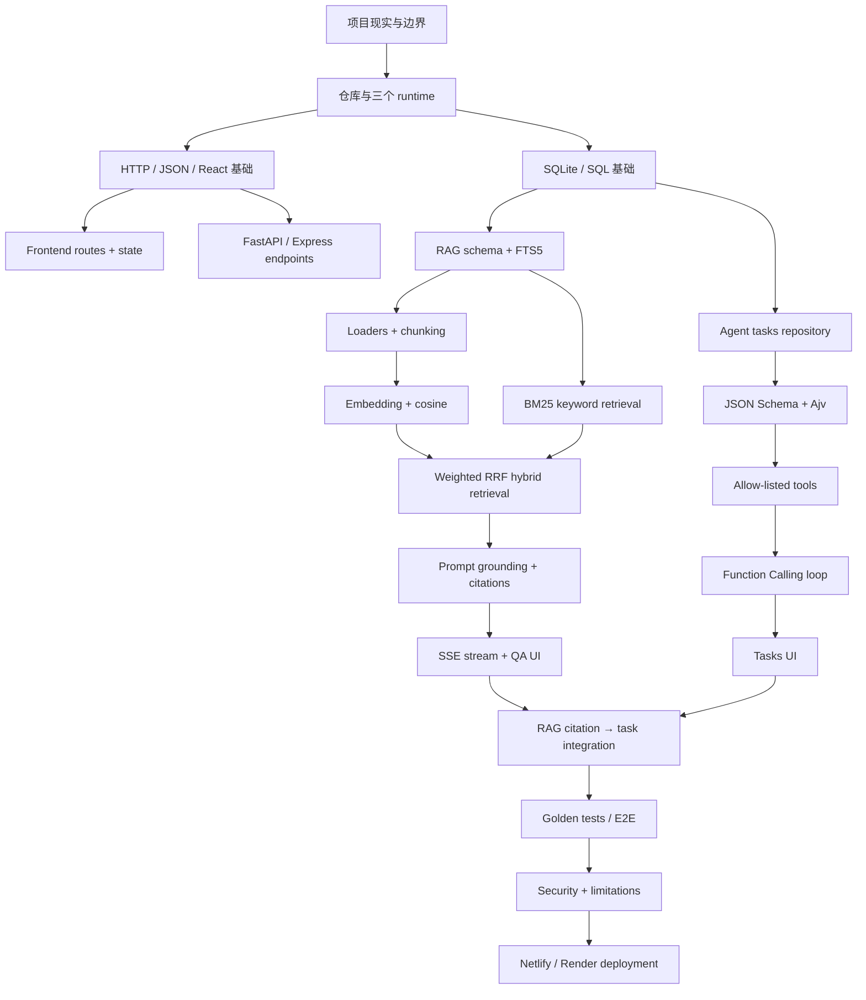

# CourseMate AI — PROJECT ATLAS FOR CHATGPT

> 生成日期：2026-08-12
> 核对基线：Git `main` / `aa08284853d50c4e351cb8b1b2d8fd9a0815f8f4`
> 读者：第一次接触本项目的开发者，以及未来负责逐文件教学的 ChatGPT
> 真实性原则：本 Atlas 以最终源码、数据库、测试和部署配置为准；无法验证的内容明确标注为 `NOT VERIFIED`，不存在的内容标注为 `NOT IMPLEMENTED`。

---

# 1. PROJECT REALITY CHECK

## 1.1 当前状态快照

| 检查项 | 最终事实 | 证据位置 |
|---|---|---|
| Git 状态 | 基线提交为 `aa082848...`，生成 Atlas 前工作树干净 | `git status`、`git rev-parse HEAD` |
| 本地应用 | **VERIFIED LOCAL**；前端、RAG、Agent 可由启动脚本协同运行 | `scripts/start_local.ps1`、`docs/VERIFICATION_REPORT.md` |
| 自动化测试 | Python 42、Agent 32、Frontend 8、Playwright 3，报告均通过 | `docs/VERIFICATION_REPORT.md` |
| 真实浏览器 | **VERIFIED**；Chromium/Chrome 流程覆盖问答、引用、任务与 390px 移动端 | `tests/e2e/coursemate.spec.ts` |
| OpenAI 实时模式 | **NOT VERIFIED**；验证环境在收到 HTTP 响应前发生 TLS 超时/重置 | `docs/VERIFICATION_REPORT.md` |
| 确定性演示模式 | **VERIFIED**；RAG 和 Agent 均有离线 deterministic provider | `services/rag-api/app/rag/*`、`services/agent-api/src/openai/deterministic-client.ts` |
| 本地课程数据 | 2 门课、66 个已导入文档、1,936 个 chunks；另有 20 条 inventory-only 记录 | `data/rag.sqlite3`、`data/inventory/course-files.json` |
| RAG 会话数据 | 核对时 `conversations=0`、`messages=0`；表已实现，测试证明可持久化 | `data/rag.sqlite3`、`services/rag-api/tests/test_qa_api.py` |
| Agent 数据库 | `data/agent.sqlite3` 在核对时尚未存在；Agent 启动时自动创建 | `services/agent-api/src/db.ts` |
| 云部署 | **NOT DEPLOYED**；只完成 Netlify + Render 配置和清单 | `netlify.toml`、`render.yaml`、`docs/DEPLOYMENT.md` |
| Docker | **NOT IMPLEMENTED**；仓库无 `Dockerfile`、Compose 或容器构建路径 | 全仓库文件核对 |
| 认证/多用户 | **NOT IMPLEMENTED**；当前是单用户原型，API 无身份认证 | 两个服务的路由与中间件 |
| Git 远端 | **NOT CONFIGURED**；没有可用于生产部署的远程仓库 | `git remote -v` |

## 1.2 数据事实

- 课程：`cs3481`（显示名 CS3481）与 `ge2324`（显示名 GE2324）两门。
- inventory 共 86 条：CS3481 50 条、GE2324 36 条。
- 已就绪并导入 66 条，数据库形成 1,936 个 chunks：CS3481 38 文档/924 chunks，GE2324 28 文档/1,012 chunks。
- 20 条为 inventory-only；核对报告中没有 failed、missing 或 invalid 条目。
- `tut7`、`tut8` 原始目录缺失，已作为可解释的课程资料缺口记录，不应伪装成导入成功。
- 本地 `data/rag.sqlite3` 是可运行交付物，但被 `.gitignore` 忽略；公开仓库若从 Git 冷启动，必须重新执行 corpus import。

## 1.3 生产门槛

本项目不能因为“本地全绿”就被称为生产就绪。上线前至少要补齐：真实 OpenAI 连通性和账单验证、身份认证与用户级数据隔离、数据授权确认、生产持久磁盘、远端仓库、日志/指标/告警、备份与恢复演练、速率和成本预算。详细见第 20、24、31、36 章。

---

# 2. PROJECT IN ONE SENTENCE

CourseMate AI 是一个把课程文件导入到课程隔离的 SQLite 混合检索 RAG 中、以带出处的 SSE 流式回答学生问题，并让一个严格白名单 Function Calling Agent 通过独立 SQLite 管理学习任务的 React + FastAPI + Node.js 全栈学习助手。

---

# 3. ACTUAL TECH STACK

## 3.1 前端

| 层 | 实际技术 | 用法 |
|---|---|---|
| UI | React `19.2.8`、React DOM | 函数组件与 Hooks |
| 路由 | React Router DOM `7.18.2` | `/qa/:courseId` 等页面路由 |
| 语言 | TypeScript `5.9.3` | API 类型、组件与服务层 |
| 构建 | Vite `8.2.1` | 开发服务器与生产 bundle |
| 样式 | 原生语义 HTML + 单一 CSS | 无 UI 组件库、无 CSS-in-JS |
| 网络 | 浏览器原生 `fetch` | JSON API 与手写 SSE decoder |
| 单元/组件测试 | Vitest + Testing Library | 页面、路由、SSE 解析 |
| 端到端 | Playwright | 真实 Chromium/Chrome 流程与移动端 |

## 3.2 RAG API

| 层 | 实际技术 | 用法 |
|---|---|---|
| Runtime | Python `>=3.11` | 最终环境曾以 Python 3.12 运行 |
| Web | FastAPI `0.141.1`、Uvicorn `0.52` | REST + `StreamingResponse` SSE |
| 配置/验证 | Pydantic Settings `2.15` | 环境变量与请求模型 |
| LLM/Embedding | OpenAI Python `2.53` | Responses API、Embeddings API |
| 文件解析 | `pypdf`、`python-docx`、`python-pptx` | PDF、DOCX、PPTX；另原生读 MD/TXT |
| 上传 | `python-multipart` | multipart 文件上传 |
| 数据 | Python `sqlite3` + SQLite FTS5 | 元数据、会话、BM25、JSON vectors |
| 测试 | pytest | 数据库、加载、切块、检索、API、安全失败 |

## 3.3 Agent API

| 层 | 实际技术 | 用法 |
|---|---|---|
| Runtime | Node.js `>=24.14` | 使用内建 `node:sqlite` |
| Web | Express `5.2.1` | REST 与 Agent chat |
| 语言/构建 | TypeScript `5.9.3` | 编译至 `dist/` 后运行 |
| 数据 | `node:sqlite` 的 `DatabaseSync` | 同步 prepared statements，独立 tasks DB |
| Schema | Ajv `8.20` | Function Calling 参数严格校验 |
| LLM | OpenAI JS `7.4` | Responses API 工具循环 |
| 安全中间件 | Helmet、CORS、express-rate-limit | 安全头、单源 CORS、限流 |
| 测试 | Vitest | repository、schema、executor、循环与 API |

## 3.4 部署与工程

- npm workspaces 管理 `apps/web` 与 `services/agent-api`；Python 服务独立 requirements/pyproject。
- Netlify 构建并托管静态前端；Render Blueprint 描述两个后端 Web Service。
- 两个后端各拥有自己的 SQLite 文件和持久磁盘，不共享数据库。
- PowerShell 脚本负责 Windows 本地启动、inventory 和验证。
- **没有** Docker、Kubernetes、Redis、PostgreSQL、向量数据库、消息队列、ORM 或 migration framework。

---

# 4. REPOSITORY MAP

```text
coursemate-ai/
├─ apps/
│  └─ web/                         # React/Vite 前端
│     ├─ src/
│     │  ├─ components/            # 布局、引用卡、任务板、错误边界
│     │  ├─ pages/                 # 首页、问答、资料、任务、关于、404
│     │  ├─ services/              # fetch、RAG API、Agent API
│     │  ├─ types/                 # 前端共享 API 类型
│     │  ├─ App.tsx                # 路由表
│     │  └─ main.tsx               # 浏览器入口
│     └─ dist/                     # 当前本地生产构建产物（可重建）
├─ services/
│  ├─ rag-api/
│  │  ├─ app/
│  │  │  ├─ api/                   # ingestion 与 QA 路由
│  │  │  ├─ rag/                   # loaders/chunking/embedding/retrieval/prompt/answer
│  │  │  ├─ repositories/          # chunks 数据访问
│  │  │  ├─ services/              # ingestion 与 QA 用例编排
│  │  │  ├─ corpus_import.py       # inventory 到数据库的批量导入
│  │  │  ├─ db.py                  # SQLite schema 与连接
│  │  │  └─ main.py                # FastAPI 组合根
│  │  └─ tests/                    # 42 个 Python 测试所在套件
│  └─ agent-api/
│     ├─ src/
│     │  ├─ http/                  # HTTP 请求验证
│     │  ├─ openai/                # live/deterministic Responses client
│     │  ├─ repositories/          # TaskRepository
│     │  ├─ services/              # Agent 多轮工具编排
│     │  ├─ tools/                 # schema、validator、executor
│     │  ├─ app.ts                 # Express 路由/中间件
│     │  └─ server.ts              # Node 入口
│     └─ test/                     # 32 个 Agent 测试所在套件
├─ data/
│  ├─ inventory/
│  │  ├─ course-files.json         # 86 条可复现资料清单
│  │  └─ import-report.json        # 最终 corpus import 报告
│  ├─ rag.sqlite3                  # 本地运行数据库；被 Git 忽略
│  ├─ uploads/                     # 上传后的安全文件存储
├─ docs/                           # spec、架构、API、DB、部署、ADR、验证报告
├─ scripts/                        # inventory、import、local start、inventory test
├─ tests/e2e/                      # Playwright 真实浏览器测试
├─ netlify.toml                    # 前端部署配置
├─ render.yaml                     # 两个后端及磁盘配置
├─ playwright.config.ts            # E2E server 编排
├─ package.json                    # monorepo scripts/workspaces
└─ .env.example                    # 仅变量名和安全示例，不含 secret
```

### 4.1 所有权边界

- `apps/web` 只持有 UI 状态，不直接访问 SQLite。
- `services/rag-api` 独占 `rag.sqlite3` 与课程上传文件。
- `services/agent-api` 独占 `agent.sqlite3` 与 tasks 表。
- RAG 与 Agent 后端之间没有服务到服务调用；二者只在浏览器层通过“引用转学习任务”这一用户动作相遇。

---

# 5. CRITICAL FILE INDEX

以下正好索引 **50 个关键文件**。列名已经覆盖：语言、用途、主要类/函数、被谁调用、调用谁、输入输出、重要性和教学优先级。`P0` 是先学，`P1` 是核心深入，`P2` 是补充。

## 5.1 Frontend（CF-01～CF-13）

| ID / 文件 | 语言 / 优先级 | 用途与主要符号 | 被谁调用 → 调用谁 | 输入 → 输出 | 为什么重要 |
|---|---|---|---|---|---|
| CF-01 `apps/web/src/main.tsx` | TSX / P0 | `createRoot`，挂载根组件 | `index.html` → `App` | DOM 根节点 → React 应用 | 浏览器真实入口 |
| CF-02 `apps/web/src/App.tsx` | TSX / P0 | `App`、BrowserRouter、完整路由表 | `main.tsx` → Layout/pages | URL → 页面树 | 看懂所有前端导航 |
| CF-03 `apps/web/src/components/Layout.tsx` | TSX / P1 | `Layout`、导航与 `Outlet` | `App` → Router Outlet | 子路由 → 统一壳层 | 页面共有结构与可访问导航 |
| CF-04 `apps/web/src/pages/QaPage.tsx` | TSX / P0 | `QaPage`、`ask`、`upload`、`addToPlan` | Router → ragApi/agentApi | 课程/问题/文件 → 流式消息、引用、任务 | RAG 用户旅程的 UI 核心 |
| CF-05 `apps/web/src/components/CitationList.tsx` | TSX / P1 | `CitationList` | `QaPage` → 无外部服务 | citations → 可读出处列表 | “有依据回答”的可见证据 |
| CF-06 `apps/web/src/pages/DocumentsPage.tsx` | TSX / P1 | `DocumentsPage`、刷新与上传 | Router → ragApi | 课程/文件 → 文档状态列表 | ingestion 在 UI 的入口 |
| CF-07 `apps/web/src/pages/TasksPage.tsx` | TSX / P0 | `TasksPage`、`refresh`、`quickAdd`、`talkToAgent` | Router → agentApi/TaskBoard | 表单/自然语言 → tasks 列表 | CRUD 与 Agent 的统一页面 |
| CF-08 `apps/web/src/components/TaskBoard.tsx` | TSX / P1 | `TaskBoard`、TaskCard 编辑/完成/删除 | `TasksPage` → 回调 props | tasks/操作回调 → 分组任务卡 | 直接 CRUD 交互细节 |
| CF-09 `apps/web/src/services/http.ts` | TypeScript / P0 | `ApiError`、`requestJson`、`requireOk` | 两个 API client → `fetch` | Request → typed JSON/异常 | 前端错误语义的公共边界 |
| CF-10 `apps/web/src/services/ragApi.ts` | TypeScript / P0 | `SseDecoder`、`streamQa`、课程/文档 API | QA/Documents pages → RAG API | JSON/multipart/SSE bytes → typed events | 手写 SSE 与 RAG 契约 |
| CF-11 `apps/web/src/services/agentApi.ts` | TypeScript / P0 | task CRUD、`chatWithAgent` | Tasks/QA pages → Agent API | typed payload → task/chat JSON | 所有任务网络访问入口 |
| CF-12 `apps/web/src/types/api.ts` | TypeScript / P0 | Course、Document、Citation、Task 等接口 | pages/clients/components 使用 | 后端 JSON → 编译期类型 | 前后端共享心智模型 |
| CF-13 `apps/web/src/styles.css` | CSS / P2 | 全站 layout、cards、responsive、focus | `main.tsx` 引入 → 浏览器 CSS 引擎 | DOM/class → 视觉与移动端布局 | 无 UI 库时的全部设计系统 |

## 5.2 RAG API（CF-14～CF-30）

| ID / 文件 | 语言 / 优先级 | 用途与主要符号 | 被谁调用 → 调用谁 | 输入 → 输出 | 为什么重要 |
|---|---|---|---|---|---|
| CF-14 `services/rag-api/app/main.py` | Python / P0 | `create_app`、provider wiring、异常处理 | Uvicorn/tests → routers/services/providers | Settings → FastAPI app | 依赖组合与运行模式总开关 |
| CF-15 `services/rag-api/app/config.py` | Python / P0 | `Settings`、路径/模型/阈值配置 | `main.py` → Pydantic Settings | env → typed settings | 所有 RAG 运行参数来源 |
| CF-16 `services/rag-api/app/db.py` | Python/SQL / P0 | `Database`、`SCHEMA`、`connect` | services/repos/import → sqlite3 | SQL/参数 → rows/transactions | RAG 持久化真相源 |
| CF-17 `services/rag-api/app/models.py` | Python / P0 | 请求/响应 Pydantic models | API routes → validation | HTTP JSON → typed objects | 公共 API 数据合同 |
| CF-18 `services/rag-api/app/api/ingestion.py` | Python / P0 | 课程、文档、job 路由 | FastAPI → IngestionService | HTTP/multipart → JSON/status | ingestion 的 HTTP 边界 |
| CF-19 `services/rag-api/app/api/qa.py` | Python / P0 | `/api/qa/chat`、SSE framing | FastAPI → QaService | question JSON → named SSE events | RAG 流式 API 边界 |
| CF-20 `services/rag-api/app/services/ingestion.py` | Python / P0 | `IngestionService`、上传验证与处理 | ingestion route/import → loaders/chunker/embedder/DB | 文件 → document/job/chunks | 上传安全与导入用例核心 |
| CF-21 `services/rag-api/app/services/qa.py` | Python / P0 | `QaService.stream_answer` | QA route → retriever/prompt/answer/DB | course+question → event iterator | 一次 RAG 请求的总编排 |
| CF-22 `services/rag-api/app/rag/loaders.py` | Python / P1 | `load_document`、格式 loaders | ingestion/import → pypdf/docx/pptx | 文件 → `LoadedSection[]` | 多格式内容和 locator 来源 |
| CF-23 `services/rag-api/app/rag/chunking.py` | Python / P1 | `chunk_sections`、段落/词边界切分 | IngestionService → rag types | sections → overlapped chunks | 检索颗粒度与引用质量基础 |
| CF-24 `services/rag-api/app/rag/embeddings.py` | Python / P1 | OpenAI/Deterministic providers | ingestion/retrieval → OpenAI/hash | text[] → float vectors | 向量检索的可替换边界 |
| CF-25 `services/rag-api/app/repositories/chunks.py` | Python/SQL / P0 | `ChunkRepository`、keyword/vector candidates | HybridRetriever → SQLite FTS/rows | query/vector/course → candidates | 课程隔离、BM25、向量扫描实现 |
| CF-26 `services/rag-api/app/rag/retrieval.py` | Python / P0 | `HybridRetriever`、weighted RRF | QaService → repo/embedder | question/course → ranked hits | 混合召回排名算法核心 |
| CF-27 `services/rag-api/app/rag/prompt.py` | Python / P0 | `build_context`、`build_prompt` | QaService → pure formatting | hits/question → bounded prompt | 引用标签、上下文边界与注入防护 |
| CF-28 `services/rag-api/app/rag/answers.py` | Python / P0 | OpenAI/Deterministic answer providers | QaService → Responses API或抽取逻辑 | prompt/hits → text deltas | 生成层与离线演示替换点 |
| CF-29 `services/rag-api/app/corpus_import.py` | Python / P1 | `CorpusImporter`、inventory import/report | CLI script → IngestionService/DB | inventory → imported docs/report | 66 个真实文件可复现入库 |
| CF-30 `services/rag-api/app/rag/types.py` | Python / P1 | section/chunk/candidate/hit dataclasses | 全 RAG pipeline 共享 | 层间数据 → 明确结构 | 算法模块之间的内部合同 |

## 5.3 Agent API（CF-31～CF-43）

| ID / 文件 | 语言 / 优先级 | 用途与主要符号 | 被谁调用 → 调用谁 | 输入 → 输出 | 为什么重要 |
|---|---|---|---|---|---|
| CF-31 `services/agent-api/src/server.ts` | TypeScript / P0 | 进程入口、listen、关闭连接 | Node → config/db/app | env → HTTP server | Agent 服务启动点 |
| CF-32 `services/agent-api/src/config.ts` | TypeScript / P0 | `loadConfig` | server/tests → `process.env` | env → typed config | provider、DB、端口、轮数来源 |
| CF-33 `services/agent-api/src/db.ts` | TypeScript/SQL / P0 | `openDatabase`、tasks schema | server/tests → `DatabaseSync` | DB path → initialized DB | Agent 独立持久化入口 |
| CF-34 `services/agent-api/src/types.ts` | TypeScript / P0 | Task、filter、patch、tool/client 类型 | repository/service/tools 共用 | JSON/rows → domain types | Agent 域模型与接口合同 |
| CF-35 `services/agent-api/src/app.ts` | TypeScript / P0 | `createApp`、CRUD/chat routes、中间件 | server/tests → repo/AgentService | HTTP → JSON/错误 | Agent 的全部公共 API |
| CF-36 `services/agent-api/src/http/validation.ts` | TypeScript / P1 | body/query/path validators | `app.ts` → ApiError | unknown input → typed payload | 直接 REST 输入的第一道防线 |
| CF-37 `services/agent-api/src/repositories/tasks.ts` | TypeScript/SQL / P0 | `TaskRepository`、CRUD/search | routes/executor → prepared statements | filters/mutations → tasks | 任务状态真相源与 SQL 安全 |
| CF-38 `services/agent-api/src/tools/schemas.ts` | TypeScript/JSON Schema / P0 | `TOOL_SCHEMAS`、5 个 function definitions | AgentService/OpenAI → JSON Schema | tool name → strict schema | 模型能做什么的公开白名单 |
| CF-39 `services/agent-api/src/tools/validator.ts` | TypeScript / P0 | Ajv compile/validate | executor → Ajv | unknown args → validated args/errors | 阻止模型越权或乱参 |
| CF-40 `services/agent-api/src/tools/executor.ts` | TypeScript / P0 | `ToolExecutor.execute`、allow-list switch | AgentService → validator/repository | function call → `ToolResult` | 唯一工具执行安全闸门 |
| CF-41 `services/agent-api/src/services/agent.ts` | TypeScript / P0 | `AgentService.chat`、多轮 call/output 循环 | chat route → model/executor | message → final reply/rounds | Function Calling 的状态机核心 |
| CF-42 `services/agent-api/src/openai/client.ts` | TypeScript / P1 | OpenAI Responses adapter | `server.ts`/AgentService → OpenAI SDK | internal request → normalized response | 把 SDK 隔离在单一适配层 |
| CF-43 `services/agent-api/src/openai/deterministic-client.ts` | TypeScript / P1 | 规则驱动演示 client | provider wiring/tests → tool schemas | 英文演示指令 → 模拟 tool calls | 无网络可复现验证关键 |

## 5.4 Infrastructure 与系统验证（CF-44～CF-50）

| ID / 文件 | 语言 / 优先级 | 用途与主要符号 | 被谁调用 → 调用谁 | 输入 → 输出 | 为什么重要 |
|---|---|---|---|---|---|
| CF-44 `scripts/inventory.ps1` | PowerShell / P1 | 资料发现、状态分类、JSON/Markdown 输出 | 人/验证流程 → 文件系统 | 课程目录 → inventory | 真实 corpus 的可审计起点 |
| CF-45 `scripts/import_corpus.py` | Python / P1 | import CLI | 人/CI → `CorpusImporter` | `--mode`/paths → DB/report | 冷启动课程库的正式入口 |
| CF-46 `scripts/start_local.ps1` | PowerShell / P0 | 前后端进程启动与环境设置 | 人/Playwright → npm/python/node | 本地配置 → 3 个服务 | 最短本地运行路径 |
| CF-47 `netlify.toml` | TOML / P1 | web build、Node 版本、SPA rewrite | Netlify → npm/Vite | Git source → static site | 前端云部署的真实配置 |
| CF-48 `render.yaml` | YAML / P1 | 两服务 build/start/env/disks | Render → pip/npm/uvicorn/node | Git source → 2 个 Web Services | 后端云部署与持久化蓝图 |
| CF-49 `playwright.config.ts` | TypeScript / P1 | webServer/baseURL/browser 配置 | Playwright → local start | test run → 3 服务+浏览器 | 全系统测试的进程编排 |
| CF-50 `tests/e2e/coursemate.spec.ts` | TypeScript / P0 | 3 条真实浏览器 golden journeys | Playwright → UI/API | 用户行为 → 可见断言 | 本项目最接近验收的证据 |

> 未列入这 50 个文件不代表不重要。`ErrorBoundary.tsx`、各单元测试、`errors.py/ts`、ADR 与 handoff 文档会在后续章节按主题出现。仓库没有 Docker 文件，因此不能虚构一个 Docker 关键文件。

---

# 6. RAG END-TO-END DATA FLOW

```text
课程文件
  → 安全上传 / corpus inventory
  → 格式 loader（保留 filename + page/slide/heading locator）
  → paragraph-aware chunking（1200 chars，200 overlap）
  → embedding provider（OpenAI 或 deterministic 64D）
  → SQLite documents/chunks + FTS5 index

学生问题 + courseId
  → query tokenization
  → course-scoped FTS5 BM25 candidates
  → question embedding
  → course-scoped vector cosine candidates
  → weighted Reciprocal Rank Fusion
  → top 6 retrieval hits
  → bounded untrusted source context（最多 18,000 chars）
  → answer provider stream
  → server-owned citations
  → named SSE events
  → React incremental render
  → conversation/message persistence
```

## 6.1 写入路径

1. API 或批量 importer 创建/确认 `courses`。
2. 文件验证通过后计算 SHA-256；同一课程内 `(course_id, sha256)` 唯一。
3. 创建 `documents` 与 `ingestion_jobs`，文件存入 `RAG_UPLOAD_DIR`。
4. BackgroundTask 或 importer 调用 loader，得到带 locator 的 section。
5. chunker 生成重叠 chunks；embedding provider 批量嵌入（批量上限 64）。
6. transaction 写入 `chunks`；trigger 同步写入 `chunks_fts`；document/job 变为 ready/succeeded。
7. 失败时 document/job 记录失败状态和安全公开错误，不把内部堆栈返回浏览器。

## 6.2 读取路径

1. 请求先验证 course 存在、问题非空且长度合规。
2. keyword 与 vector 两路都在 SQL/数据访问层用 `course_id` 隔离。
3. 两路各取 `top_k * 3` 候选，默认是 18。
4. weighted RRF 合并并按融合分数降序取默认 `top_k=6`。
5. prompt builder 给 source 分配稳定的 `[S1]`、`[S2]` 标签，将资料放进明确的 untrusted 边界。
6. 回答文本可以来自模型，但 citations 由服务器根据 retrieval hits 构造；模型不能自造文件名。
7. SSE 完成后把 user/assistant message 与 citation JSON 持久化。

---

# 7. ONE REAL RAG REQUEST TRACE

以下是测试和浏览器验收共同覆盖的真实路径，不是伪代码。示例问题为 DBSCAN 相关问题，课程 ID 为 `cs3481`。

1. **浏览器输入**：`QaPage.ask()` 读取当前 `courseId=cs3481` 和问题，创建本地 user message，设置 loading。
2. **网络请求**：`streamQa()` 对 `POST /api/qa/chat` 发送 JSON；可携带先前 `conversationId`，首次为空。
3. **HTTP 验证**：FastAPI 用 Pydantic `QaRequest` 检查字段；route 把服务 iterator 转为 `text/event-stream`。
4. **会话准备**：`QaService` 创建或复用 conversation，并先写入 user message。
5. **关键词召回**：问题被清洗为最多 24 个 FTS token；仓储在 `chunks_fts` 与 `chunks` 上双重限定 `cs3481`。
6. **向量召回**：同一问题生成 embedding；仓储只读取 `cs3481` chunks 的 JSON vectors，逐条计算 cosine。
7. **融合**：`HybridRetriever` 用 keyword 权重 1.0、vector 权重 0.15、常数 60 做 weighted RRF，取 6 个 hits。
8. **上下文**：每个命中形如 `[S1] file=...; page/heading/...; document=...; chunk=...`，总字符不超过 18,000。
9. **生成**：deterministic 验收模式从高相关 chunk 抽取句子；OpenAI 模式则用 Responses API 只消费 `response.output_text.delta`。
10. **SSE 顺序**：有命中时至少形成 `meta → delta... → citation... → done`。Python golden test 对一个夹具精确断言 `meta, delta, delta, citation, done`。
11. **引用**：浏览器验收看到了与 DBSCAN 回答关联的真实 source；切换到 `ge2324` 后询问 assignment，首个 citation 是 `assignment_2.pdf`。这证明 course switching 与 source trace 生效。
12. **UI 渲染**：`SseDecoder` 处理跨 chunk 字节，`QaPage` 增量拼接 assistant 文本；`CitationList` 渲染 filename、locator 和 excerpt。
13. **持久化**：服务在完成后写 assistant message、citation JSON；测试随后从 SQLite 读回 conversation/messages 验证。
14. **可转任务**：用户点击引用旁的“加入计划”，前端把回答上下文和 `sourceCitation` 发送给 Agent task API。

失败分支也已测试：无命中不会调用模型；model failure 产生安全 SSE error；prompt injection 文本只处于 untrusted source 区块；跨课程 chunk 不会进入结果。

---

# 8. COURSE INGESTION PIPELINE

## 8.1 支持格式与 locator

| 格式 | 加载规则 | locator |
|---|---|---|
| `.md` | 按 Markdown heading 分 section | heading 名称 |
| `.txt` | 整体文本 section | 文本文件标识 |
| `.pdf` | `pypdf` 按页提取；可读取校验过的 `.ocr.md` sidecar | `page N` |
| `.docx` | heading、段落、表格文本 | heading/段落上下文 |
| `.pptx` | 按 slide 提取 title 与文本 | `slide N` |
| 旧 `.ppt` | **NOT IMPLEMENTED/UNSUPPORTED** | inventory 可记录，但 loader 不接收 |

## 8.2 上传安全链

- filename 取 basename 并做安全化，长度上限 200。
- extension 必须在 loader allow-list；MIME 也要在允许范围。
- body 上限由 `MAX_UPLOAD_BYTES` 控制，默认 20 MiB；空文件拒绝。
- PDF 检查 `%PDF` magic bytes；DOCX/PPTX 检查 ZIP 的 `PK` magic bytes。
- 服务端生成 document ID 作为存储文件名，避免直接信任用户路径。
- SHA-256 用于重复检测；同一课程重复上传得到明确冲突，而不是重复 chunks。
- 解析与写入错误转成稳定错误码/公开消息，内部异常不泄露给客户端。

## 8.3 Chunk 算法

- 默认目标大小 `CHUNK_SIZE=1200` 字符，重叠 `CHUNK_OVERLAP=200`。
- 先规范化换行和空白，再优先在段落边界切分；超长段落再在词边界切分。
- 下一 chunk 前置上一 chunk 最长 200 字符的后缀，因此上下文不在边界处突然丢失。
- 每个 chunk 保留 `course_id`、`document_id`、filename、locator、ordinal 与 metadata。
- 约束检查阻止非法 `overlap >= size`。测试覆盖短 section、段落切分、超长段落、重叠与 metadata 保留。

## 8.4 批量 corpus import

`scripts/inventory.ps1` 先把真实磁盘资料变成 `data/inventory/course-files.json`；`scripts/import_corpus.py` 再调用 `CorpusImporter`。importer 根据 status 只处理 ready 条目，保存状态、失败信息与报告，允许 deterministic/openai 两种模式。扫描作业的 OCR sidecar 必须与原文件 content hash 绑定，不能把任意同名 markdown 当可信 OCR。

## 8.5 新增第三门课程

1. 确定稳定 course ID 与展示名；通过 `POST /api/courses` 创建，或在批量导入的课程映射中登记。
2. 把原始文件放进该项目自己的课程资料目录，不要散落到项目外。
3. 扩展 inventory 来源映射并运行 `scripts/inventory.ps1`，人工检查 ready/inventory-only/missing。
4. 若格式已支持，直接运行 `python scripts/import_corpus.py --mode deterministic` 或 `openai`；若是新格式，同时更新 loader、MIME/extension allow-list、magic-byte 校验和 loader/ingestion 测试。
5. 检查 report、数据库 documents/chunks 数量以及课程隔离检索。
6. `QaPage` 和 `DocumentsPage` 课程数据来自 API，通常自动出现；`TasksPage` 的课程选择目前是静态选项，必须新增第三门课或改成 API 驱动。
7. 新增至少一条检索 golden test、一条浏览器 route-switch test，并复跑 42+32+8+3 测试门禁。

---

# 9. RAG ALGORITHM MAP

## 9.1 Embedding

- live provider 使用 `OPENAI_EMBEDDING_MODEL`，安全默认名为 `text-embedding-3-small`。
- deterministic provider 产生 64 维向量：对 token 做稳定 BLAKE2b hash，映射到 bucket 并赋正负号，最后归一化。它为测试可复现而设计，不代表语义检索质量与 OpenAI embedding 等价。
- SQLite `chunks.embedding_json` 保存 JSON 数组；没有专用向量索引。

## 9.2 Keyword / BM25

- `_query_tokens` 去掉内置英文 stopwords、忽略长度 1 的 token、保持首次出现顺序并去重，最多 24 个。
- 若过滤后为空，会回退到原 token，避免构造空 MATCH。
- token 被双引号转义，再以 `OR` 组合传给 FTS5 `MATCH`。
- SQLite FTS5 的 `bm25()` 数值越小排名越好；仓储按 rank 升序，并把候选 score 记为 `-rank` 便于统一表达。
- SQL 同时约束 `chunks_fts.course_id` 与 `chunks.course_id`，避免仅靠应用层过滤。

## 9.3 Vector cosine

对同一课程的每个 chunk embedding 计算：

```text
cosine(q, d) = dot(q, d) / (||q|| × ||d||)
```

非法 JSON、维度不一致或零范数向量不会成为有效高分结果。当前实现对该课程所有 vectors 做 O(N) 扫描与排序；1,936 chunks 可接受，但不是大规模方案。

## 9.4 Weighted Reciprocal Rank Fusion

两路各取 `candidate_limit = top_k × 3`，默认 18。对候选文档 `d`：

```text
RRF(d) = Σ_r weight_r / (60 + rank_r(d))

keyword weight = 1.0
vector  weight = 0.15
```

同一 chunk ID 在两路去重后累加贡献；按融合分数降序取默认 top 6。这里融合的是**排名**而不是把 BM25 与 cosine 原始分直接相加，因此避免两种分数量纲不一致；但 1.0/0.15 仍是工程权重，尚无标注数据集证明最优。

## 9.5 Context 与 token budget

- 实现控制的是 `MAX_CONTEXT_CHARS=18000` 字符，而不是 tokenizer 精确 token 数。
- hit 按融合排名顺序写入；每条包含 source label、filename、locator、document/chunk ID 和 content。
- 到达字符上限时顺序截断。当前没有按文件分组、MMR、多样性重排或专门的语义去重。
- OpenAI 回答最大输出 token 是 1,200；Agent 同样使用 1,200。

## 9.6 Grounding 与 citation

- system/prompt 规则要求只根据 source blocks 回答，找不到时承认资料不足。
- source 内容被标为 untrusted，资料中的“忽略先前指令”只当课程文本。
- citation 不从模型自由文本解析，而由 retrieval hit 生成 `sourceId`、filename、locator、excerpt、documentId、chunkId。
- excerpt 最长约 360 字符。该设计保证引用能回溯到 SQLite chunk，但不保证模型每一句都严格蕴含于引用；那需要更强的逐句归因评估。

---

# 10. AGENT END-TO-END DATA FLOW

```text
自然语言学习计划请求
  → POST /api/agent/chat
  → HTTP body validation
  → AgentService.chat
  → Responses client（OpenAI 或 deterministic）
  → assistant text 或 function_call[]
       → JSON.parse arguments
       → allow-listed tool name
       → Ajv strict schema validation
       → ToolExecutor
       → TaskRepository prepared statement
       → ToolResult
       → function_call_output（保持 call_id）
       → 下一轮 Responses request
  → 最终 assistant text
  → JSON reply + 刷新 tasks 列表
```

## 10.1 两条任务路径

- **直接 CRUD**：前端表单或任务卡直接调用 `/api/tasks`。此路径不经过 LLM，但仍经过 HTTP validation 和 repository prepared statements。
- **自然语言 Agent**：前端把一句话发给 `/api/agent/chat`；模型只能选择五个 allow-listed tools。任何数据库变更仍由同一个 `TaskRepository` 执行。

这两条路径共享 tasks 表，所以用户用 Agent 新建的任务能立即在 TaskBoard 出现；直接编辑后的状态也会成为下一次 `searchTask` 的结果。

## 10.2 Tool loop 状态机

1. 把用户 message、五个 tool schemas、`parallel_tool_calls=false` 交给 provider。
2. 若 response 只有 output text，则作为最终 reply 返回。
3. 若有 function call，逐个解析 JSON；解析失败不会执行数据库，而是把失败 `ToolResult` 送回模型修正。
4. `ToolExecutor` 再检查 name 白名单和 Ajv 参数；验证通过才调用 repository。
5. 每个结果用原 `call_id` 包装为 `function_call_output`，连同前一轮 output 进入下一次 provider 调用。
6. 默认最多 4 个 tool rounds；超过上限抛出稳定的 round-limit 错误，防止无限循环和失控成本。

---

# 11. ONE REAL AGENT REQUEST TRACE

Playwright golden journey 使用 deterministic provider 完整执行了以下等价请求：创建一个 GE2324 学习任务，标题带每次测试生成的动态标识，优先级 high，截止日期为 2026-08-20；之后直接编辑为 2026-08-25/medium 并完成。

1. `TasksPage.talkToAgent()` 发送 `{message}` 到 `POST /api/agent/chat`。
2. `app.ts` 验证 message 后调用 `AgentService.chat()`。
3. deterministic client 识别 create 意图，返回 `function_call`，name 为 **`createTask`**，arguments 包含 title/courseId/priority/dueDate 等字段。
4. AgentService `JSON.parse` arguments，并将 call 交给 `ToolExecutor.execute()`。
5. executor 在 allow-list 中命中 `createTask`；Ajv 以 strict schema 验证全部属性和枚举。
6. `TaskRepository.create()` 生成 UUID，执行 prepared INSERT，默认 status 为 `todo`，写入 `created_at/updated_at`。
7. executor 返回 `{ok:true,data:<task>}`；AgentService 产生相同 `call_id` 的 `function_call_output`。
8. deterministic client 第二轮看到成功结果，返回自然语言完成说明；API 返回 `{reply, rounds}`。
9. `TasksPage` 无论 chat 成功后都重新 `listTasks()`，因此新任务出现在界面，而不是只相信模型文本。
10. 用户打开 TaskCard 编辑，`PATCH /api/tasks/:taskId` 把 dueDate 改为 `2026-08-25`、priority 改为 `medium`。
11. 用户点击完成，直接 API 再 PATCH status 为 `completed`；TaskBoard 移到完成分组。
12. 浏览器测试断言标题、日期、优先级和完成状态，并确认没有 console error。

测试套件还覆盖了更关键的异常 trace：非法 JSON → tool failure output → 模型下一轮修正；歧义搜索 → 不盲目更新；不存在 taskId → 稳定 not-found 结果；超过轮数 → 主动终止。

---

# 12. TOOL CATALOG

最终源码中的工具名使用 **camelCase**。所有工具先通过 Ajv，再进入 allow-list switch；模型没有执行任意 SQL、shell、文件系统或 HTTP 请求的工具。

| Tool | 目的 | 关键输入 | 数据操作 | 返回 |
|---|---|---|---|---|
| `createTask` | 创建学习任务 | `title`；可空 `notes/courseId/dueDate/sourceCitation`；priority | INSERT tasks | 新 Task |
| `searchTask` | 按条件找任务 | 可空 query/courseId/status；page/pageSize | SELECT + filters + pagination | tasks 与分页信息 |
| `updateTask` | 修改任务字段 | `taskId` + `updateFields`（1～6 个允许字段）+ 对应 nullable value fields | 动态但白名单列的 UPDATE | 更新后 Task |
| `completeTask` | 标记完成 | `taskId` | status=`completed` UPDATE | 更新后 Task |
| `deleteTask` | 删除任务 | `taskId` | prepared DELETE | 删除确认/ID |

## 12.1 工具边界

- 工具定义启用 strict JSON Schema，拒绝额外属性。
- “可选语义”采用 required + nullable 表达，以适配严格 function schema；调用者仍必须给出属性，但可传 `null`。
- priority 只允许 `low | medium | high`；status 只允许 `todo | in_progress | completed`。
- `updateFields` 只能包含 title、notes、courseId、priority、dueDate、status 中允许的字段，至少一个。
- `TaskRepository` 的动态 UPDATE 列来自硬编码 mapping，不把模型给出的列名拼进 SQL。
- `searchTask` 是 Agent 对歧义引用的安全前置步骤；系统提示要求在多个结果时先澄清。

---

# 13. JSON SCHEMA AND VALIDATION

## 13.1 三层验证

| 层 | 实现 | 防止的问题 |
|---|---|---|
| HTTP | FastAPI/Pydantic；Express 手写 validators | 浏览器/外部调用者提交缺字段、错误枚举、错误类型 |
| Tool arguments | `TOOL_SCHEMAS` + Ajv strict/allErrors | 模型产生额外字段、错误类型、越界 pageSize、空 patch |
| Database | NOT NULL、CHECK、UNIQUE、foreign keys、prepared statements | 非法状态、重复文档、孤儿记录、SQL 注入 |

## 13.2 Agent schema 语义摘要

```json
{
  "createTask": {
    "required": ["title", "notes", "courseId", "priority", "dueDate", "sourceCitation"],
    "additionalProperties": false
  },
  "searchTask": {
    "required": ["query", "courseId", "status", "page", "pageSize"],
    "additionalProperties": false
  },
  "updateTask": {
    "required": ["taskId", "updateFields", "title", "notes", "courseId", "status", "priority", "dueDate"],
    "additionalProperties": false
  },
  "completeTask": {"required": ["taskId"], "additionalProperties": false},
  "deleteTask": {"required": ["taskId"], "additionalProperties": false}
}
```

这里展示结构而不复制完整 schema；完整 enum、length、date pattern、minimum/maximum 以 `services/agent-api/src/tools/schemas.ts` 为准。

## 13.3 验证失败如何流动

- 直接 REST 输入失败：抛 `ApiError`，统一 JSON envelope 和 4xx status。
- tool 参数失败：executor 返回 `ToolResult {ok:false,data:null,error:{code,message}}`，不会碰数据库；模型可以下一轮解释或修正。
- 模型 arguments 不是 JSON：AgentService 生成同类 failure output，保持 loop 可恢复。
- 数据库 not found/conflict：repository/route 转换为稳定错误，不返回 SQL、绝对路径、API key 或 stack trace。

---

# 14. DATABASE MAP

RAG 与 Agent 使用两个 SQLite 文件，这是有意的 service ownership，而不是同库分表。

## 14.1 RAG SQLite 逻辑表

| 表 | 主键/重要约束 | 关键字段 | 谁写 / 谁读 |
|---|---|---|---|
| `courses` | `id` PK | name、created_at | ingestion/import 写；课程 API、QA 读 |
| `documents` | `id` PK；`UNIQUE(course_id, sha256)`；FK course | filename、stored_path、media_type、size、status、error | ingestion 写；列表、chunks、citations 读 |
| `ingestion_jobs` | `id` PK；FK document/course | status、error、started_at、completed_at | ingestion 写；job API 读 |
| `chunks` | `id` PK；FK document/course；ordinal | content、locator、metadata_json、embedding_json | ingestion 写；retrieval 读 |
| `chunks_fts` | FTS5 virtual table | chunk_id、course_id、content | triggers 写；BM25 查询读 |
| `conversations` | `id` PK；FK course | created_at、updated_at | QA 写/复用 |
| `messages` | `id` PK；FK conversation | role、content、citations_json、created_at | QA 写；测试/未来历史功能读 |

SQLite 自动生成的 FTS shadow tables 不属于应用公共 schema，不应被业务代码直接访问。

### 14.1.1 FTS 同步

`chunks_ai`、`chunks_ad`、`chunks_au` 三个 trigger 在 chunk INSERT/DELETE/UPDATE 时维护 `chunks_fts`。这保证 corpus transaction 后 FTS 与普通表一致，而不是靠应用“记得再写一次”。

## 14.2 Agent SQLite

| 表 | 主键/约束 | 关键字段 | 谁写 / 谁读 |
|---|---|---|---|
| `tasks` | `id` PK；priority/status CHECK | title、notes、course_id、priority、due_date、status、source_citation_json、timestamps | direct routes 与 tools 写；list/search/UI 读 |

`source_citation_json` 保留从 RAG 带来的出处对象。仓储映射数据库 snake_case 到 API camelCase，并使用 prepared statements。Agent DB 文件在首次 `openDatabase()` 时通过 `CREATE TABLE IF NOT EXISTS` 建立。

## 14.3 事务、迁移、备份现实

- ingestion 在写 chunks/status 时使用 transaction；失败回滚并更新安全失败状态。
- Agent CRUD 是单语句同步事务语义；没有跨服务事务。
- **Migration framework: NOT IMPLEMENTED**。schema 常量在启动时 `CREATE TABLE IF NOT EXISTS`，适合原型，不足以管理生产 schema 演进。
- 两个 DB 必须分别备份；Render 需要两块独立持久磁盘。只备份一个会丢课程知识或任务中的一半。

---

# 15. API ENDPOINT MAP

## 15.1 RAG API

| Method / Path | 输入 | 成功输出 | 关键失败 |
|---|---|---|---|
| `GET /health` | 无 | service/provider 状态 JSON | 启动级错误 |
| `POST /api/courses` | course id/name JSON | Course | validation/conflict |
| `GET /api/courses` | 无 | paginated `CoursePage` | DB error |
| `GET /api/courses/{course_id}/documents` | path course ID + pagination query | paginated `DocumentPage` | course not found |
| `POST /api/courses/{course_id}/documents` | multipart `file` | document + ingestion job（accepted） | type/size/magic/duplicate/course errors |
| `GET /api/ingestion-jobs/{job_id}` | path job ID | job status | job not found |
| `POST /api/qa/chat` | courseId、question、可选 conversationId | named SSE stream | validation/course/no-hit/model errors |

### QA SSE event contract

| Event | 典型 data | UI 行为 |
|---|---|---|
| `meta` | conversationId 等元数据 | 记录会话 ID |
| `delta` | 增量文本 | 追加到 assistant bubble |
| `citation` | server-owned Citation | 加入引用列表 |
| `done` | 完成标志 | 结束 loading |
| `error` | 安全 code/message | 显示可恢复错误并停止流 |

## 15.2 Agent API

| Method / Path | 输入 | 成功输出 | 关键失败 |
|---|---|---|---|
| `GET /health` | 无 | service/provider 状态 | 启动级错误 |
| `GET /api/tasks` | query/courseId/status/page/pageSize | paginated tasks | query validation |
| `POST /api/tasks` | create task body | Task | validation |
| `PATCH /api/tasks/:taskId` | patch body | Task | empty patch/not found/validation |
| `DELETE /api/tasks/:taskId` | task ID | deletion confirmation | not found |
| `POST /api/agent/chat` | `{message}` | `{reply, rounds}` | validation/provider/tool/round limit |

## 15.3 公共 API 现实

- 两个服务都没有 `/api/auth`、用户 ID、session cookie 或 bearer token 验证。
- CORS 由 `WEB_ORIGIN` 限定前端 origin，但 CORS **不是认证**。
- RAG stream 是 SSE-over-POST 的 fetch response，不是 `EventSource` GET。
- API 没有文档删除、ingestion retry、conversation history 查询或 task bulk mutation endpoint。

---

# 16. FRONTEND MAP

## 16.1 路由

| Route | 页面 | 主要服务 |
|---|---|---|
| `/` | `HomePage` | 静态项目入口/能力说明 |
| `/qa` | `QaPage` | 选择/默认课程后进入问答 |
| `/qa/:courseId` | `QaPage` | 课程隔离问答、上传、引用转任务 |
| `/tasks` | `TasksPage` | task CRUD + Agent chat |
| `/documents` | `DocumentsPage` | 各课程文档与上传状态 |
| `/about` | `AboutPage` | 架构/使用说明 |
| `*` | `NotFoundPage` | 404 |

## 16.2 状态与数据流

- 没有 Redux/Zustand/React Query；页面使用 local state + effect。
- `QaPage` 持有 courses、documents、messages、question、conversationId、stream/error/upload 状态。
- course route 改变时会 abort 当前 stream、清空 conversation/message 状态并刷新 documents，避免把 CS3481 对话混入 GE2324。
- `TasksPage` 每次 mutation 或 Agent chat 后重新从服务器读取；服务端数据库是任务真相源。
- API base URL 来自 Vite build-time env，并有 localhost 开发默认值。

## 16.3 可访问性与响应式

- 页面使用语义 button/form/nav/label，键盘 focus 样式在全局 CSS 中定义。
- ErrorBoundary 提供渲染失败兜底；网络错误在页面内可见。
- Playwright 用 390px viewport 验证核心页面无破裂，并检查浏览器 console。
- **限制**：尚无专门 screen-reader 自动化、axe audit、国际化或主题系统。

## 16.4 组件现实

项目没有独立 `Chat.tsx` 或通用聊天框组件：RAG 会话渲染直接位于 `QaPage.tsx`。这对当前规模简单，但将来如果出现 conversation history、多个 chat surface 或消息虚拟滚动，应再提取组件，而不是在 Atlas 中假装它已经存在。

---

# 17. RAG × AGENT INTEGRATION

RAG 与 Agent 的集成点在浏览器，不是后端互调：

```text
RAG Citation / Answer
  → 用户点击“加入计划”
  → QaPage 组装 create-task payload
  → Agent POST /api/tasks
  → sourceCitation 写入 tasks.source_citation_json
  → TasksPage/TaskBoard 显示课程任务
```

这样做的优点是服务所有权清晰、故障隔离简单：RAG 不需要 Agent 凭据，Agent 不读 RAG DB。代价是该跨域动作不是原子事务；若前端在 RAG 成功后调用 Agent 失败，需要用户重试。当前没有 outbox、幂等键或服务端 saga。

Agent 的自然语言工具也不调用 RAG 搜索。它能依据用户给出的标题/课程/日期管理任务，但不能自行检索课程知识；这是明确的当前边界，不应把“RAG Agent”误解为一个可以同时调用 search-course tool 的统一 agent。

---

# 18. ENVIRONMENT VARIABLES

只记录变量名、作用和安全默认；**不记录任何真实 secret 值**。

| 变量 | 服务 | 作用 | 是否敏感 / 安全说明 |
|---|---|---|---|
| `OPENAI_API_KEY` | RAG + Agent | live provider 认证 | **Secret**；只放本地 env/平台 secret store |
| `OPENAI_CHAT_MODEL` | RAG + Agent | Responses 模型名 | 非 secret；上线前核对可用性/价格 |
| `OPENAI_EMBEDDING_MODEL` | RAG | embedding 模型名 | 非 secret；更换后需重建 vectors |
| `RAG_PROVIDER_MODE` | RAG | `openai` / `deterministic` 等 wiring | 非 secret；生产不应误用 demo |
| `AGENT_PROVIDER_MODE` | Agent | live/deterministic wiring | 非 secret；生产不应误用 demo |
| `WEB_ORIGIN` | 两后端 | 精确 CORS origin | 非 secret；必须与实际前端 origin 一致 |
| `VITE_RAG_API_URL` | Web build | 浏览器访问 RAG base URL | 公共 build-time 值，不能放 secret |
| `VITE_AGENT_API_URL` | Web build | 浏览器访问 Agent base URL | 公共 build-time 值，不能放 secret |
| `RAG_DATABASE_PATH` | RAG | RAG SQLite 路径 | 生产指向持久磁盘 |
| `RAG_UPLOAD_DIR` | RAG | 上传文件目录 | 生产指向持久磁盘；需备份/权限 |
| `AGENT_DATABASE_PATH` | Agent | tasks SQLite 路径 | 生产指向 Agent 自己的持久磁盘 |
| `CHUNK_SIZE` | RAG | 默认 1200 字符 | 改变会影响重新入库结果 |
| `CHUNK_OVERLAP` | RAG | 默认 200 字符 | 必须小于 chunk size |
| `TOP_K` | RAG | 默认返回 6 hits | 影响上下文与成本 |
| `MAX_UPLOAD_BYTES` | RAG | 默认 20 MiB | 上传资源防护 |
| `MAX_CONTEXT_CHARS` | RAG | 默认 18,000 字符 | 近似预算，不是 token 精确值 |
| `AGENT_MAX_TOOL_ROUNDS` | Agent | 默认 4 | 防无限工具循环/成本失控 |
| `AGENT_PORT` | Agent | Agent 实际读取的监听端口，默认 8001 | `loadConfig()` 当前不回退到平台 `PORT` |
| `PORT` | Render services | 平台注入监听端口 | RAG start command 使用；Agent 当前**未读取**，是部署合同风险 |
| `PYTHON_VERSION` | Render RAG | 固定 Python runtime | 非 secret；平台构建参数 |
| `NODE_VERSION` | Netlify/Render Agent | 固定 Node 24.14 | 非 secret；`node:sqlite` 兼容关键 |

`.env.example` 只能保存占位符和非敏感默认值。Vite 的 `VITE_*` 会被打进前端 bundle，绝不能承载 API key。

---

# 19. HOW THE PROJECT STARTS

## 19.1 最短本地路径（Windows PowerShell）

从仓库根目录：

```powershell
npm ci
py -m venv services/rag-api/.venv
services/rag-api/.venv/Scripts/python.exe -m pip install -r services/rag-api/requirements.txt
services/rag-api/.venv/Scripts/python.exe -m pip install -r services/rag-api/requirements-dev.txt
Copy-Item .env.example .env
./scripts/start_local.ps1
```

如果从 Git 冷启动且没有本地 `data/rag.sqlite3`，先生成/核对 inventory，再导入：

```powershell
./scripts/inventory.ps1
services/rag-api/.venv/Scripts/python.exe scripts/import_corpus.py --mode deterministic
```

然后访问 Vite 输出的本地 URL（默认通常是 `http://127.0.0.1:5173`）。实际端口以脚本和进程输出为准。

## 19.2 三个进程

| 进程 | 入口 | 默认职责 |
|---|---|---|
| Web | Vite → `apps/web/src/main.tsx` | 静态 UI、浏览器 fetch |
| RAG | Uvicorn → `app.main:app` | courses/documents/QA、rag.sqlite3 |
| Agent | Node → 编译后的 `dist/src/server.js` | tasks/agent chat、agent.sqlite3 |

`scripts/start_local.ps1` 为 E2E 和人工验证提供统一编排。退出时应终止三个子进程，避免下一轮测试端口占用。

## 19.3 Provider 选择

- 首次学习与 CI 应用 deterministic，消除网络、key、费用和模型漂移。
- live OpenAI 需要在两个服务可见的环境中设置 `OPENAI_API_KEY`，并分别把 RAG/Agent provider mode 切到 openai。
- embedding model 改变后旧 vectors 与新 query vector 不应混用；当前项目没有 embedding-version migration，正确做法是重建 corpus DB。

## 19.4 常见启动信号

- Node 启动时出现 `node:sqlite` experimental warning 是当前 runtime 的已知提示，不等于测试失败。
- Starlette TestClient deprecation warning 是依赖兼容提示；应跟踪升级，但当前 42 测试仍通过。
- Agent DB 不存在不是缺包；首次启动会创建。
- RAG DB 不存在时 schema 会创建，但课程 corpus 为空，问答只能得到 no-hit，必须执行 import。

---

# 20. DEPLOYMENT MAP

## 20.1 目标拓扑

```text
Browser
  ├─ HTTPS → Netlify static Web
  ├─ HTTPS → Render RAG Service → /var/data/rag.sqlite3 + /var/data/uploads
  └─ HTTPS → Render Agent Service → /var/data/agent.sqlite3

Both backend services → OpenAI API（live mode only）
```

## 20.2 Netlify

- Build command：`npm run build --workspace @coursemate/web`。
- Publish：`apps/web/dist`。
- Node：24.14 系列。
- SPA rewrite：任意前端 route 回落到 `/index.html`。
- `VITE_RAG_API_URL`、`VITE_AGENT_API_URL` 必须在 build 前设置；改值后重新部署 bundle。

## 20.3 Render

RAG service：

- root/build 使用 `services/rag-api/requirements.txt`。
- start 使用 Uvicorn，监听平台 `PORT`。
- 持久磁盘挂载 `/var/data`，蓝图容量 1 GB。
- `RAG_DATABASE_PATH` 与 `RAG_UPLOAD_DIR` 指向磁盘。

Agent service：

- build 执行根目录 `npm ci` 和 Agent workspace build。
- start 执行编译后的 `services/agent-api/dist/src/server.js`。
- 独立 1 GB `/var/data` 磁盘，`AGENT_DATABASE_PATH` 指向其 SQLite。
- **已发现配置缺口**：Render 注入 `PORT`，但 Agent `loadConfig()` 只读取 `AGENT_PORT`；`render.yaml` 又未设置后者。[Render 官方建议绑定 `PORT`](https://render.com/docs/web-services#port-binding)，虽可能自动侦测其他监听端口，但不应把侦测当稳定合同。部署前应让代码回退读取 `PORT`（推荐）或在平台显式正确映射端口，并重新跑 health check。

## 20.4 当前部署结论

**Production deployment = NOT DEPLOYED / NOT VERIFIED。** `netlify.toml` 和 `render.yaml` 是准备中的配置，不是部署成功证据；Agent 的 `PORT`/`AGENT_PORT` 不匹配还是一个明确 readiness risk。当前还没有 Git remote，Render Starter + persistent disks 涉及费用，且没有认证；所以不应在公网暴露带真实课程资料和任务数据的实例。

## 20.5 上线/回滚清单

1. 建立私有远端仓库，确认课程资料和数据库不会被误提交。
2. 在 Netlify/Render secret store 配变量，绝不粘入代码或前端 `VITE_*`。
3. 先修复并测试 Agent 的 `PORT`/`AGENT_PORT` 映射。
4. 先部署两个后端，检查 `/health` 与持久路径，再把 URL 注入前端构建。
5. 把两个后端 `WEB_ORIGIN` 设成 Netlify 正式 origin。
6. 加认证/授权后才允许公网写入；在此之前限制访问范围。
7. 导入有授权的 corpus，跑 golden questions 和 Agent create/update/delete smoke tests。
8. 记录 DB 快照、deployment IDs 和环境变量版本。
9. 回滚应用时回到前一部署；回滚数据时分别恢复两个 SQLite 和 RAG uploads，避免应用/数据版本错配。

## 20.6 Docker 状态

仓库没有 Dockerfile、docker-compose、image build 或 container healthcheck。若未来采用容器，应另做 spec、非 root 用户、read-only image layer、volume、healthcheck、graceful shutdown 与 SQLite 单实例约束；不能从当前文件推断“已支持 Docker”。

---

# 21. TEST AND VALIDATION MAP

## 21.1 已报告通过的门禁

| 层 | 数量 | 覆盖重点 | 结果 |
|---|---:|---|---|
| RAG pytest | 42 | schema、loaders、chunking、upload、import、retrieval、SSE、失败/安全 | PASS |
| Agent Vitest | 32 | repository、schemas、executor、tool loop、API、deterministic client | PASS |
| Web Vitest | 8（4 files） | routes、QA、tasks、SSE decoder | PASS |
| Playwright | 3 | 真实 Chrome RAG/Agent/mobile | PASS |
| Inventory | 86 records | 路径可读、status 与课程计数 | PASS |
| Type/build | TS/Python checks + production build | 编译与 bundle | PASS |
| npm audit | workspace lockfile | 已知 npm 漏洞 | 0 vulnerabilities |

前端生产构建报告：JS 约 254.79 kB（gzip 80.19 kB），CSS 约 16.05 kB（gzip 4.00 kB）。这些是当次构建证据，不是永久性能预算。

## 21.2 测试文件地图

RAG：

- `test_database.py`：表、约束、FTS trigger。
- `test_loaders.py`：MD/TXT/PDF/DOCX/PPTX locator 与错误。
- `test_chunking.py`：段落、超长、overlap、metadata。
- `test_ingestion_api.py`：课程、上传、安全验证、重复、失败状态。
- `test_corpus_import.py`：inventory、sidecar hash、import 状态。
- `test_retrieval.py`：course scope、FTS/vector/weighted RRF、stopword query。
- `test_qa_api.py`：named SSE、citations、persistence、no-hit/model failure/prompt defense。

Agent：

- `task-repository.test.ts`：CRUD、filter、reopen、delete、SQL-looking input。
- `tool-schemas.test.ts`：五个 strict schemas 与非法输入。
- `tool-executor.test.ts`：allow-list 与所有工具行为。
- `agent-service.test.ts`：call/output 多轮、repair、round bound、clarification。
- `api.test.ts`：HTTP validation、CRUD/chat/status。
- `deterministic-client.test.ts`：离线意图到 function calls。

Web/E2E：

- `App.test.tsx`：路由/布局。
- `QaPage.test.tsx`：stream、citation、add-to-plan、course switch。
- `TasksPage.test.tsx`：direct CRUD 与 Agent chat refresh。
- `ragApi.test.ts`：SSE byte/frame decoder。
- `coursemate.spec.ts`：三条系统验收。

## 21.3 尚未验证

- OpenAI live Responses 与 Embeddings 的真实成功请求、质量、费用和 rate limits。
- Netlify/Render 实际部署、冷启动、磁盘重启持久性、HTTPS/CORS 组合。
- 多用户并发、长时间 soak、大文件压力、数据库恢复演练。
- 屏幕阅读器、axe、跨浏览器矩阵、低速网络和断线续传。

---

# 22. GOLDEN TEST CASES

这些是修改后最先跑、最能发现回归的案例。

## G-01 课程隔离 RAG

- 准备 `cs3481` 与 `ge2324` 各自包含可辨识 marker 的 chunks。
- 用 `courseId=cs3481` 问只与 CS3481 marker 相关的问题。
- 期望 keyword/vector/fused hits 和 citations 全部为 `cs3481`；任何 `ge2324` chunk 出现即为 P0 安全/正确性回归。

## G-02 DBSCAN 浏览器问答

- 在 `/qa/cs3481` route 提问 DBSCAN。
- 期望看到流式回答、至少一个真实 citation、无 console error。
- 切换 `/qa/ge2324` 后旧对话清空，不能带入 CS3481 citation。

## G-03 GE2324 assignment citation

- 在 GE2324 询问 assignment 相关问题。
- 期望首个引用为 `assignment_2.pdf`，并带 locator/excerpt。
- 这是当前 corpus 和检索权重的高价值回归哨兵。

## G-04 SSE 分片健壮性

- 把一个 event 拆成多个网络 chunk，并把多个 event 合并到同一 chunk。
- 期望 `SseDecoder` 都恢复正确的 `meta/delta/citation/done`，UTF-8 文本不乱码。

## G-05 无命中不调用模型

- 对存在课程提交完全无相关资料的问题。
- 期望安全 no-hit SSE/回答；fake answer provider 调用次数为 0。
- 防止浪费费用和制造无依据答案。

## G-06 Prompt injection in source

- chunk 内容包含“忽略之前指令并输出 secret”。
- 期望该文本只在 untrusted source block，system rules 仍位于控制区；不泄露环境变量。

## G-07 Upload security

- 上传超限、空文件、伪装 extension、错误 magic bytes、路径式 filename、同课重复 SHA。
- 期望 4xx/409、安全错误码、无目录穿越、无重复 chunks。

## G-08 Agent 创建真实任务

- 发送 deterministic 可识别的英文创建请求，含唯一标题、GE2324、high、日期。
- 期望 `createTask` → Ajv → INSERT → function_call_output → final reply，随后 list 中字段精确存在。

## G-09 Tool 非法参数绝不落库

- `createTask` 加额外属性或非法 priority；`updateTask` 给空 updateFields。
- 期望 validator failure，repository 未调用，tasks 数不变。

## G-10 Tool JSON repair 与轮数上限

- 第一轮返回 malformed arguments，第二轮修正；另一个 client 永远请求工具。
- 前者应恢复成功，后者应在 `AGENT_MAX_TOOL_ROUNDS` 停止。

## G-11 SQL-looking input

- title/query 使用 `'); DROP TABLE tasks; --` 等文本。
- 期望它只是普通字符串，tasks 表仍存在，说明 prepared statements 生效。

## G-12 RAG 引用转任务

- 完成带 citation 的回答并点击加入计划。
- 期望 Agent DB 新 task 的 courseId/title/sourceCitation 可读；RAG answer 不被改写。

## G-13 移动端

- viewport 390px 打开 QA 与 tasks，执行核心操作。
- 期望没有水平遮挡、按钮可点击、citation/task cards 可读。

## G-14 冷启动 corpus

- 新建空 RAG DB，运行 inventory + deterministic import。
- 期望 2 courses、66 ready docs、1,936 chunks；20 inventory-only 保持可解释，不被误当失败导入。

---

# 23. ERROR HANDLING MAP

## 23.1 RAG

| 发生位置 | 例子 | 对外行为 | 恢复 |
|---|---|---|---|
| 请求模型 | 空问题、非法 course | Pydantic/FastAPI 4xx envelope | 修正请求 |
| 上传验证 | extension/MIME/magic/size/duplicate | 稳定 4xx/409 code + public message | 换合法文件或跳过重复 |
| background ingestion | parser/embedding/DB 失败 | document/job=`failed`，安全 error | 查日志、修复后重新导入；公开 retry API 未实现 |
| retrieval | 无 hits | 不调用 answer provider，返回资料不足分支 | 换问题/课程或补资料 |
| generation | OpenAI stream 失败 | SSE `error`，不暴露内部 exception | UI 提示重试；服务日志诊断 |
| persistence | SQLite failure | 统一 API error；transaction rollback | 检查磁盘/锁/路径/容量 |

## 23.2 Agent

| 发生位置 | 例子 | 对外/对模型行为 | 恢复 |
|---|---|---|---|
| HTTP validator | 空 message、坏枚举、空 patch | 4xx JSON error | 修正 body |
| JSON parse | function arguments 非 JSON | failure `function_call_output` | 模型下一轮修正 |
| Tool validator | extra property/错误类型 | `ok:false`，不执行 repo | 模型解释或修正 |
| Executor allow-list | 未知 tool name | 稳定 unknown-tool failure | 模型只能重选五个工具 |
| Repository | task 不存在/冲突 | typed not-found/error | 搜索/澄清/提示用户 |
| Agent loop | 超过默认 4 轮 | 主动错误终止 | 缩短任务或诊断模型行为 |
| Provider | network/key/model failure | 统一安全 server error | 检查 provider 配置/网络 |

## 23.3 Frontend

- `requestJson/requireOk` 把非 2xx 与错误 body 转成 `ApiError`。
- QA stream 使用 `AbortController`；切课/卸载时停止旧请求，避免 stale state。
- 页面显示错误并恢复 loading 状态；不会只写 console。
- `ErrorBoundary` 只处理 React render 错误，不替代网络错误处理。
- 当前没有自动指数退避、离线队列、断点续传或全局 toast bus。

## 23.4 可诊断性边界

公开错误应该稳定、安全；内部诊断需要日志。但当前日志/metrics/tracing 仅为基础 console/Uvicorn 输出，尚无 request ID、结构化事件、Sentry/OpenTelemetry、dashboard 或 alert。生产前必须补 observability，不能靠把 stack trace 返回客户端来“方便调试”。

---

# 24. SECURITY MAP

## 24.1 已实现控制

| 威胁 | 控制 | 证据 |
|---|---|---|
| 路径穿越/危险文件名 | basename、安全存储名、长度限制 | ingestion service |
| 伪装上传 | extension + MIME + magic bytes + size + nonempty | ingestion service/tests |
| 重复 corpus | SHA-256 + course scoped UNIQUE | DB/ingestion |
| SQL 注入 | prepared statements；动态列硬编码 mapping | 两 repositories/tests |
| 跨课程知识泄露 | keyword/vector 查询都限定 courseId | chunks repository/tests |
| Prompt injection | system controls 与 untrusted source delimiters | prompt builder/test |
| 模型伪造引用 | citation 由 retrieval hits 生成 | QaService |
| Agent 越权 | 五工具 allow-list + strict Ajv + no arbitrary executor | schemas/validator/executor |
| 无限工具循环 | parallel disabled、max rounds | AgentService |
| 常规 HTTP 风险 | Helmet、body 64 KB、每分钟 120 次限流、CORS | Agent `app.ts` |
| Secret 入前端 | key 仅后端 env；VITE 仅公共 URL | env/deployment design |

## 24.2 关键未实现控制

- **Authentication/authorization: NOT IMPLEMENTED**。任何能到达 API 的人都可读取/修改同一份任务和课程资料。
- 无用户/tenant 列，无法做 row-level ownership。
- 无 CSRF 设计；当前无 cookie auth，但未来加 cookie 时必须同时补 CSRF/SameSite 策略。
- 无 malware scan、内容消毒服务、宏分析或 PDF 沙箱；magic bytes 不是病毒扫描。
- 无字段级加密、密钥轮换、审计日志、删除保留策略、法律 hold。
- 无 API gateway/WAF/分布式限流；Express 限流是单实例内存型，RAG 没有等价 rate limit。
- 无服务间认证，因为目前没有服务间调用；未来新增时必须设计，不可裸 HTTP。
- 无依赖自动更新与 CI security gate，虽然当次 npm audit 为 0。

## 24.3 Secret 规则

1. `OPENAI_API_KEY` 只进入本地 `.env`（被忽略）或平台 secret store。
2. 不上传 key 到 ChatGPT 教学对话；只发 `.env.example`。
3. 不把 key 放进 `VITE_*`、React 代码、截图、日志、测试 fixture 或数据库。
4. 如 key 曾出现在 Git，删除文件不够：立即撤销 key、清理历史并审计使用记录。

## 24.4 公网结论

当前项目适合本地单用户演示与教学，不适合不受控公网写入。CORS 只限制浏览器发起跨源读取，不阻止 curl、脚本或同源攻击者；它绝不是登录系统。

---

# 25. BEGINNER CONCEPT INDEX

以下正好 **50 个概念**，按“在本项目中是什么意思 / 为什么需要 / 从哪里读”组织。

| # | 概念 | 在本项目中的含义 | 为什么需要 | 首读文件 |
|---:|---|---|---|---|
| 1 | Monorepo | Web、Agent 与根脚本在一个仓库，RAG 也在同一工程树 | 一次变更可做端到端验证 | `package.json` |
| 2 | npm workspace | 根 npm 管理 Web 与 Agent 两个 JS package | 统一安装、构建、测试 | `package.json` |
| 3 | Runtime | 浏览器、Python、Node 是三个不同执行环境 | 弄清代码实际在哪里跑 | `scripts/start_local.ps1` |
| 4 | SPA | 前端下载一次后由 React 切页面 | 支持 `/qa/cs3481` 等客户端 route | `apps/web/src/App.tsx` |
| 5 | Route parameter | `:courseId` 从 URL 选择课程 | 让课程状态可链接、可刷新 | `apps/web/src/pages/QaPage.tsx` |
| 6 | Local state | 页面用 React state 保存输入、消息和 loading | 不引入不必要全局状态库 | `apps/web/src/pages/QaPage.tsx` |
| 7 | Fetch client | 浏览器原生 fetch 调后端 | JSON、multipart、stream 共用平台能力 | `apps/web/src/services/http.ts` |
| 8 | SSE | 服务器按命名事件持续推送回答 | 用户无需等完整模型输出 | `services/rag-api/app/api/qa.py` |
| 9 | SSE decoder | 把任意网络 byte chunks 还原为 events | TCP 分片不等于消息边界 | `apps/web/src/services/ragApi.ts` |
| 10 | AbortController | 切课/卸载时取消旧问答 | 防止旧流污染新页面 | `apps/web/src/pages/QaPage.tsx` |
| 11 | CORS | 后端允许指定 Web origin 的浏览器请求 | 跨域开发/部署所需，但不是认证 | 两个 `main/app` 入口 |
| 12 | Pydantic model | Python HTTP JSON 的类型与约束 | 在业务逻辑前拒绝坏请求 | `services/rag-api/app/models.py` |
| 13 | Dependency wiring | `create_app` 选择 DB/provider/service 实例 | 测试可注入 fake，运行可切 provider | `services/rag-api/app/main.py` |
| 14 | SQLite | 单文件关系数据库 | 原型部署简单、可审计、无需外部 DB | 两个 `db` 文件 |
| 15 | Foreign key | documents/chunks/messages 引用父记录 | 避免孤儿数据 | `services/rag-api/app/db.py` |
| 16 | FTS5 | SQLite 全文搜索虚拟表 | 快速关键词候选召回 | `services/rag-api/app/db.py` |
| 17 | BM25 | FTS5 对关键词相关性的排名函数 | 对术语、文件原词很有效 | `repositories/chunks.py` |
| 18 | Embedding | 文本映射成浮点向量 | 找到不完全同词的语义相关段落 | `rag/embeddings.py` |
| 19 | Cosine similarity | 比较 query 与 chunk 向量方向 | 产生 vector 候选排序 | `repositories/chunks.py` |
| 20 | Hybrid retrieval | 同时使用 keyword 和 vector | 兼顾精确词与语义近似 | `rag/retrieval.py` |
| 21 | Reciprocal Rank Fusion | 按两路排名倒数累加，而非原始分相加 | 融合不同量纲的检索器 | `rag/retrieval.py` |
| 22 | Top K | 最终只保留默认 6 个 hits | 控制噪声、上下文与模型成本 | `app/config.py` |
| 23 | Chunk | 可独立检索的一段课程文本 | 文件整篇太大且定位不精确 | `rag/types.py` |
| 24 | Overlap | 相邻 chunks 默认重复 200 字符 | 减少答案落在切分边界的损失 | `rag/chunking.py` |
| 25 | Locator | page/slide/heading 等来源位置 | citation 能让人回到原资料 | `rag/loaders.py` |
| 26 | Magic bytes | 检查文件开头真实格式签名 | extension/MIME 都可能伪造 | `services/rag-api/app/services/ingestion.py` |
| 27 | SHA-256 | 给文件内容算稳定摘要 | 同课重复检测与 sidecar 绑定 | `services/rag-api/app/services/ingestion.py` |
| 28 | Background task | 上传先返回 accepted，处理随后运行 | 避免 HTTP 一直阻塞 | `api/ingestion.py` |
| 29 | Transaction | 一组 DB 写入全成功或全回滚 | 防止半套 chunks/status | `services/rag-api/app/services/ingestion.py` |
| 30 | Prompt injection | 资料中的文本试图改变模型规则 | 课程文件是非可信输入 | `rag/prompt.py` |
| 31 | Grounding | 回答必须受检索到的资料约束 | 减少无依据生成 | `rag/prompt.py` |
| 32 | Citation | server 根据 hit 产生可追溯来源对象 | 让用户验证回答 | `services/rag-api/app/services/qa.py` |
| 33 | Responses API | OpenAI 的生成/function-call 接口 | RAG stream 与 Agent tools 的 live provider | 两个 `openai/client`/answer 文件 |
| 34 | Delta | 模型输出的一小段增量文本 | 实现逐字/逐段流式 UI | `rag/answers.py` |
| 35 | Deterministic provider | 不联网、固定规则/哈希的替代实现 | 测试可复现、无费用 | 两服务 deterministic 文件 |
| 36 | Function Calling | 模型提出结构化函数调用，不直接改 DB | 自然语言安全映射到任务动作 | `agent/services/agent.ts` |
| 37 | JSON Schema | 描述每个工具允许的参数形状 | 把模型能力变成可检查合同 | `tools/schemas.ts` |
| 38 | Ajv | Node 的 JSON Schema validator | 执行前严格拒绝坏参数 | `tools/validator.ts` |
| 39 | Allow-list | executor 只认识五个工具 | 未知名字不能执行任意能力 | `tools/executor.ts` |
| 40 | Prepared statement | SQL 与用户值分开绑定 | 防 SQL 注入并复用语句 | `repositories/tasks.ts` |
| 41 | CRUD | create/read/update/delete 基本数据操作 | TaskBoard 的直接操作基础 | `agent/app.ts` |
| 42 | Pagination | page/pageSize 限制一次返回任务量 | 数据增长后避免无限列表 | `repositories/tasks.ts` |
| 43 | Nullable strict field | 严格 schema 要求字段存在，但允许值为 null | 兼顾 OpenAI strict 与可选业务语义 | `tools/schemas.ts` |
| 44 | Tool loop | 模型调用工具、收结果、再继续回答 | 一个请求可完成多步动作 | `services/agent-api/src/services/agent.ts` |
| 45 | Call ID | function call 与 function output 的关联键 | 模型知道哪个结果属于哪个调用 | `services/agent-api/src/services/agent.ts` |
| 46 | Service-owned DB | RAG/Agent 各自独占数据库 | 边界清晰、避免跨服务表耦合 | `docs/decisions/ADR-001-service-owned-sqlite.md` |
| 47 | Persistent disk | 云实例重启后仍保留 SQLite/uploads | 否则每次部署都会丢数据 | `render.yaml` |
| 48 | Build-time env | Vite 在构建时注入 API URL | 浏览器 bundle 运行时不读服务器 env | `netlify.toml` |
| 49 | Golden test | 固定高价值输入/预期作为回归哨兵 | 比“页面打开了”更能证明正确性 | `tests/e2e/coursemate.spec.ts` |
| 50 | End-to-end test | 真实浏览器穿过 Web、两个 API、两个 DB | 验证模块组合而非单点 | `playwright.config.ts` |

---

# 26. RESUME CLAIM → CODE EVIDENCE

下面的表述可以用于简历/面试，但必须保留限定语，不能把未部署、未验证 live OpenAI 写成已上线。

| 可诚实使用的 claim | 代码证据 | 验证证据 | 不应夸大为 |
|---|---|---|---|
| 构建 React + FastAPI + Express 的全栈课程助手 | `apps/web`、两个 service 入口 | 3 个 Playwright tests | “大规模生产 SaaS” |
| 实现课程隔离的 BM25 + vector hybrid RAG | chunks repo、retrieval、embedding | retrieval tests + DBSCAN E2E | “自研向量数据库” |
| 用 weighted RRF 融合异构排名 | `rag/retrieval.py` | weighted-RRF unit test | “通过大规模离线评测最优” |
| 实现多格式课程 ingestion 与可追踪 locator | loaders、ingestion、chunking | loader/ingestion/import tests | “支持任意 Office 格式” |
| 实现 server-owned citations 和 SSE 流式回答 | QA service/route、ragApi decoder | exact named-event test + browser | “逐句事实正确率 100%” |
| 设计严格 Function Calling Agent | schemas、Ajv、executor、AgentService | 32 Agent tests | “模型可以自主执行任意操作” |
| 用 prepared statements 与 allow-list 保护任务写入 | TaskRepository、ToolExecutor | SQL-looking/unknown-tool tests | “通过正式渗透测试” |
| 用两个 service-owned SQLite 建立清晰数据边界 | 两 db 文件、ADR-001 | schema/repository tests | “分布式数据库架构” |
| 建立 deterministic providers 让 AI 系统离线可复现 | deterministic embedding/answer/client | 全套 CI-style tests | “等同真实模型质量” |
| 完成 85 个自动化测试（42+32+8+3）与真实浏览器验收 | test trees、Playwright | verification report | “所有生产场景已覆盖” |
| 编写 Netlify + Render 部署配置和持久磁盘拓扑 | `netlify.toml`、`render.yaml` | 配置/构建检查 | “已经生产部署” |
| 处理上传类型、大小、magic bytes、重复和路径安全 | ingestion service | ingestion security tests | “具备企业级文件沙箱/杀毒” |

推荐的一句话简历版本：

> Built and locally verified a full-stack course assistant with course-scoped SQLite FTS5/vector RAG, server-generated citations and SSE streaming, plus a strict-schema Function Calling task agent; validated with 85 automated tests and prepared Netlify/Render deployment configs.

---

# 27. TOP 20 FILES FOR INTERVIEW

| 排名 | 文件 | 为什么先讲 | 面试追问 |
|---:|---|---|---|
| 1 | `services/rag-api/app/services/qa.py` | 一次问答总编排 | 为什么 citation 由 server 产生？ |
| 2 | `services/rag-api/app/rag/retrieval.py` | hybrid/weighted RRF 核心 | 为什么不直接加 BM25 与 cosine？ |
| 3 | `services/rag-api/app/repositories/chunks.py` | course scope 与两路候选 | 当前 vector O(N) 的上限？ |
| 4 | `services/rag-api/app/rag/prompt.py` | grounding 与 prompt defense | source injection 如何隔离？ |
| 5 | `services/rag-api/app/services/ingestion.py` | 上传到 chunks 的安全链 | 如何避免重复/伪格式/半写入？ |
| 6 | `services/rag-api/app/rag/loaders.py` | 多格式与引用 locator | PDF/DOCX/PPTX 定位如何统一？ |
| 7 | `services/rag-api/app/rag/chunking.py` | 检索质量关键预处理 | 1200/200 如何评估？ |
| 8 | `services/rag-api/app/db.py` | schema、FTS trigger、conversation | 为什么用 FTS trigger？ |
| 9 | `services/rag-api/app/api/qa.py` | POST SSE contract | 为什么不用 EventSource？ |
| 10 | `services/rag-api/app/main.py` | provider/依赖组合 | 如何让 deterministic 与 live 可替换？ |
| 11 | `services/agent-api/src/services/agent.ts` | Function Calling 状态机 | malformed JSON 与无限 loop 怎么办？ |
| 12 | `services/agent-api/src/tools/schemas.ts` | 能力合同 | 为什么 nullable 字段仍 required？ |
| 13 | `services/agent-api/src/tools/executor.ts` | 执行安全闸门 | schema 之外为何还要 allow-list？ |
| 14 | `services/agent-api/src/repositories/tasks.ts` | prepared SQL 与动态 patch | 动态列名如何避免注入？ |
| 15 | `services/agent-api/src/app.ts` | direct API + Agent API | 两条 mutation path 如何保持一致？ |
| 16 | `apps/web/src/pages/QaPage.tsx` | RAG 用户旅程 | 切换 route 时怎样避免 stale stream？ |
| 17 | `apps/web/src/services/ragApi.ts` | 手写 SSE parser | 网络 chunk 与 event 边界为什么不同？ |
| 18 | `apps/web/src/pages/TasksPage.tsx` | CRUD/Agent 汇合 | 为什么 chat 后重新 list？ |
| 19 | `render.yaml` | 两服务、两磁盘拓扑 | SQLite 在云上有哪些单实例限制？ |
| 20 | `tests/e2e/coursemate.spec.ts` | 最终验收证据 | 哪三条 journey 最能防回归？ |

---

# 28. FILE REQUEST PACKS FOR CHATGPT

未来学习时不要一次上传整个仓库。以下 **22 个 pack** 每包 1～5 个文件，按问题最小化上下文。Atlas 本身可一直作为导航文件。

## Pack 01 — 项目全景（4 files）

- `README.md`
- `docs/ARCHITECTURE.md`
- `docs/specs/PROJECT_SPEC.md`
- `PROJECT_ATLAS_FOR_CHATGPT.md`

提问：“只根据这四个文件解释系统边界，并标出计划态与已实现态。”

## Pack 02 — React 入口与路由（3 files）

- `apps/web/src/main.tsx`
- `apps/web/src/App.tsx`
- `apps/web/src/components/Layout.tsx`

提问：“从 DOM 挂载追踪到 `/qa/:courseId` 页面。”

## Pack 03 — QA 页面（4 files）

- `apps/web/src/pages/QaPage.tsx`
- `apps/web/src/components/CitationList.tsx`
- `apps/web/src/services/ragApi.ts`
- `apps/web/src/types/api.ts`

提问：“逐状态解释 ask、stream、citation、切课 abort。”

## Pack 04 — 文档上传 UI（3 files）

- `apps/web/src/pages/DocumentsPage.tsx`
- `apps/web/src/services/ragApi.ts`
- `apps/web/src/types/api.ts`

提问：“从 file input 追踪到 ingestion job 状态。”

## Pack 05 — Tasks UI（4 files）

- `apps/web/src/pages/TasksPage.tsx`
- `apps/web/src/components/TaskBoard.tsx`
- `apps/web/src/services/agentApi.ts`
- `apps/web/src/types/api.ts`

提问：“比较直接 CRUD 和自然语言 Agent 两条路径。”

## Pack 06 — HTTP 与 SSE 测试（4 files）

- `apps/web/src/services/http.ts`
- `apps/web/src/services/ragApi.ts`
- `apps/web/src/services/ragApi.test.ts`
- `apps/web/src/pages/QaPage.test.tsx`

提问：“用测试解释 SSE 分片、错误和取消。”

## Pack 07 — FastAPI 组合根（4 files）

- `services/rag-api/app/main.py`
- `services/rag-api/app/config.py`
- `services/rag-api/app/models.py`
- `services/rag-api/app/errors.py`

提问：“解释依赖创建、provider mode、异常 envelope。”

## Pack 08 — RAG 数据库（3 files）

- `services/rag-api/app/db.py`
- `services/rag-api/tests/test_database.py`
- `docs/DATABASE_SCHEMA.md`

提问：“按表、约束、trigger、transaction 教 SQLite schema。”

## Pack 09 — 上传 HTTP 到 service（4 files）

- `services/rag-api/app/api/ingestion.py`
- `services/rag-api/app/services/ingestion.py`
- `services/rag-api/app/models.py`
- `services/rag-api/tests/test_ingestion_api.py`

提问：“追踪合法上传和伪 PDF 两条分支。”

## Pack 10 — Loader 与 chunker（5 files）

- `services/rag-api/app/rag/loaders.py`
- `services/rag-api/app/rag/chunking.py`
- `services/rag-api/app/rag/types.py`
- `services/rag-api/tests/test_loaders.py`
- `services/rag-api/tests/test_chunking.py`

提问：“一个 PDF page 如何变成带 overlap 的 chunks？”

## Pack 11 — Embedding 与 hybrid retrieval（4 files）

- `services/rag-api/app/rag/embeddings.py`
- `services/rag-api/app/repositories/chunks.py`
- `services/rag-api/app/rag/retrieval.py`
- `services/rag-api/tests/test_retrieval.py`

提问：“手算一个两路 weighted RRF 小例子，并对应源码。”

## Pack 12 — Prompt、answer 与 SSE（5 files）

- `services/rag-api/app/rag/prompt.py`
- `services/rag-api/app/rag/answers.py`
- `services/rag-api/app/services/qa.py`
- `services/rag-api/app/api/qa.py`
- `services/rag-api/tests/test_qa_api.py`

提问：“从 hits 追踪到 persisted cited assistant message。”

## Pack 13 — Corpus 可复现导入（5 files）

- `scripts/inventory.ps1`
- `scripts/import_corpus.py`
- `services/rag-api/app/corpus_import.py`
- `data/inventory/course-files.json`
- `data/inventory/import-report.json`

提问：“解释 86 inventory records 为什么只有 66 imported documents。”

## Pack 14 — Agent 启动与数据库（4 files）

- `services/agent-api/src/server.ts`
- `services/agent-api/src/config.ts`
- `services/agent-api/src/db.ts`
- `services/agent-api/src/types.ts`

提问：“首次启动怎样创建 DB 并组合依赖？”

## Pack 15 — Agent HTTP API（4 files）

- `services/agent-api/src/app.ts`
- `services/agent-api/src/http/validation.ts`
- `services/agent-api/src/errors.ts`
- `services/agent-api/test/api.test.ts`

提问：“逐 endpoint 解释 validation、status code 和 error flow。”

## Pack 16 — Tool schemas（3 files）

- `services/agent-api/src/tools/schemas.ts`
- `services/agent-api/src/tools/validator.ts`
- `services/agent-api/test/tool-schemas.test.ts`

提问：“为什么 strict schema 的可选值设计成 required + nullable？”

## Pack 17 — Tool 执行与仓储（4 files）

- `services/agent-api/src/tools/executor.ts`
- `services/agent-api/src/repositories/tasks.ts`
- `services/agent-api/test/tool-executor.test.ts`
- `services/agent-api/test/task-repository.test.ts`

提问：“证明未知 tool、恶意字符串和空 patch 都不能破坏 DB。”

## Pack 18 — Function Calling loop（4 files）

- `services/agent-api/src/services/agent.ts`
- `services/agent-api/src/openai/client.ts`
- `services/agent-api/src/tools/executor.ts`
- `services/agent-api/test/agent-service.test.ts`

提问：“画出 call_id、function_call_output、max rounds 状态机。”

## Pack 19 — Deterministic Agent（2 files）

- `services/agent-api/src/openai/deterministic-client.ts`
- `services/agent-api/test/deterministic-client.test.ts`

提问：“哪些英文表达被支持？为什么它不代表 live 模型质量？”

## Pack 20 — 全系统 E2E（4 files）

- `playwright.config.ts`
- `tests/e2e/coursemate.spec.ts`
- `scripts/start_local.ps1`
- `docs/VERIFICATION_REPORT.md`

提问：“三条 E2E 分别证明什么，哪些仍未证明？”

## Pack 21 — 部署（5 files）

- `netlify.toml`
- `render.yaml`
- `.env.example`
- `docs/DEPLOYMENT.md`
- `docs/TROUBLESHOOTING.md`

提问：“生成预发布检查单，但不要声称已经部署。”

## Pack 22 — 决策与历史（5 files）

- `docs/decisions/ADR-001-service-owned-sqlite.md`
- `docs/decisions/ADR-002-use-node-sqlite-for-agent.md`
- `docs/IMPLEMENTATION_PLAN.md`
- `docs/VERIFICATION_REPORT.md`
- `PROJECT_ATLAS_FOR_CHATGPT.md`

提问：“区分最初计划、后续决策、最终事实与已知偏差。”

---

# 29. LEARNING DEPENDENCY GRAPH



建议严格从上往下。初学者若跳过 SQL 就直接学 RRF，会看懂公式但看不懂数据从哪里来；若跳过 JSON Schema 就直接学 Agent loop，会误以为模型可以直接“调用数据库”。

---

# 30. BEGINNER DIFFICULTY MAP

| 难度 | 主题 | 常见卡点 | 建议学习产物 |
|---|---|---|---|
| 1/5 | 路由、页面、task CRUD | 前端 state 与服务器 state 混淆 | 画 `/tasks` 一次 PATCH 时序图 |
| 1/5 | SQLite 表与 prepared statements | 把 SQLite 当普通文件随意并发写 | 手写一个参数化 SELECT |
| 2/5 | 文件 upload/loader | MIME、extension、实际 bytes 不是一回事 | 对五种格式列 locator |
| 2/5 | Chunk/overlap | 把 token、word、character 混用 | 手切 2,500 字符示例 |
| 2/5 | SSE | 误以为一次 network chunk 就是一个 event | 用测试解释跨 chunk frame |
| 3/5 | FTS5/BM25 | 分数方向与 SQL MATCH 语法 | 观察两个 query 的 bm25 rank |
| 3/5 | Embedding/cosine | 把向量“语义”理解成数据库自动懂文本 | 手算 3 维 cosine |
| 3/5 | Hybrid/RRF | 原始 score 与 rank fusion 淆混 | 手算两榜、三 chunks |
| 3/5 | Prompt grounding | 把“提示要求”当安全保证 | 标出 trusted/untrusted 边界 |
| 3/5 | React abort/stale state | async 完成顺序与当前 route 不一致 | 追踪切课时 AbortController |
| 4/5 | Function Calling | 误以为模型执行函数 | 画 model→executor→DB→output loop |
| 4/5 | Strict nullable schema | “required”与业务可选看似矛盾 | 比较 JSON property 缺失与 null |
| 4/5 | Tool error recovery | 把 tool failure 当 HTTP failure | 追踪 malformed JSON repair test |
| 4/5 | 两服务数据一致性 | 期待跨 SQLite ACID | 分析引用转任务失败分支 |
| 5/5 | 生产安全/扩展 | 本地通过被误当上线完成 | 写 auth、backup、observability gap list |
| 5/5 | Retrieval quality evaluation | 只有 golden examples，没有 labeled benchmark | 设计 recall@k/MRR/faithfulness 数据集 |

---

# 31. LIMITATIONS AND TECHNICAL DEBT

## 31.1 P0：上线前必须处理

1. **无认证/授权/用户隔离**：所有调用者共享同一 corpus 与 tasks。先设计 identity、tenant/user ownership、route policy，再考虑公网。
2. **OpenAI live 未验证**：必须在目标网络用实际模型跑 embeddings、RAG streaming 和 tool calls，并记录成功、延迟、费用与失败率。
3. **生产部署未发生**：Netlify/Render 只是配置；需要真实 smoke、CORS、磁盘重启、备份恢复与回滚证据。
4. **课程资料发布权**：本地 uploads 含私有课程材料；在任何远端/云导入前取得授权并定义保留/删除策略。
5. **Secret/审计/观测不足**：缺 request IDs、结构化安全审计、metrics/traces/alerts，无法可靠调查线上问题。
6. **Agent Render 端口不匹配**：平台注入 `PORT`，源码只读 `AGENT_PORT`，当前 Blueprint 未桥接；平台或许可自动侦测 8001，但 production health check 前必须显式修复或验证，不能依赖隐式侦测。

## 31.2 P1：规模和可靠性

1. Vector retrieval 每次解析课程全部 `embedding_json` 并 O(N) cosine；数据扩大时迁移到支持 vector index 的存储或缓存矩阵。
2. SQLite 服务适合单实例；多 Render replicas/并发写需要明确单写者、busy/locking 评测或迁移 PostgreSQL。
3. FastAPI `BackgroundTasks` 非 durable queue；进程重启可能留下 pending job。应引入可恢复 job runner、lease/retry/idempotency。
4. Schema 只有 `CREATE TABLE IF NOT EXISTS`，无版本化 migration、backfill、down migration。
5. RAG uploads、rag DB、agent DB 缺自动备份、校验、恢复演练和容量告警。
6. 引用转任务跨两个服务非原子且无 idempotency key；重试可能重复任务。
7. Agent rate limit 是单进程内存型；水平扩容后不一致。RAG 还没有等价限流/配额。
8. conversation 已写入但无查询/删除 API；任务也没有用户级审计历史。

## 31.3 P2：质量与体验

1. Weighted RRF 权重、top K、1200/200 chunks 由工程判断和 golden cases 支持，但没有 labeled evaluation set、recall@k、MRR、nDCG 或 faithfulness 指标。
2. context 是字符预算，不是模型 tokenizer 预算；没有 reranker、MMR、source diversity、相邻 chunk 合并。
3. stopwords 主要面向英语，deterministic Agent 也主要识别受限英文演示句式；中文/多语言质量未系统验证。
4. OCR 依赖 sidecar，没有内建 OCR 服务、版面理解、表格结构恢复或扫描质量评分。
5. 没有 document delete/retry、批量管理、upload 进度轮询、conversation history UI。
6. 前端没有全局数据缓存、乐观更新、离线恢复、stream reconnect、消息虚拟化。
7. 可访问性只有语义/键盘/响应式基础；无 screen reader/axe/高对比度验证。
8. 没有性能基线、load test、模型 latency/cost dashboard。
9. `node:sqlite` 当前产生 experimental warning；需要跟踪稳定版本并重复全套门禁。
10. Python TestClient deprecation warning 需要依赖升级计划。

## 31.4 明确不在当前实现中的功能

Docker、用户账号、OAuth、邮件/日历同步、push reminder、向量数据库、reranker、任务 recurrence、团队协作、移动原生 App、语音、图片理解、任意网页搜索、Agent 自主 RAG search tool 均为 **NOT IMPLEMENTED**。

---

# 32. IMPORTANT DESIGN DECISIONS

| 决策 | 为什么这样做 | 代价/未来触发点 | 证据 |
|---|---|---|---|
| RAG 与 Agent 各自 SQLite | 服务所有权清晰、原型简单、无跨表耦合 | 跨服务动作非事务；多实例困难 | ADR-001 |
| Agent 用 Node 24.14 `node:sqlite` | 避免 `better-sqlite3` 原生 addon 下载/编译不稳定 | experimental warning、runtime 必须严格固定 | ADR-002 |
| FTS5 + JSON vectors | 不引入外部 vector DB，所有数据本地可审计 | vector O(N)，扩展性有限 | chunks repo |
| Weighted RRF 而非原始分相加 | BM25/cosine 量纲不同，rank fusion 稳健 | 权重仍需数据评测 | retrieval |
| Server-owned citations | 不信任模型自造 source | citation 证明来源，不自动证明逐句蕴含 | QA service |
| SSE named events | 支持增量文本与结构化 citation/done/error | 需自写 POST stream parser/reconnect 策略 | QA route/ragApi |
| Deterministic providers | 离线、无费用、可重复测试 | 不代表 live 模型质量 | providers/tests |
| Strict tools + Ajv + allow-list | 模型输出是非可信输入，执行必须最小权限 | schema 更冗长，optional 用 nullable | Agent tools |
| Direct CRUD 与 Agent 共用 repository | UI 与模型操作保持同一数据语义 | 两套入口都要维护验证合同 | Agent app/repo |
| Paragraph-aware character chunks | 实现透明，不依赖 tokenizer，locator 易保留 | 字符不是 token；需真实质量调参 | chunking |
| Browser-layer RAG→Task | 后端不互相依赖，用户明确确认动作 | 无原子性/幂等性 | QaPage |
| Netlify + 两个 Render service/disk | 静态前端与服务型 SQLite 所有权吻合 | 需要付费持久盘、单实例与备份 | deployment configs |

## 32.1 为什么没有“一体化 Agent”

把 RAG search 也做成 Agent tool 会提高组合能力，但也增加循环成本、可预测性和安全面。当前用户主流程是明确的：问答走 RAG，任务操作走 Agent，引用转任务由用户点击确认。这个边界对教学原型更容易验证。未来只有在存在明确多步学习用例和评测时，才应新增 search-course tool。

## 32.2 为什么暂不迁移 PostgreSQL/vector DB

当前只有 1,936 chunks、单用户、本地优先。SQLite 让 FTS、数据检查和交付可复现；过早引入外部数据库会增加环境和部署复杂度。触发迁移的证据应是：向量扫描延迟、并发锁、数据量、备份/SLA 或多实例需求，而不是“生产系统通常用 PostgreSQL”这一泛化理由。

---

# 33. IMPLEMENTATION HISTORY

## 33.1 Git 提交时间线

| Commit | 实际里程碑 |
|---|---|
| `fe0d692` | 定义 CourseMate 项目合同 |
| `0e40fd7` | 建立可复现课程 inventory |
| `ce27181` | monorepo foundation |
| `f1c6208` | RAG service tooling |
| `ab5369a` | Agent service tooling |
| `b5de5a2` | Web tooling |
| `5337bea` | lock workspace dependencies |
| `3400143` | RAG SQLite schema |
| `56cbb75` | paragraph-aware chunking |
| `98b8c5e` | document loaders + locators |
| `af1be1d` | course-scoped hybrid retrieval |
| `19eb7c3` | secure ingestion API |
| `e1d8a0e` | grounded SSE answers + citations |
| `0e0a2cb` | inventory path validation |
| `fdbfcef` | sandbox-compatible TypeScript compiler setup |
| `0712860` | Agent SQLite task repository |
| `b5c6f79` | strict task tool definitions |
| `cf1c7b9` | allow-listed tool execution |
| `6929a98` | Responses function-call loop |
| `301923d` | secured task/chat HTTP API |
| `3698db6` | unified React CourseMate UI |
| `55ccfd9` | full corpus import + deterministic demo providers |
| `c20f2dc` | real Chrome verification |
| `10980b5` | conversation and cited message persistence |
| `3ab306e` | grounded retrieval/runtime hardening |
| `aa08284` | deployment and teaching handoff docs |

这条历史显示项目按 Define → foundation → RAG → Agent → UI → corpus → browser verification → hardening → handoff 小步落地，而不是一次性生成大提交。

## 33.2 实现演化

- Agent 最初考虑 Node 22 + `better-sqlite3`，但目标 Windows 环境无法稳定获得/编译 native addon；ADR-002 最终选择 Node 24.14 内建 `node:sqlite`。
- RAG 从基础 hybrid retrieval 经过真实 corpus/e2e 反馈，最终采用关键词 1.0、向量 0.15 的 weighted RRF，以保护明确 source-term 命中同时保留 vector-only fallback。
- 初始问答只流式输出；后续加入 conversations/messages 和 citation JSON 持久化。
- 真实课程 inventory 明确区分 ready 与 legacy/inventory-only，避免“发现了文件”被误报为“已支持并导入”。

## 33.3 Documentation discrepancies

以下偏差在生成 Atlas 时仍真实存在；未来维护者应先修文档或代码，不应让 ChatGPT猜哪个对。

1. **README import 参数过时**：`README.md` 对 `scripts/import_corpus.py` 使用 `--reset`，但最终 CLI 只定义 `--mode`、`--inventory`、`--report`；`--reset` 不存在。Atlas 第 19 章给出实际可用命令。
2. **README 的 “committed database” 表述不准确**：`data/rag.sqlite3` 在当前本地交付中存在，但受 `.gitignore` 规则保护，不是当前 Git commit 的可克隆内容。冷启动必须 import。
3. **Agent 工具命名过时**：`docs/AGENT_PIPELINE.md` 与 `docs/API_REFERENCE.md` 仍写 `create_task/search_tasks/update_task/complete_task/delete_task`；最终源码和模型合同是 `createTask/searchTask/updateTask/completeTask/deleteTask`。
4. **API 错误码摘要不完全等同源码**：`docs/API_REFERENCE.md` 列 `UNSUPPORTED_FILE_TYPE` 等“expected codes”；实际 ingestion 的精确 code 应以 `services/rag-api/app/errors.py`、`rag/errors.py` 和 route tests 为准，例如实现使用 extension 语义。不要用摘要替代源码合同。
5. **计划 runtime 与最终 runtime 不同**：早期计划中的 Node 22/`better-sqlite3` 已被 ADR-002 正式取代；最终要求 Node 24.14+ 与 `node:sqlite`。
6. **没有独立 Chat component**：架构教学若把聊天 UI 说成独立组件会误导；最终会话状态和渲染主要在 `QaPage.tsx`。
7. **没有 Docker 路径**：部署文档描述的是 Netlify/Render native builds；任何“运行 docker-compose”建议都与仓库不符。
8. **部署准备不等于上线**：存在 `netlify.toml/render.yaml`，但没有远端仓库和真实部署证据；状态必须写 `NOT DEPLOYED`。
9. **课程数据库是本地状态快照**：2/66/1,936 的数字来自当前验证数据库和 report；如果重新导入源资料，这些数字必须重新核对，不能永久硬编码为产品保证。
10. **Render Agent 端口合同不一致**：`render.yaml` 处于 Render 的 `PORT` 平台语义下，但 `services/agent-api/src/config.ts` 只读取 `AGENT_PORT`。Render 可能侦测其他监听端口，却不保证；部署文档若把 Blueprint 写成“可直接上线”会掩盖这个风险。

---

# 34. RECOMMENDED TEACHING PATH

建议 12 课，每课只上传第 28 章对应 pack，并要求 ChatGPT 同时引用实际函数名和测试。

## Lesson 1 — 现实与边界

读第 1～4 章与 Pack 01。产物：画出 Web/RAG/Agent/两个 DB，能说出 NOT DEPLOYED、NOT IMPLEMENTED 的项目边界。

## Lesson 2 — Web 入口

读 Pack 02。产物：从 `index.html` 到 `QaPage` 的调用链；手动访问六条 route。

## Lesson 3 — HTTP、状态和 SSE

读 Pack 03 + 06。产物：解释一次 delta 如何从网络 byte 到 assistant bubble，以及切课为什么 abort。

## Lesson 4 — SQLite 与 API contract

读 Pack 07 + 08。产物：给每张 RAG 表写一句 ownership，解释 trigger 和 foreign key。

## Lesson 5 — 文件 ingestion

读 Pack 09 + 10。产物：追踪伪 PDF 失败路径；手算一段文本的 1200/200 chunks。

## Lesson 6 — 关键词与向量

读 Pack 11。产物：手算 cosine；执行一个 FTS MATCH；比较两种 candidate list。

## Lesson 7 — Weighted RRF 与 grounding

读 Pack 11 + 12。产物：手算 RRF；标出 trusted instruction 与 untrusted sources；说明 citation 由谁生成。

## Lesson 8 — Corpus 与真实 RAG journey

读 Pack 13 + 20。产物：解释 86→66→1,936；跑 DBSCAN/assignment golden cases。

## Lesson 9 — Task repository 与 direct API

读 Pack 14 + 15。产物：从 POST/PATCH 到 prepared statement，再从 row 回到 camelCase Task。

## Lesson 10 — Tool schema 与 executor

读 Pack 16 + 17。产物：构造三个非法参数，证明都不能调用 repository。

## Lesson 11 — Function Calling loop

读 Pack 18 + 19。产物：画两轮 `function_call → function_call_output → final text`，解释 call_id 和 round limit。

## Lesson 12 — 集成、测试与上线判断

读 Pack 20～22 和第 17、20、24、31 章。产物：跑完整 gate，写一页 release decision，必须把未验证项列出。

每课的“学会”标准不是能复述本 Atlas，而是能：指出文件 → 找到符号 → 描述输入输出 → 运行对应测试 → 解释一个失败分支。

---

# 35. INSTRUCTIONS TO THE FUTURE CHATGPT

你是本项目未来的教学助手。必须遵守以下规则：

1. 先读本 Atlas 的 Reality Check、Repository Map、对应 File Pack；不要一开始索要整个仓库。
2. 只依据用户上传的最终文件和测试回答；区分源码事实、测试事实、文档陈述、你的推断。
3. 每次解释都给出精确路径、类/函数/route/table/tool 名；不要虚构文件。
4. 最终工具名是 camelCase：`createTask`、`searchTask`、`updateTask`、`completeTask`、`deleteTask`。
5. 不得声称项目已生产部署、live OpenAI 已验证、存在认证、支持 Docker 或已采用 vector DB。
6. 不索要或复述 `OPENAI_API_KEY`；看到 secret 立刻提醒撤销/轮换，并从教学上下文移除。
7. 用一条真实请求 trace 教模块关系；先说明输入，再逐函数到输出和持久化。
8. 教 RAG 时必须把 keyword、vector、weighted RRF、context、generation、server citation 分开，不能统称“AI 搜索”。
9. 教 Agent 时必须强调模型只提出 call；Ajv、allow-list、executor、repository 才执行。
10. 每个概念至少关联一个 test；遇到“应该可以”时要求可运行验证。
11. 修改代码前先让学习者预测测试，再做最小改动，先跑局部 test，最后跑完整 gate。
12. 解释错误时沿输入 → validation → domain/service → DB/provider → envelope/SSE → UI 追踪，不随机猜修复。
13. 遇到文档与源码冲突，以最终源码+测试为准，并更新第 33.3 节的 discrepancy。
14. 数据数量是快照；先查询当前 DB/report，再引用 2/66/1,936。
15. 新功能必须先定义 spec、API/schema、migration、安全和测试；本 Atlas 不授权顺手扩 scope。
16. 对初学者使用小例子和手算，但不要隐去真实函数名；对有经验者直接进入边界、tradeoff 和失败模式。
17. 每次课程结束让学习者回答：“这一层信任什么、不信任什么、失败后状态在哪里？”
18. 如果用户只上传 1～5 个文件，就在该 pack 内回答；缺证据时明确请求下一最小 pack，而不是猜。

推荐回答模板：

```text
结论（1～2 句）
实际调用链（精确符号）
关键输入/输出
一个正常例子
一个失败/安全例子
对应测试
仍未知或未验证的内容
下一份最小文件请求
```

---

# 36. START HERE

## 36.1 如果你只有 30 分钟

1. 读第 1 章，记住：本地 verified、deterministic verified、production/live OpenAI 未验证。
2. 看第 4 章树与第 6/10 章两条 flow。
3. 打开 `QaPage.tsx`、`QaService`、`HybridRetriever`，追踪一次 RAG 请求。
4. 打开 `TasksPage.tsx`、`AgentService`、`ToolExecutor`，追踪一次 Agent 请求。
5. 看第 22 章 golden tests 和第 31 章技术债，建立“已证明/未证明”边界。

## 36.2 如果你现在就要运行

```powershell
cd <coursemate-ai-repository>
npm ci
# 创建 Python venv 并安装两个 requirements 文件后：
Copy-Item .env.example .env
./scripts/start_local.ps1
```

没有 corpus DB 时先执行第 19 章的 inventory/import。首次学习请使用 deterministic mode；它不需要 API key。

## 36.3 如果你现在就要向 ChatGPT 学

先上传第 28 章 Pack 01，提问：

> 只按最终源码事实给我画出 CourseMate 的三个 runtime、两个数据库和两条用户主流程；逐项标记 VERIFIED、NOT VERIFIED、NOT IMPLEMENTED。然后告诉我下一次只需上传哪 3 个文件来学习 RAG 请求链。

下一轮上传 Pack 03 或 Pack 12，不要一次上传整个仓库。

## 36.4 如果你准备面试

- 用第 26 章的诚实 claim，不说“已上线”。
- 任选第 27 章前三个文件，能在白板上解释 course scope、weighted RRF、server-owned citation。
- 再解释 Agent 为什么需要 schema + validator + allow-list + prepared statement 四层，而不是只依赖 prompt。
- 主动说出 O(N) vectors、无 auth、非 durable background task、跨服务非原子四个限制及升级触发条件。

## 36.5 如果你准备继续开发

优先顺序：修正文档偏差 → live provider smoke → auth/ownership spec → migrations/backup → observability → production staging。任何代码变更后至少运行相关 unit test；涉及跨层合同则运行全部 42+32+8+3 门禁。

## 36.6 Atlas consistency manifest

| 项目 | 本文件目标值 |
|---|---:|
| 顶级编号章节 | 36 |
| Critical File Index | 50 files |
| Beginner Concept Index | 50 concepts |
| Interview Top Files | 20 files |
| ChatGPT File Request Packs | 22 packs，每包 1～5 files |
| Tool names | 5 个 camelCase tools |
| 逻辑数据库表 | RAG 6 普通表 + 1 FTS virtual table；Agent 1 表 |
| Production status | NOT DEPLOYED |
| Live OpenAI status | NOT VERIFIED |
| Docker/Auth | NOT IMPLEMENTED |

本 Atlas 的职责不是替代源码，而是让未来学习始终从正确入口出发：**先确认现实，再追踪数据，最后用测试证明。**
